# Adresles - Documentación de Diseño del Sistema

> **Versión**: 1.2  
> **Fecha**: 30 de Enero de 2026  
> **Estado**: Diseño completado

---

## Índice

1. [Fase 1: Investigación y Análisis](#fase-1-investigación-y-análisis)
   - [1.1 Descripción del Software](#11-descripción-del-software)
   - [1.2 Propuesta de Valor](#12-propuesta-de-valor)
   - [1.3 Ventajas Competitivas](#13-ventajas-competitivas)
   - [1.4 Funciones Principales](#14-funciones-principales)
   - [1.5 Lean Canvas](#15-lean-canvas)
   - [1.6 User Journeys Detallados](#16-user-journeys-detallados)
   - [1.7 Flujo de Reminders](#17-flujo-de-reminders)
   - [1.8 Fórmula de Pricing](#18-fórmula-de-pricing)
2. [Fase 2: Casos de Uso](#fase-2-casos-de-uso)
   - [2.1 Actores del Sistema](#21-actores-del-sistema)
   - [2.2 Caso de Uso 1: Checkout Adresles](#22-caso-de-uso-1-checkout-adresles)
   - [2.3 Caso de Uso 2: Obtención de Dirección por Conversación](#23-caso-de-uso-2-obtención-de-dirección-por-conversación)
   - [2.4 Caso de Uso 3: Compra Regalo](#24-caso-de-uso-3-compra-regalo)
   - [2.5 Matriz de Trazabilidad](#25-matriz-de-trazabilidad-casos-de-uso---requisitos)
3. [Fase 3: Modelado de Datos](#fase-3-modelado-de-datos)
   - [3.1 Análisis de Base de Datos](#31-análisis-de-base-de-datos-dynamodb-vs-alternativas)
   - [3.2 Modelo Entidad-Relación](#32-modelo-entidad-relación)
   - [3.3 Diccionario de Datos](#33-diccionario-de-datos)
   - [3.4 Política de Retención](#34-política-de-retención-de-datos)
   - [3.5 Diagramas de Estados](#35-diagramas-de-estados)
4. [Fase 4: Diseño de Alto Nivel](#fase-4-diseño-de-alto-nivel)
   - [4.1 Visión General de la Arquitectura](#41-visión-general-de-la-arquitectura)
   - [4.2 Diagrama C4 - Nivel 1: Contexto](#42-diagrama-c4---nivel-1-contexto-del-sistema)
   - [4.3 Diagrama C4 - Nivel 2: Contenedores](#43-diagrama-c4---nivel-2-contenedores)
   - [4.4 Diagrama C4 - Nivel 3: Componentes](#44-diagrama-c4---nivel-3-componentes-módulo-conversations)
   - [4.5 Estructura del Proyecto](#45-estructura-del-proyecto)
   - [4.6 Diagrama de Infraestructura](#46-diagrama-de-infraestructura-y-deployment)
   - [4.7 Docker Compose](#47-docker-compose---configuración)
   - [4.8 Diagramas de Secuencia](#48-diagramas-de-secuencia)
   - [4.9 CI/CD Pipeline](#49-cicd-pipeline-github-actions)
   - [4.10 Seguridad](#410-seguridad)
   - [4.11 Monitorización](#411-monitorización-y-observabilidad)
   - [4.12 API Endpoints](#412-api-endpoints-principales)
5. [Registro de Decisiones](#registro-de-decisiones)
6. [Glosario](#glosario)

---

## Fase 1: Investigación y Análisis

### 1.1 Descripción del Software

**Adresles** es una plataforma SaaS B2B2C que revoluciona la experiencia de checkout en tiendas online eliminando la fricción más común en el proceso de compra: la introducción manual de la dirección de entrega.

El sistema funciona mediante un plugin que se integra en el checkout de eCommerce, permitiendo al comprador completar su pedido indicando únicamente su nombre y número de teléfono. Posteriormente, un agente conversacional basado en IA (GPT-4.0) contacta al usuario mediante la aplicación Adresles para obtener la dirección de entrega mediante una conversación natural, actualizando automáticamente esta información en el sistema del eCommerce.

#### Características Clave

- **Global desde el inicio**: Soporte multiidioma y multi-moneda
- **Plataformas soportadas** (roadmap): WooCommerce → PrestaShop → Magento → Shopify
- **Identificación por teléfono**: El número de teléfono es el identificador único del usuario
- **Validación inteligente**: Integración con Google Maps API + detección proactiva de datos faltantes en edificios

#### Flujo Principal Simplificado

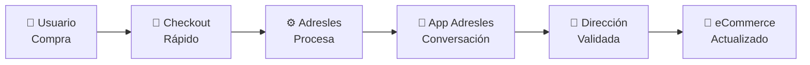

### 1.2 Propuesta de Valor

| Stakeholder | Propuesta de Valor |
|-------------|-------------------|
| **Comprador** | Checkout ultra-rápido sin formularios tediosos. Gestión centralizada de direcciones. Comunicación natural en su idioma preferido. |
| **eCommerce** | Reducción del abandono de carrito. Mayor tasa de conversión. Diferenciación competitiva en UX. Prueba gratuita de 1 mes. |
| **Tienda física con eCommerce** | Experiencia omnicanal mejorada. Fidelización de clientes. |

### 1.3 Ventajas Competitivas

1. **Checkout sin fricción**: Elimina el punto de mayor abandono en el funnel de compra.

2. **Conversación natural con IA**: A diferencia de formularios rígidos, la obtención de dirección se realiza mediante conversación fluida que puede resolver ambigüedades, sugerir correcciones y adaptarse al usuario.

3. **Validación inteligente de direcciones**: 
   - Integración con Google Maps API para normalización
   - Detección proactiva de información faltante (escalera, bloque, piso, puerta)
   - Resolución de ambigüedades mediante conversación

4. **Libreta de Direcciones centralizada**: El usuario puede guardar múltiples direcciones y reutilizarlas en cualquier eCommerce integrado con Adresles.

5. **Funcionalidad de Regalo integrada**: Permite comprar para terceros sin conocer su dirección, mejorando drásticamente la experiencia de gifting.

6. **Efecto red**: Cuantos más eCommerce usen Adresles, más usuarios tendrán su dirección pre-cargada, aumentando el valor para todos.

7. **Multiidioma nativo**: Detección automática del idioma del usuario y conversación en su idioma preferido.

8. **Multi-moneda**: Soporte global desde el lanzamiento.

### 1.4 Funciones Principales

#### Para el Comprador (B2C)

| Función | Descripción |
|---------|-------------|
| **Checkout Adresles** | Completar compra solo con nombre y teléfono |
| **Conversación IA** | Indicar dirección de entrega por chat natural en App Adresles |
| **Libreta de Direcciones** | Gestionar direcciones favoritas reutilizables |
| **Modo Regalo** | Enviar pedido a otra persona sin conocer su dirección |
| **Registro Adresles** | Crear cuenta para persistir preferencias |
| **Detección de idioma** | Conversación automática en el idioma del usuario |

#### Para el eCommerce (B2B)

| Función | Descripción |
|---------|-------------|
| **Plugin de Checkout** | Integración en el proceso de pago |
| **Webhook de Compras** | Recepción automática de pedidos en tiempo real |
| **Dashboard de Gestión** | Monitorización de pedidos y conversaciones |
| **API de Sincronización** | Actualización de direcciones en el sistema |
| **Prueba gratuita** | 1 mes sin coste para evaluar el servicio |

#### Para el Sistema (Interno)

| Función | Descripción |
|---------|-------------|
| **Orquestador de Conversaciones** | Gestión del flujo conversacional con GPT-4.0 |
| **Motor de Journeys** | Selección automática del flujo según contexto |
| **Sistema de Reminders** | Recordatorios tras 15 min sin respuesta |
| **Validador de Direcciones** | Google Maps API + detección de datos faltantes |
| **Escalado a Soporte** | Envío de incidencias por email cuando la IA no puede resolver |

### 1.5 Lean Canvas

```
┌─────────────────────────────────────────────────────────────────────────────────────────────┐
│                                    LEAN CANVAS - ADRESLES                                   │
├───────────────────────┬───────────────────────┬───────────────────────┬─────────────────────┤
│       PROBLEMA        │       SOLUCIÓN        │   PROPUESTA ÚNICA     │  VENTAJA ESPECIAL   │
│                       │                       │      DE VALOR         │                     │
│ • Alto abandono de    │ • Plugin checkout     │                       │ • Efecto red:       │
│   carrito por         │   sin dirección       │ "Compra en 2 clics,   │   usuarios con      │
│   formularios         │                       │  nosotros nos         │   dirección ya      │
│   largos              │ • Agente IA que       │  encargamos del       │   guardada          │
│                       │   obtiene dirección   │  resto"               │                     │
│ • Fricción en         │   por App propia      │                       │ • IA conversacional │
│   compras móviles     │                       │                       │   multiidioma       │
│                       │ • Libreta de          │                       │                     │
│ • Comprar regalos     │   direcciones         │                       │ • Validación GMaps  │
│   sin saber           │   centralizada        │                       │   + detección       │
│   dirección           │                       │                       │   inteligente       │
│                       │ • Modo regalo         │                       │                     │
│ • Formularios no      │                       │                       │ • Funcionalidad     │
│   adaptados a móvil   │ • Validación GMaps    │                       │   de regalo única   │
├───────────────────────┼───────────────────────┼───────────────────────┴─────────────────────┤
│    SEGMENTOS DE       │    MÉTRICAS CLAVE     │                   CANALES                   │
│      CLIENTES         │                       │                                             │
│                       │ • Tasa conversión     │ • Plugin WooCommerce (fase 1)               │
│ B2B:                  │   checkout            │ • Plugin PrestaShop (fase 2)                │
│ • eCommerce WooComm   │ • % abandono carrito  │ • Plugin Magento (fase 3)                   │
│ • eCommerce PrestaS   │ • Tiempo medio de     │ • Plugin Shopify (fase 4)                   │
│ • eCommerce Magento   │   obtención dirección │                                             │
│ • eCommerce Shopify   │ • NPS usuarios        │ • Marketplace de plugins                    │
│                       │ • Usuarios registrados│                                             │
│ B2C:                  │ • Direcciones         │ • Venta directa B2B                         │
│ • Compradores online  │   guardadas           │                                             │
│ • Millennials/GenZ    │ • Tasa de respuesta   │ • Viralidad por uso                         │
│ • Compradores global  │   <15 min             │                                             │
├───────────────────────┴───────────────────────┼─────────────────────────────────────────────┤
│          ESTRUCTURA DE COSTES                 │           FUENTES DE INGRESOS               │
│                                               │                                             │
│ • Infraestructura cloud (AWS)                 │ • Fee por transacción (variable):           │
│ • API OpenAI (GPT-4.0)                        │   - 5.0% para importes ≤ 10€                │
│ • Google Maps API (validación)                │   - 2.5% para importes ≥ 100€               │
│ • Desarrollo y mantenimiento                  │   - Escala lineal entre 10€ y 100€          │
│ • Soporte al cliente                          │                                             │
│ • Infraestructura multi-región (global)       │ • Prueba gratuita: 1 mes                    │
│                                               │                                             │
│ Fórmula fee: fee% = 5 - (2.5 × (importe-10)   │ Ejemplos:                                   │
│                              / 90)            │ • Compra 10€ → fee 5% = 0.50€               │
│ (mínimo 2.5%, máximo 5%)                      │ • Compra 55€ → fee 3.75% = 2.06€            │
│                                               │ • Compra 100€ → fee 2.5% = 2.50€            │
└───────────────────────────────────────────────┴─────────────────────────────────────────────┘
```

### 1.6 User Journeys Detallados

#### Journey 1: Compra Tradicional (Usuario NO usa modo Adresles)
El usuario completa checkout tradicional con dirección. Adresles le invita a registrarse para futuras compras más rápidas.

#### Journey 2: Compra Adresles - Usuario Registrado en Adresles
- **2.1**: Con dirección favorita → Se propone dirección guardada, opción de cambiar
- **2.2**: Sin dirección favorita → Se solicita nueva dirección

#### Journey 3: Compra Adresles - Usuario Registrado solo en eCommerce
- **3.1**: Con dirección en eCommerce → Se propone dirección del eCommerce + invitación registro
- **3.2**: Sin dirección en eCommerce → Se solicita dirección + invitación registro

#### Journey 4: Compra Adresles - Usuario Nuevo
Usuario no registrado en ningún sistema → Se solicita dirección + invitación registro

#### Journey 5: Modo Regalo
- **Regalado**: Se contacta para obtener/confirmar dirección (si registrado, se propone su favorita)
- **Comprador**: Se informa del proceso en curso con el regalado

### 1.7 Flujo de Reminders

> ⚠️ **NOTA MVP**: El sistema de reminders automáticos se implementará en una fase posterior al MVP. Para el MVP mockeado, las conversaciones permanecerán activas hasta que el usuario responda o se escale manualmente a soporte cuando sea necesario. Esta decisión simplifica el desarrollo inicial y permite enfocarse en la funcionalidad core de conversación con IA y validación de direcciones.

**Diseño para fase post-MVP:**

Cuando el usuario no responde en 15 minutos:

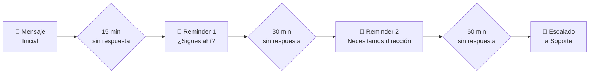

### 1.8 Fórmula de Pricing

```
Para importe X (en euros):

Si X ≤ 10:       fee = 5%
Si X ≥ 100:      fee = 2.5%
Si 10 < X < 100: fee = 5 - (2.5 × (X - 10) / 90)
```

| Importe | Fee % | Fee (€) |
|---------|-------|---------|
| 10 €    | 5.00% | 0.50 €  |
| 25 €    | 4.58% | 1.15 €  |
| 50 €    | 3.89% | 1.94 €  |
| 75 €    | 3.19% | 2.40 €  |
| 100 €   | 2.50% | 2.50 €  |
| 150 €   | 2.50% | 3.75 €  |

---

## Fase 2: Casos de Uso

### 2.1 Actores del Sistema

| Actor | Tipo | Descripción |
|-------|------|-------------|
| **Comprador** | Principal | Usuario que realiza una compra y proporciona su dirección mediante conversación |
| **Regalado** | Principal | Persona que recibe un regalo y debe proporcionar su dirección |
| **Administrador/Mock UI** | Principal | Ingresa manualmente JSON de compra mock para simular integración con eCommerce |
| **Sistema Mock eCommerce** | Secundario | Simulación de plataforma de tienda online para recibir actualizaciones de dirección (mock) |
| **Agente IA (GPT-4.0)** | Secundario | Motor de conversación inteligente para obtener y validar direcciones |
| **Google Maps API** | Secundario | Servicio de validación y normalización de direcciones (implementación real) |
| **Sistema de Soporte** | Secundario | Recibe escalados manuales cuando la IA no puede resolver |
| **Sistema Adresles Backend** | Secundario | Procesa pedidos, gestiona conversaciones y coordina validaciones |

### 2.2 Caso de Uso 1: Procesar Compra desde eCommerce (Mock)

**CU-01: Procesar Compra desde eCommerce (Mock)**

| Campo | Descripción |
|-------|-------------|
| **ID** | CU-01 |
| **Nombre** | Procesar Compra desde eCommerce (Mock) |
| **Actor Principal** | Comprador |
| **Actores Secundarios** | Sistema Mock, Agente IA (GPT-4.0), Adresles Backend |
| **Precondiciones** | Sistema mock recibe JSON con datos de compra |
| **Postcondiciones** | Pedido procesado, conversación(es) iniciada(s), dirección confirmada/simulada actualización a eCommerce |
| **Trigger** | Entrada manual de JSON mock con datos de compra en el sistema |

#### Flujo Principal (Modo Adresles sin dirección)

1. El Sistema recibe JSON mock con datos de compra que incluye:
   - Tienda online (nombre, URL)
   - Número de pedido en la tienda
   - Datos del comprador (nombre, apellidos, teléfono, email)
   - Modo de compra: "adresles" (sin dirección de entrega)
   - Datos de los productos comprados
   - Importe total y moneda
2. Adresles valida el JSON y crea registro de pedido con estado PENDING_ADDRESS
3. Adresles busca o crea usuario por número de teléfono
4. Adresles inicia conversación con el Comprador (ver CU-02)
5. El Comprador proporciona y confirma la Dirección de Entrega en la conversación
6. Adresles valida la dirección con Google Maps API
7. Adresles crea registro OrderAddress con la dirección confirmada
8. Adresles actualiza estado del pedido a ADDRESS_CONFIRMED
9. Adresles simula la actualización de la dirección al Sistema eCommerce (mock - log estructurado)
10. Adresles actualiza estado del pedido a SYNCED
11. Adresles confirma al Comprador la Dirección de Entrega finalmente seleccionada
12. Si el Comprador no está registrado en Adresles, Adresles inicia conversación ofreciendo el registro (ver CU-03)

#### Flujos Alternativos

**FA-1: Compra con Modo Regalo**

- En paso 1, el JSON indica `is_gift: true` e incluye datos del regalado (nombre, apellidos, teléfono, nota opcional)
- En paso 2, Adresles identifica el pedido como regalo y crea registro GiftRecipient
- En paso 4, el Sistema inicia DOS conversaciones en paralelo e independientes:

**Conversación con Comprador (informativa):**

4a. Agente IA saluda al Comprador, confirmando la compra regalo

5a. Agente IA informa que se está contactando al Regalado para obtener su dirección de entrega

6a. Agente IA mantiene al Comprador informado del progreso (sin revelar la dirección del Regalado por protección de datos)

7a. Cuando el Regalado confirma su dirección, Agente IA notifica al Comprador que la dirección fue obtenida exitosamente

8a. Agente IA confirma que el pedido está en proceso y será enviado al destinatario

9a. Si el Comprador no está registrado en Adresles, Agente IA inicia conversación de invitación a registro (ver CU-03)

**Conversación con Regalado (obtención de dirección):**

4b. Agente IA saluda al Regalado informando que tiene un regalo pendiente

5b. El Sistema verifica estado del Regalado:
- Si registrado en Adresles con dirección favorita → Agente IA propone su dirección favorita
- Si registrado en eCommerce con dirección → Agente IA propone dirección del eCommerce
- Si no tiene dirección → Agente IA solicita nueva dirección

6b. El Regalado proporciona o confirma la dirección de entrega

7b. Adresles valida la dirección con Google Maps API (mismo proceso que CU-02 pasos 5-8)

8b. Si la dirección parece un edificio sin detalles completos → Agente IA solicita escalera/bloque/piso/puerta

9b. Agente IA confirma dirección completa al Regalado

10b. Regalado aprueba la dirección

11b. Agente IA confirma que el regalo será enviado a la dirección indicada

12b. Si el Regalado no está registrado en Adresles, Agente IA inicia conversación de invitación a registro (ver CU-03)

- Continúa en paso 7 del flujo principal (crear OrderAddress)
- Las conversaciones avanzan independientemente a su propio ritmo

**Subflujo FA-1.1: Comprador conoce dirección del Regalado**
- En paso 1, el JSON incluye `gift_address_provided: true` con datos completos de dirección del regalado
- Se omite la conversación con el Regalado (4b-12b)
- Solo se ejecuta la conversación informativa con el Comprador (4a-9a)
- Se valida la dirección proporcionada con Google Maps API
- Continúa en paso 7 del flujo principal

**Subflujo FA-1.2: Regalado no responde**
- Durante la conversación con el Regalado, si no hay respuesta, la conversación queda en estado WAITING_RESPONSE
- El Comprador es notificado del estado a través de su conversación informativa
- El sistema puede escalar manualmente a soporte si es necesario
- (Nota: Reminders automáticos no implementados en MVP)

**FA-2: Compra Tradicional con Dirección**

- En paso 1, el JSON indica `mode: "tradicional"` e incluye dirección de entrega completa
- En paso 2, Adresles crea pedido con estado ADDRESS_CONFIRMED (no PENDING_ADDRESS)
- Adresles crea inmediatamente OrderAddress con la dirección proporcionada
- Agente IA inicia conversación informativa con el Comprador:
  - Saluda y confirma la compra realizada
  - Informa: tienda, número de pedido, dirección de entrega indicada
  - Confirma que el pedido será enviado a la dirección
- Adresles simula la actualización al eCommerce (mock)
- Adresles actualiza estado del pedido a SYNCED
- Si el Comprador no está registrado en Adresles, Agente IA invita a registrarse para futuras compras más rápidas (ver CU-03)

#### Diagrama de Caso de Uso

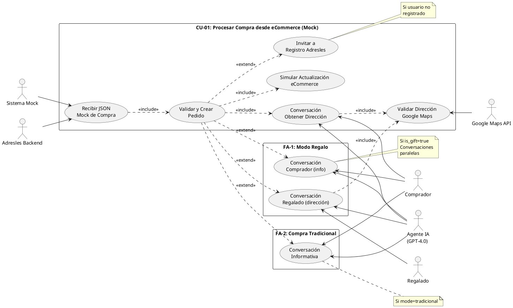

---

### 2.3 Caso de Uso 2: Obtención de Dirección por Conversación

**CU-02: Obtener Dirección mediante Conversación IA**

| Campo | Descripción |
|-------|-------------|
| **ID** | CU-02 |
| **Nombre** | Obtener Dirección mediante Conversación IA |
| **Actor Principal** | Comprador |
| **Actores Secundarios** | Agente IA (GPT-4.0), Google Maps API, Sistema de Soporte |
| **Precondiciones** | Existe pedido pendiente de dirección (CU-01 completado) |
| **Postcondiciones** | Dirección validada, confirmada y simulada la actualización en eCommerce (mock) |
| **Trigger** | Adresles inicia conversación tras recibir JSON mock de pedido |

#### Flujo Principal

1. Adresles detecta idioma del usuario (simulado en MVP)
2. Agente IA saluda al Comprador en su idioma, informando de la compra realizada
3. El Sistema verifica estado del usuario:
    - Si registrado en Adresles con dirección favorita → propone dirección
    - Si registrado en eCommerce con dirección → propone dirección
    - Si no tiene dirección → solicita dirección
4. El Comprador proporciona/confirma dirección
5. Google Maps API valida y normaliza la dirección
6. Si la dirección parece ser un edificio sin detalles completos:
    - Agente IA pregunta por escalera/bloque/piso/puerta
    - Comprador proporciona detalles adicionales
7. Agente IA confirma dirección completa al Comprador
8. Comprador aprueba la dirección
9. Adresles simula la actualización de la dirección en el eCommerce (mock - log estructurado o notificación)
10. Agente IA confirma que el pedido será enviado a la dirección indicada
11. Si el Comprador no está registrado en Adresles:
    - Agente IA invita a registrarse para futuras compras más rápidas (ver CU-03)

#### Flujos Alternativos

**FA-1: Comprador quiere cambiar dirección propuesta**
- En paso 4, Comprador indica que quiere otra dirección
- El Sistema solicita nueva dirección
- Continúa en paso 5

**FA-2: Dirección no válida según Google Maps**
- En paso 5, la validación falla
- Agente IA informa del problema y pide aclaración
- Comprador proporciona dirección corregida
- Vuelve a paso 5

**FA-3: IA no puede resolver la situación**
- Agente IA detecta que no puede ayudar
- El Sistema genera resumen de la incidencia
- El Sistema envía email a soporte@adresles.com
- Agente IA informa al Comprador que soporte contactará pronto

**FA-4: Múltiples pedidos pendientes del mismo usuario**
- En paso 2, el Sistema detecta varios pedidos sin dirección
- Agente IA lista los pedidos pendientes
- Comprador puede asignar misma dirección a todos o diferentes
- El Sistema deja claro qué dirección corresponde a cada pedido

#### Diagrama de Caso de Uso

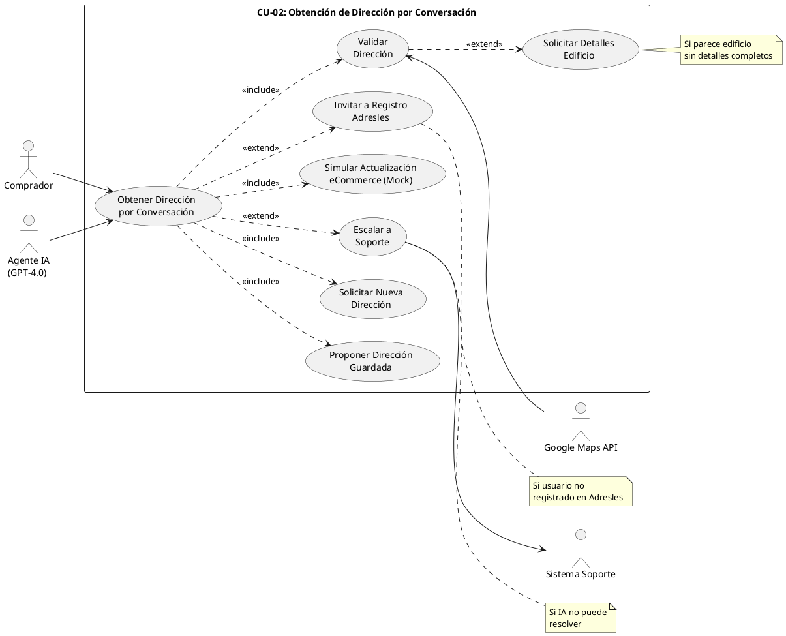

---

### 2.4 Caso de Uso 3: Solicitud de Registro Voluntario en Adresles

**CU-03: Solicitar Registro Voluntario en Adresles**

| Campo | Descripción |
|-------|-------------|
| **ID** | CU-03 |
| **Nombre** | Solicitar Registro Voluntario en Adresles |
| **Actor Principal** | Comprador o Regalado |
| **Actores Secundarios** | Agente IA (GPT-4.0), Sistema Adresles |
| **Precondiciones** | Usuario ha completado una compra (modo Adresles o tradicional) y NO está registrado en Adresles (is_registered = false) |
| **Postcondiciones** | Usuario registrado en Adresles (is_registered = true) o ha rechazado el registro conscientemente |
| **Trigger** | Finalización de CU-02 (tras confirmar dirección) o después de confirmar compra tradicional (FA-2 de CU-01) |

#### Flujo Principal

1. El Sistema verifica que el usuario no está registrado en Adresles (`is_registered = false`)
2. Agente IA inicia conversación de invitación a registro
3. Agente IA explica beneficios del registro en Adresles:
   - Futuras compras más rápidas en cualquier tienda integrada
   - Libreta de direcciones centralizada accesible desde cualquier eCommerce
   - Reutilizar direcciones guardadas sin tener que repetirlas
   - Gestión unificada de direcciones de entrega
4. Agente IA solicita confirmación: "¿Desea registrarse en Adresles para disfrutar de estos beneficios?"
5. Usuario acepta el registro
6. Sistema crea/actualiza cuenta de usuario en Adresles:
   - Marca `is_registered = true`
   - Establece `registered_at = now()`
   - Mantiene datos existentes (teléfono, nombre, email si existe)
7. Si el usuario proporcionó dirección en esta compra, Agente IA pregunta: "¿Desea guardar esta dirección para futuras compras?"
8. Si usuario acepta guardar dirección:
   - Sistema crea registro en tabla `Address` con datos de la dirección
   - Marca `is_default = true` (primera dirección guardada)
   - Vincula dirección al usuario
9. Agente IA confirma registro exitoso y beneficios activados:
   - "¡Registro completado! Ya puede usar Adresles en cualquier tienda integrada"
   - "Su dirección ha sido guardada y estará disponible en su próxima compra"
10. Sistema actualiza `last_interaction_at` del usuario
11. Conversación finalizada

#### Flujos Alternativos

**FA-1: Usuario rechaza registro**
- En paso 5, el Usuario indica que no desea registrarse
- Agente IA agradece y respeta la decisión: "Entendido. Puede registrarse cuando lo desee desde cualquier compra futura"
- Agente IA confirma que puede seguir usando Adresles sin registrarse
- Sistema no modifica el estado `is_registered` (permanece false)
- Conversación finalizada

**FA-2: Usuario quiere más información**
- En paso 5, el Usuario solicita más información sobre privacidad, uso de datos o funcionamiento
- Agente IA proporciona información adicional:
  - Política de privacidad: datos solo para facilitar compras, no compartidos con terceros
  - Datos almacenados: nombre, teléfono, email opcional, direcciones guardadas
  - Compatibilidad: lista de tiendas online integradas con Adresles
  - Gestión de datos: puede actualizar o eliminar su cuenta en cualquier momento
- Agente IA vuelve a preguntar si desea registrarse
- Continúa en paso 5

**FA-3: Usuario no proporcionó dirección en esta compra**
- En paso 7, si la compra no incluyó captura de dirección (caso poco común)
- Se omiten pasos 7-8
- Agente IA confirma registro sin mención a guardado de dirección
- Continúa en paso 9

**FA-4: Usuario ya tiene direcciones guardadas**
- En paso 8, si el usuario ya tiene direcciones en Adresles (migración o uso previo)
- Sistema pregunta si desea marcar esta dirección como favorita o simplemente agregarla
- Sistema crea registro en `Address` con `is_default` según preferencia del usuario
- Continúa en paso 9

#### Diagrama de Caso de Uso

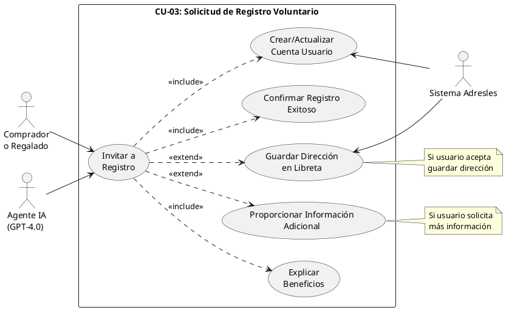

---

### 2.5 Matriz de Trazabilidad Casos de Uso - Requisitos

| Requisito | CU-01 | CU-02 | CU-03 |
|-----------|-------|-------|-------|
| Mock de integración eCommerce | ✓ | | |
| Entrada manual de JSON | ✓ | | |
| Checkout sin dirección (modo Adresles) | ✓ | | |
| Compra tradicional con dirección | ✓ | | |
| Modo regalo | ✓ | | |
| Conversación IA | ✓ | ✓ | ✓ |
| Validación Google Maps | ✓ | ✓ | |
| Detección datos faltantes edificio | | ✓ | |
| Proponer dirección favorita | | ✓ | |
| Escalado a soporte | | ✓ | |
| Multi-idioma | ✓ | ✓ | ✓ |
| Actualización eCommerce (mock) | ✓ | ✓ | |
| Invitación registro | ✓ | ✓ | ✓ |
| Múltiples pedidos | | ✓ | |
| Registro voluntario usuario | | | ✓ |
| Guardado de dirección en libreta | | | ✓ |

---

## Fase 3: Modelado de Datos

### 3.1 Análisis de Base de Datos: DynamoDB vs Alternativas

Dado el requisito de evaluar DynamoDB, presento un análisis comparativo:

#### Características del Sistema a Modelar

| Característica | Implicación para BD |
|----------------|---------------------|
| Relaciones claras (eCommerce → Tiendas → Pedidos) | Favorece modelo relacional |
| Multi-tenant estricto | Requiere particionamiento eficiente |
| Auditoría completa | Alto volumen de escrituras de logs |
| Conversaciones con política de retención | Datos con TTL, alto volumen |
| Queries complejos (reportes, dashboard) | Favorece SQL |
| Escala global, multi-región | Requiere replicación |

#### Comparativa

| Criterio | DynamoDB | Supabase (PostgreSQL) | Híbrido |
|----------|----------|----------------------|---------|
| **Modelo de datos** | NoSQL (clave-valor/documento) | Relacional | Ambos |
| **Relaciones complejas** | ⚠️ Difícil, requiere desnormalización | ✅ Nativo con JOINs | ✅ Cada uno en su fuerte |
| **Auditoría** | ✅ DynamoDB Streams | ✅ Triggers/RLS | ✅ |
| **TTL automático** | ✅ Nativo | ⚠️ Requiere pg_cron | ✅ DynamoDB para TTL |
| **Escalabilidad** | ✅ Automática, serverless | ✅ Escalado automático | ✅ |
| **Auth integrado** | ❌ Requiere Cognito | ✅ Supabase Auth | ✅ |
| **Realtime** | ⚠️ Streams + Lambda | ✅ Realtime nativo | ✅ |
| **Coste a bajo volumen** | ✅ Pay-per-request | ✅ Free tier generoso | ⚠️ Dos servicios |
| **Queries ad-hoc** | ⚠️ Limitado sin GSI | ✅ SQL completo | ✅ |
| **Row Level Security** | ❌ Manual | ✅ RLS nativo | ✅ |
| **Experiencia equipo** | ✅ Ya tienen AWS | ✅ PostgreSQL estándar | ✅ |

#### Decisión Recomendada: Arquitectura Híbrida

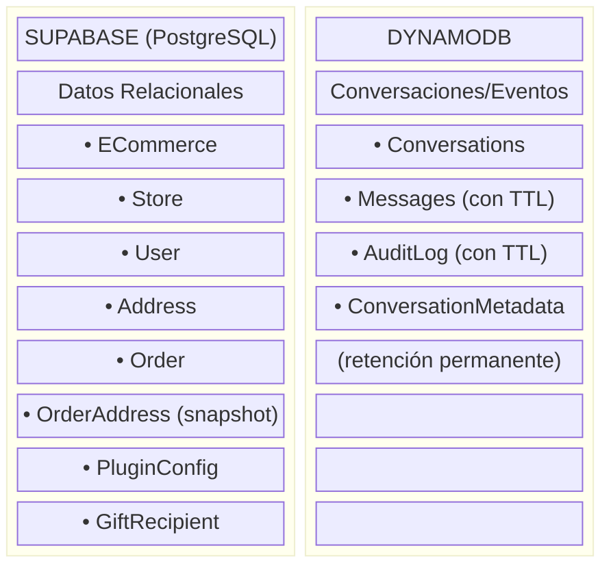

**Justificación:**
- **Supabase**: Integridad referencial, Auth integrado, RLS para multi-tenant, Realtime para UI
- **DynamoDB**: Alto throughput para mensajes, TTL nativo para retención, experiencia AWS del equipo
- **Ambos**: Escalan automáticamente, coste optimizado

### 3.2 Modelo Entidad-Relación

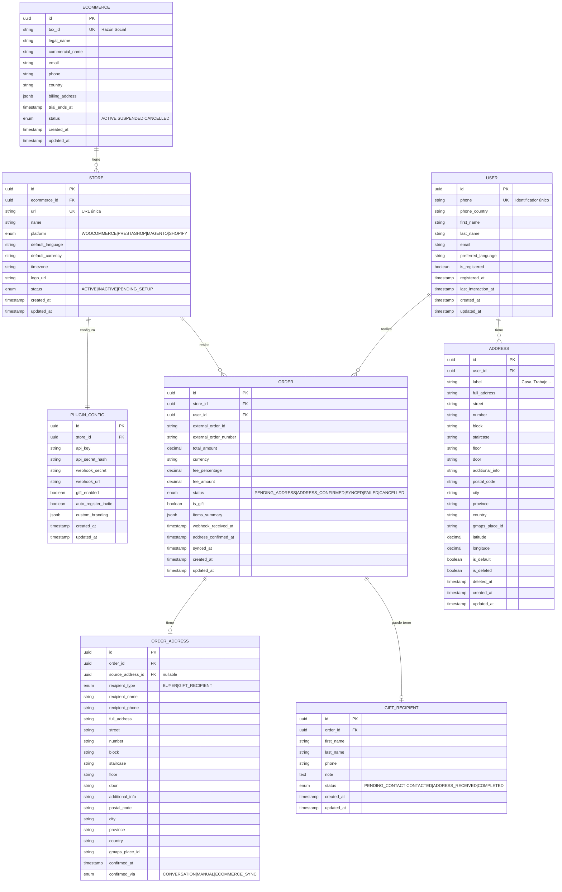

### 3.3 Diccionario de Datos

#### 3.3.1 Supabase (PostgreSQL) - Datos Relacionales

##### Tabla: `ecommerce`

| Atributo | Tipo | Restricciones | Descripción |
|----------|------|---------------|-------------|
| `id` | UUID | PK | Identificador único |
| `tax_id` | VARCHAR(50) | UNIQUE, NOT NULL | Razón Social / CIF / VAT |
| `legal_name` | VARCHAR(255) | NOT NULL | Nombre legal de la empresa |
| `commercial_name` | VARCHAR(255) | | Nombre comercial |
| `email` | VARCHAR(255) | NOT NULL | Email de contacto principal |
| `phone` | VARCHAR(20) | | Teléfono de contacto |
| `country` | VARCHAR(2) | NOT NULL | Código ISO país sede |
| `billing_address` | JSONB | | Dirección de facturación |
| `trial_ends_at` | TIMESTAMPTZ | | Fin del periodo de prueba |
| `status` | TEXT | NOT NULL, CHECK | ACTIVE, SUSPENDED, CANCELLED |
| `created_at` | TIMESTAMPTZ | NOT NULL, DEFAULT now() | Fecha de creación |
| `updated_at` | TIMESTAMPTZ | NOT NULL, DEFAULT now() | Última modificación |

##### Tabla: `store`

| Atributo | Tipo | Restricciones | Descripción |
|----------|------|---------------|-------------|
| `id` | UUID | PK | Identificador único |
| `ecommerce_id` | UUID | FK → ecommerce, NOT NULL | eCommerce propietario |
| `url` | VARCHAR(500) | UNIQUE, NOT NULL | URL única de la tienda |
| `name` | VARCHAR(255) | NOT NULL | Nombre de la tienda |
| `platform` | TEXT | NOT NULL, CHECK | WOOCOMMERCE, PRESTASHOP, MAGENTO, SHOPIFY |
| `default_language` | VARCHAR(5) | NOT NULL | Idioma por defecto (es, en, fr...) |
| `default_currency` | VARCHAR(3) | NOT NULL | Moneda por defecto (EUR, USD...) |
| `timezone` | VARCHAR(50) | NOT NULL | Zona horaria |
| `logo_url` | VARCHAR(500) | | Logo de la tienda |
| `status` | TEXT | NOT NULL, CHECK | ACTIVE, INACTIVE, PENDING_SETUP |
| `created_at` | TIMESTAMPTZ | NOT NULL, DEFAULT now() | Fecha de creación |
| `updated_at` | TIMESTAMPTZ | NOT NULL, DEFAULT now() | Última modificación |

##### Tabla: `plugin_config`

| Atributo | Tipo | Restricciones | Descripción |
|----------|------|---------------|-------------|
| `id` | UUID | PK | Identificador único |
| `store_id` | UUID | FK → store, UNIQUE, NOT NULL | Tienda asociada |
| `api_key` | VARCHAR(255) | NOT NULL | API Key para el plugin |
| `api_secret_hash` | VARCHAR(255) | NOT NULL | Hash del API Secret |
| `webhook_secret` | VARCHAR(255) | NOT NULL | Secret para validar webhooks |
| `webhook_url` | VARCHAR(500) | | URL configurada para webhooks |
| `gift_enabled` | BOOLEAN | DEFAULT true | Opción regalo habilitada |
| `auto_register_invite` | BOOLEAN | DEFAULT true | Invitar a registro automáticamente |
| `custom_branding` | JSONB | | Personalización visual |
| `created_at` | TIMESTAMPTZ | NOT NULL, DEFAULT now() | Fecha de creación |
| `updated_at` | TIMESTAMPTZ | NOT NULL, DEFAULT now() | Última modificación |

##### Tabla: `user`

| Atributo | Tipo | Restricciones | Descripción |
|----------|------|---------------|-------------|
| `id` | UUID | PK | Identificador único |
| `phone` | VARCHAR(20) | UNIQUE, NOT NULL | Teléfono (identificador único) |
| `phone_country` | VARCHAR(2) | NOT NULL | Código país del teléfono |
| `first_name` | VARCHAR(100) | | Nombre |
| `last_name` | VARCHAR(100) | | Apellidos |
| `email` | VARCHAR(255) | | Email opcional |
| `preferred_language` | VARCHAR(5) | | Idioma preferido detectado |
| `is_registered` | BOOLEAN | DEFAULT false | Usuario registrado en Adresles |
| `registered_at` | TIMESTAMPTZ | | Fecha de registro |
| `last_interaction_at` | TIMESTAMPTZ | | Última interacción |
| `created_at` | TIMESTAMPTZ | NOT NULL, DEFAULT now() | Fecha de creación |
| `updated_at` | TIMESTAMPTZ | NOT NULL, DEFAULT now() | Última modificación |

##### Tabla: `address`

| Atributo | Tipo | Restricciones | Descripción |
|----------|------|---------------|-------------|
| `id` | UUID | PK | Identificador único |
| `user_id` | UUID | FK → user, NOT NULL | Usuario propietario |
| `label` | VARCHAR(100) | | Etiqueta (Casa, Trabajo...) |
| `full_address` | VARCHAR(500) | NOT NULL | Dirección completa formateada |
| `street` | VARCHAR(255) | NOT NULL | Calle |
| `number` | VARCHAR(20) | | Número |
| `block` | VARCHAR(20) | | Bloque |
| `staircase` | VARCHAR(20) | | Escalera |
| `floor` | VARCHAR(20) | | Piso |
| `door` | VARCHAR(20) | | Puerta |
| `additional_info` | VARCHAR(255) | | Info adicional |
| `postal_code` | VARCHAR(20) | NOT NULL | Código postal |
| `city` | VARCHAR(100) | NOT NULL | Ciudad |
| `province` | VARCHAR(100) | | Provincia/Estado |
| `country` | VARCHAR(2) | NOT NULL | Código ISO país |
| `gmaps_place_id` | VARCHAR(255) | | ID de Google Maps |
| `latitude` | DECIMAL(10,8) | | Latitud |
| `longitude` | DECIMAL(11,8) | | Longitud |
| `is_default` | BOOLEAN | DEFAULT false | Dirección favorita |
| `is_deleted` | BOOLEAN | DEFAULT false | Soft delete |
| `deleted_at` | TIMESTAMPTZ | | Fecha de eliminación |
| `created_at` | TIMESTAMPTZ | NOT NULL, DEFAULT now() | Fecha de creación |
| `updated_at` | TIMESTAMPTZ | NOT NULL, DEFAULT now() | Última modificación |

##### Tabla: `order`

| Atributo | Tipo | Restricciones | Descripción |
|----------|------|---------------|-------------|
| `id` | UUID | PK | Identificador único |
| `store_id` | UUID | FK → store, NOT NULL | Tienda origen |
| `user_id` | UUID | FK → user, NOT NULL | Comprador |
| `external_order_id` | VARCHAR(100) | NOT NULL | ID del pedido en el eCommerce |
| `external_order_number` | VARCHAR(50) | | Número visible del pedido |
| `total_amount` | DECIMAL(12,2) | NOT NULL | Importe total |
| `currency` | VARCHAR(3) | NOT NULL | Moneda |
| `fee_percentage` | DECIMAL(5,2) | NOT NULL | % fee aplicado |
| `fee_amount` | DECIMAL(12,2) | NOT NULL | Importe fee |
| `status` | TEXT | NOT NULL, CHECK | PENDING_ADDRESS, ADDRESS_CONFIRMED, SYNCED, FAILED, CANCELLED |
| `is_gift` | BOOLEAN | DEFAULT false | Es un regalo |
| `items_summary` | JSONB | | Resumen de productos |
| `webhook_received_at` | TIMESTAMPTZ | NOT NULL | Cuando se recibió el webhook |
| `address_confirmed_at` | TIMESTAMPTZ | | Cuando se confirmó dirección |
| `synced_at` | TIMESTAMPTZ | | Cuando se sincronizó con eCommerce |
| `created_at` | TIMESTAMPTZ | NOT NULL, DEFAULT now() | Fecha de creación |
| `updated_at` | TIMESTAMPTZ | NOT NULL, DEFAULT now() | Última modificación |

**Índices:**
- `idx_order_store_status` ON (store_id, status)
- `idx_order_user` ON (user_id)
- `idx_order_external` ON (store_id, external_order_id) UNIQUE

##### Tabla: `order_address` (Snapshot inmutable)

| Atributo | Tipo | Restricciones | Descripción |
|----------|------|---------------|-------------|
| `id` | UUID | PK | Identificador único |
| `order_id` | UUID | FK → order, UNIQUE, NOT NULL | Pedido asociado |
| `source_address_id` | UUID | FK → address, NULL | Dirección origen (si aplica) |
| `recipient_type` | TEXT | NOT NULL, CHECK | BUYER, GIFT_RECIPIENT |
| `recipient_name` | VARCHAR(200) | NOT NULL | Nombre del destinatario |
| `recipient_phone` | VARCHAR(20) | NOT NULL | Teléfono del destinatario |
| `full_address` | VARCHAR(500) | NOT NULL | Dirección completa |
| `street` | VARCHAR(255) | NOT NULL | Calle |
| `number` | VARCHAR(20) | | Número |
| `block` | VARCHAR(20) | | Bloque |
| `staircase` | VARCHAR(20) | | Escalera |
| `floor` | VARCHAR(20) | | Piso |
| `door` | VARCHAR(20) | | Puerta |
| `additional_info` | VARCHAR(255) | | Info adicional |
| `postal_code` | VARCHAR(20) | NOT NULL | Código postal |
| `city` | VARCHAR(100) | NOT NULL | Ciudad |
| `province` | VARCHAR(100) | | Provincia |
| `country` | VARCHAR(2) | NOT NULL | País |
| `gmaps_place_id` | VARCHAR(255) | | ID de Google Maps |
| `confirmed_at` | TIMESTAMPTZ | NOT NULL | Momento de confirmación |
| `confirmed_via` | TEXT | NOT NULL, CHECK | CONVERSATION, MANUAL, ECOMMERCE_SYNC |

> ⚠️ **NOTA**: Esta tabla es INMUTABLE. Una vez creado el registro, no se modifica. Si el usuario cambia su dirección en la libreta, este snapshot permanece intacto.

##### Tabla: `gift_recipient`

| Atributo | Tipo | Restricciones | Descripción |
|----------|------|---------------|-------------|
| `id` | UUID | PK | Identificador único |
| `order_id` | UUID | FK → order, UNIQUE, NOT NULL | Pedido regalo |
| `first_name` | VARCHAR(100) | NOT NULL | Nombre del regalado |
| `last_name` | VARCHAR(100) | NOT NULL | Apellidos del regalado |
| `phone` | VARCHAR(20) | NOT NULL | Teléfono del regalado |
| `note` | TEXT | | Nota del comprador |
| `status` | TEXT | NOT NULL, CHECK | PENDING_CONTACT, CONTACTED, ADDRESS_RECEIVED, COMPLETED |
| `created_at` | TIMESTAMPTZ | NOT NULL, DEFAULT now() | Fecha de creación |
| `updated_at` | TIMESTAMPTZ | NOT NULL, DEFAULT now() | Última modificación |

> 📝 **NOTA**: `gift_recipient` depende únicamente de `order`. No tiene relación directa con `user`. El regalado puede o no existir como usuario en el sistema.

#### 3.3.2 DynamoDB - Conversaciones y Mensajes

##### Tabla: `Conversations`

| Atributo | Tipo | Key | Descripción |
|----------|------|-----|-------------|
| `PK` | String | Partition Key | `CONV#{conversation_id}` |
| `SK` | String | Sort Key | `METADATA` |
| `conversation_id` | String | | UUID de la conversación |
| `order_id` | String | GSI1-PK | UUID del pedido |
| `user_phone` | String | GSI2-PK | Teléfono del usuario |
| `user_type` | String | | `BUYER` \| `RECIPIENT` |
| `conversation_type` | String | | `INFORMATION` \| `GET_ADDRESS` \| `REGISTER` \| `GIFT_NOTIFICATION` \| `SUPPORT` |
| `is_registered_adresles` | Boolean | | Si el usuario está registrado en Adresles |
| `is_registered_ecommerce` | Boolean | | Si el usuario está registrado en el eCommerce |
| `has_address_adresles` | Boolean | | Si tiene dirección en Adresles |
| `has_address_ecommerce` | Boolean | | Si tiene dirección en el eCommerce |
| `status` | String | | `ACTIVE` \| `WAITING_RESPONSE` \| `COMPLETED` \| `ESCALATED` \| `TIMEOUT` |
| `language` | String | | Código de idioma detectado |
| `journey_type` | String | | Tipo de journey activo |
| `current_step` | String | | Paso actual del flujo |
| `context` | Map | | Contexto acumulado para el LLM |
| `reminder_count` | Number | | Número de reminders enviados |
| `last_reminder_at` | String | | ISO timestamp último reminder |
| `created_at` | String | | ISO timestamp |
| `updated_at` | String | | ISO timestamp |
| `completed_at` | String | | ISO timestamp |
| `escalated_at` | String | | ISO timestamp |
| `ttl` | Number | | Epoch para metadata (2 años) |

**GSI1**: `order_id` (PK) - Para buscar conversaciones de un pedido
**GSI2**: `user_phone` (PK), `created_at` (SK) - Para buscar conversaciones de un usuario

##### Tipos de Conversación (`conversation_type`)

| Tipo | Descripción |
|------|-------------|
| `INFORMATION` | Conversación informativa (ej: notificar compra tradicional) |
| `GET_ADDRESS` | Obtener dirección de entrega |
| `REGISTER` | Invitar/completar registro en Adresles |
| `GIFT_NOTIFICATION` | Notificar al comprador sobre estado del regalo |
| `SUPPORT` | Escalado a soporte |

##### Tabla: `Messages`

| Atributo | Tipo | Key | Descripción |
|----------|------|-----|-------------|
| `PK` | String | Partition Key | `CONV#{conversation_id}` |
| `SK` | String | Sort Key | `MSG#{ulid}` |
| `message_id` | String | | ULID del mensaje |
| `role` | String | | `USER` \| `ASSISTANT` \| `SYSTEM` |
| `content` | String | | Contenido del mensaje |
| `metadata` | Map | | Metadata adicional (tokens, etc.) |
| `timestamp` | String | | ISO timestamp |
| `ttl` | Number | | Epoch para auto-delete |

##### Tabla: `AuditLog`

| Atributo | Tipo | Key | Descripción |
|----------|------|-----|-------------|
| `PK` | String | Partition Key | `AUDIT#{entity_type}#{entity_id}` |
| `SK` | String | Sort Key | `{timestamp}#{ulid}` |
| `action` | String | | CREATE, UPDATE, DELETE, READ |
| `entity_type` | String | GSI1-PK | Tipo de entidad |
| `entity_id` | String | | ID de la entidad |
| `actor_type` | String | | USER, SYSTEM, ADMIN |
| `actor_id` | String | | ID del actor |
| `changes` | Map | | Campos modificados (before/after) |
| `ip_address` | String | | IP del request |
| `user_agent` | String | | User agent |
| `timestamp` | String | GSI1-SK | ISO timestamp |
| `ttl` | Number | | Epoch para auto-delete (configurable) |

**GSI1**: `entity_type` (PK), `timestamp` (SK) - Para buscar auditoría por tipo

### 3.4 Política de Retención de Datos

| Dato | Retención |
|------|-----------|
| Messages (contenido) | 90 días → Auto-delete vía TTL |
| Conversation (metadata) | 2 años → Luego solo estadísticas agregadas |
| AuditLog | 1 año → Configurable por compliance |
| Order | 7 años → Requisito fiscal |
| OrderAddress | 7 años → Vinculado a Order |
| User | Indefinido mientras activo |
| Address (soft deleted) | 1 año tras soft-delete → Hard delete |
| ECommerce/Store | Indefinido mientras activo |

### 3.5 Diagramas de Estados

#### Estado de Order

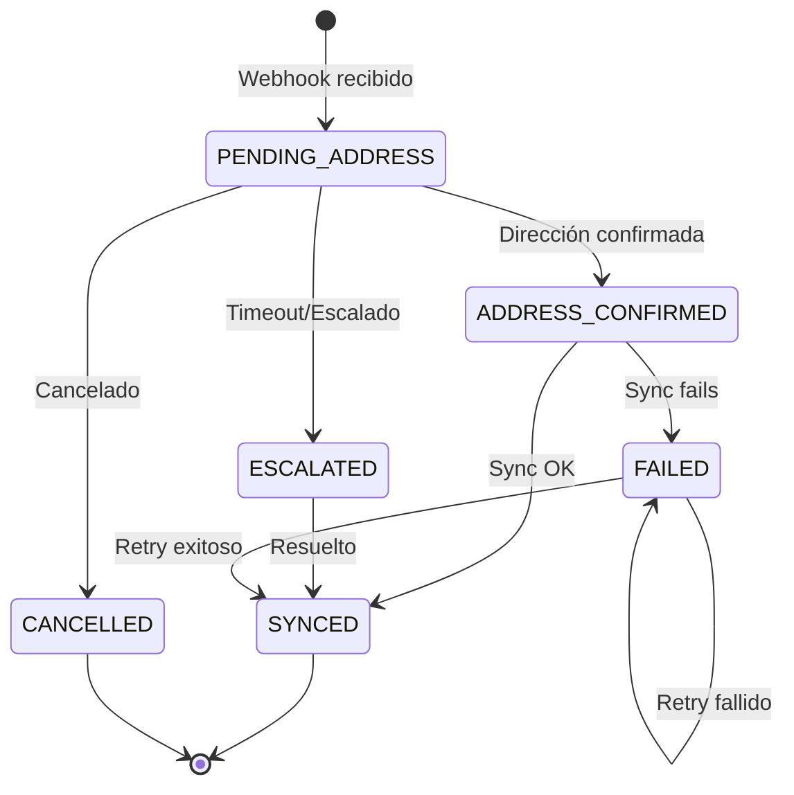

#### Estado de Conversation

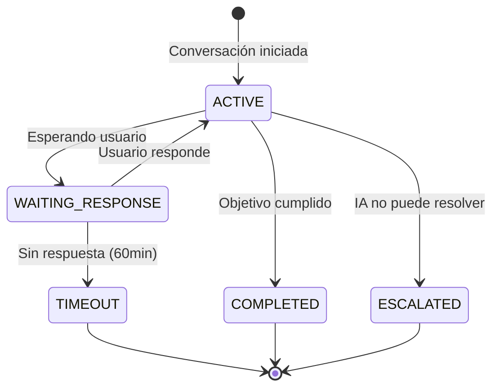

#### Estado de GiftRecipient

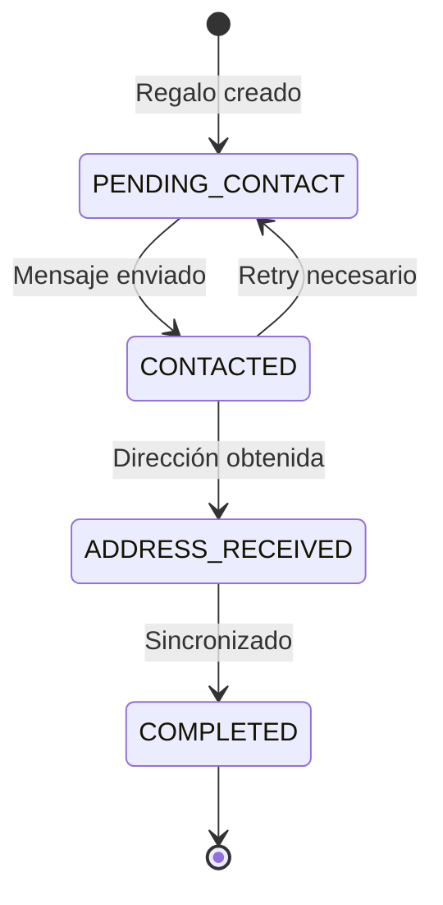

---

## Fase 4: Diseño de Alto Nivel

### 4.1 Visión General de la Arquitectura

La arquitectura de Adresles sigue el patrón **Monolito Modular** con separación clara de responsabilidades, diseñado para:

- **Velocidad de desarrollo**: Un solo repositorio, despliegue simplificado
- **Escalabilidad futura**: Módulos con interfaces claras, fácil extracción a microservicios
- **Coste optimizado**: Aprovecha servidor dedicado existente + servicios managed

#### Principios Arquitectónicos

| Principio | Aplicación en Adresles |
|-----------|------------------------|
| **Separación de concerns** | Módulos independientes por dominio |
| **Dependency Inversion** | Repositorios abstraídos, servicios inyectables |
| **Event-Driven** | Colas para procesamiento asíncrono (conversaciones) |
| **API-First** | Contratos definidos antes de implementación |
| **Infrastructure as Code** | Docker Compose para reproducibilidad |

### 4.2 Diagrama C4 - Nivel 1: Contexto del Sistema

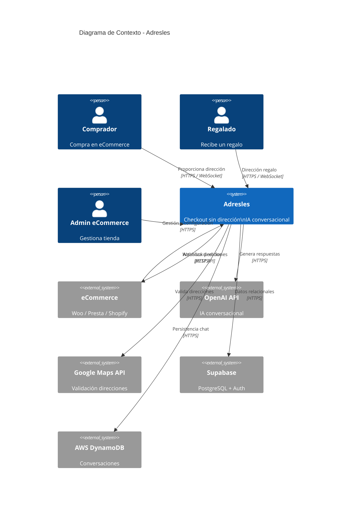

### 4.3 Diagrama C4 - Nivel 2: Contenedores

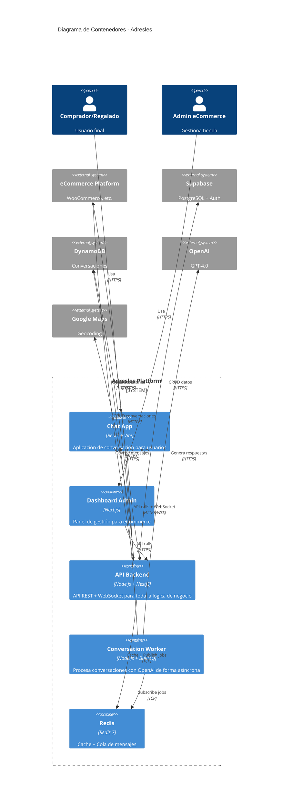

### 4.4 Diagrama C4 - Nivel 3: Componentes (Módulo Conversations)

Profundizamos en el módulo más crítico del sistema: **Conversations**.

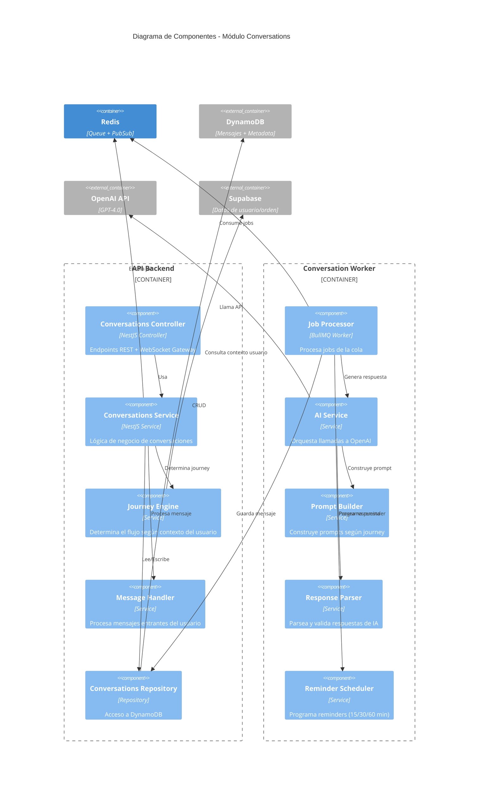

### 4.5 Estructura del Proyecto

```
adresles/
├── apps/
│   ├── api/                          # Backend NestJS
│   │   ├── src/
│   │   │   ├── main.ts
│   │   │   ├── app.module.ts
│   │   │   ├── modules/
│   │   │   │   ├── auth/
│   │   │   │   │   ├── auth.module.ts
│   │   │   │   │   ├── auth.controller.ts
│   │   │   │   │   ├── auth.service.ts
│   │   │   │   │   ├── guards/
│   │   │   │   │   │   ├── jwt.guard.ts
│   │   │   │   │   │   └── api-key.guard.ts
│   │   │   │   │   └── dto/
│   │   │   │   ├── orders/
│   │   │   │   │   ├── orders.module.ts
│   │   │   │   │   ├── orders.controller.ts
│   │   │   │   │   ├── orders.service.ts
│   │   │   │   │   ├── orders.repository.ts
│   │   │   │   │   └── dto/
│   │   │   │   ├── conversations/
│   │   │   │   │   ├── conversations.module.ts
│   │   │   │   │   ├── conversations.controller.ts
│   │   │   │   │   ├── conversations.gateway.ts    # WebSocket
│   │   │   │   │   ├── conversations.service.ts
│   │   │   │   │   ├── conversations.repository.ts
│   │   │   │   │   ├── journeys/
│   │   │   │   │   │   ├── journey.engine.ts
│   │   │   │   │   │   ├── get-address.journey.ts
│   │   │   │   │   │   ├── register.journey.ts
│   │   │   │   │   │   ├── gift-notification.journey.ts
│   │   │   │   │   │   └── information.journey.ts
│   │   │   │   │   └── dto/
│   │   │   │   ├── addresses/
│   │   │   │   │   ├── addresses.module.ts
│   │   │   │   │   ├── addresses.service.ts
│   │   │   │   │   ├── gmaps.service.ts           # Google Maps
│   │   │   │   │   └── dto/
│   │   │   │   ├── webhooks/
│   │   │   │   │   ├── webhooks.module.ts
│   │   │   │   │   ├── webhooks.controller.ts
│   │   │   │   │   ├── processors/
│   │   │   │   │   │   ├── woocommerce.processor.ts
│   │   │   │   │   │   └── prestashop.processor.ts
│   │   │   │   │   └── dto/
│   │   │   │   ├── ecommerce-sync/
│   │   │   │   │   ├── sync.module.ts
│   │   │   │   │   ├── sync.service.ts
│   │   │   │   │   └── adapters/
│   │   │   │   │       ├── woocommerce.adapter.ts
│   │   │   │   │       └── prestashop.adapter.ts
│   │   │   │   └── users/
│   │   │   ├── shared/
│   │   │   │   ├── database/
│   │   │   │   │   ├── supabase.module.ts
│   │   │   │   │   └── dynamodb.module.ts
│   │   │   │   ├── queue/
│   │   │   │   │   └── bullmq.module.ts
│   │   │   │   └── utils/
│   │   │   └── config/
│   │   │       └── configuration.ts
│   │   ├── Dockerfile
│   │   └── package.json
│   │
│   ├── worker/                        # Worker para conversaciones
│   │   ├── src/
│   │   │   ├── main.ts
│   │   │   ├── processors/
│   │   │   │   ├── conversation.processor.ts
│   │   │   │   └── reminder.processor.ts
│   │   │   ├── services/
│   │   │   │   ├── ai.service.ts
│   │   │   │   ├── prompt-builder.service.ts
│   │   │   │   └── response-parser.service.ts
│   │   │   └── prompts/
│   │   │       ├── system-prompts/
│   │   │       │   ├── get-address.prompt.ts
│   │   │       │   └── register.prompt.ts
│   │   │       └── templates/
│   │   ├── Dockerfile
│   │   └── package.json
│   │
│   ├── web-chat/                      # Frontend Chat (React + Vite)
│   │   ├── src/
│   │   │   ├── main.tsx
│   │   │   ├── App.tsx
│   │   │   ├── components/
│   │   │   │   ├── ui/
│   │   │   │   └── chat/
│   │   │   ├── hooks/
│   │   │   ├── lib/
│   │   │   ├── stores/
│   │   │   └── types/
│   │   ├── Dockerfile
│   │   └── package.json
│   │
│   └── web-admin/                     # Frontend Admin (Next.js)
│       ├── src/
│       │   ├── app/
│       │   ├── components/
│       │   └── lib/
│       ├── Dockerfile
│       └── package.json
│
├── packages/                          # Código compartido
│   ├── shared-types/                  # TypeScript types compartidos
│   │   ├── src/
│   │   │   ├── order.types.ts
│   │   │   ├── conversation.types.ts
│   │   │   └── index.ts
│   │   └── package.json
│   └── api-client/                    # Cliente API generado
│       └── package.json
│
├── infrastructure/
│   ├── docker/
│   │   └── docker-compose.yml
│   └── scripts/
│       ├── deploy.sh
│       └── backup.sh
│
├── .github/
│   └── workflows/
│       ├── ci.yml
│       └── deploy.yml
│
├── package.json                       # Monorepo root (pnpm workspaces)
├── pnpm-workspace.yaml
├── turbo.json                         # Turborepo config
└── README.md
```

### 4.6 Diagrama de Infraestructura y Deployment

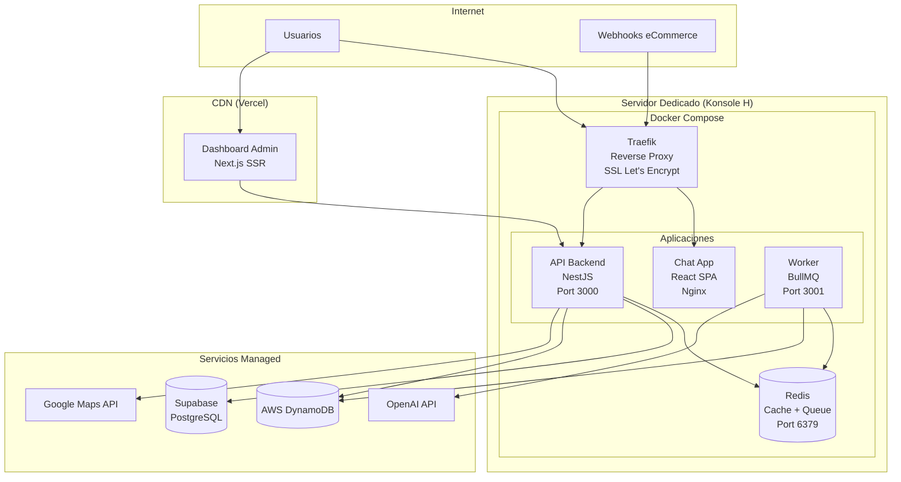

### 4.7 Docker Compose - Configuración

```yaml
# infrastructure/docker/docker-compose.yml
version: '3.8'

services:
  traefik:
    image: traefik:v2.10
    container_name: adresles-traefik
    restart: unless-stopped
    command:
      - "--api.insecure=true"
      - "--providers.docker=true"
      - "--providers.docker.exposedbydefault=false"
      - "--entrypoints.web.address=:80"
      - "--entrypoints.websecure.address=:443"
      - "--certificatesresolvers.letsencrypt.acme.httpchallenge=true"
      - "--certificatesresolvers.letsencrypt.acme.httpchallenge.entrypoint=web"
      - "--certificatesresolvers.letsencrypt.acme.email=${ACME_EMAIL}"
      - "--certificatesresolvers.letsencrypt.acme.storage=/letsencrypt/acme.json"
    ports:
      - "80:80"
      - "443:443"
    volumes:
      - /var/run/docker.sock:/var/run/docker.sock:ro
      - traefik-certificates:/letsencrypt
    networks:
      - adresles-network

  api:
    build:
      context: ../../apps/api
      dockerfile: Dockerfile
    container_name: adresles-api
    restart: unless-stopped
    environment:
      - NODE_ENV=production
      - PORT=3000
      - REDIS_URL=redis://redis:6379
      - SUPABASE_URL=${SUPABASE_URL}
      - SUPABASE_SERVICE_KEY=${SUPABASE_SERVICE_KEY}
      - AWS_REGION=${AWS_REGION}
      - AWS_ACCESS_KEY_ID=${AWS_ACCESS_KEY_ID}
      - AWS_SECRET_ACCESS_KEY=${AWS_SECRET_ACCESS_KEY}
      - GOOGLE_MAPS_API_KEY=${GOOGLE_MAPS_API_KEY}
    labels:
      - "traefik.enable=true"
      - "traefik.http.routers.api.rule=Host(`api.adresles.com`)"
      - "traefik.http.routers.api.entrypoints=websecure"
      - "traefik.http.routers.api.tls.certresolver=letsencrypt"
      - "traefik.http.services.api.loadbalancer.server.port=3000"
    depends_on:
      - redis
    networks:
      - adresles-network

  worker:
    build:
      context: ../../apps/worker
      dockerfile: Dockerfile
    container_name: adresles-worker
    restart: unless-stopped
    environment:
      - NODE_ENV=production
      - REDIS_URL=redis://redis:6379
      - OPENAI_API_KEY=${OPENAI_API_KEY}
      - AWS_REGION=${AWS_REGION}
      - AWS_ACCESS_KEY_ID=${AWS_ACCESS_KEY_ID}
      - AWS_SECRET_ACCESS_KEY=${AWS_SECRET_ACCESS_KEY}
    depends_on:
      - redis
    networks:
      - adresles-network

  web-chat:
    build:
      context: ../../apps/web-chat
      dockerfile: Dockerfile
    container_name: adresles-chat
    restart: unless-stopped
    labels:
      - "traefik.enable=true"
      - "traefik.http.routers.chat.rule=Host(`chat.adresles.com`)"
      - "traefik.http.routers.chat.entrypoints=websecure"
      - "traefik.http.routers.chat.tls.certresolver=letsencrypt"
      - "traefik.http.services.chat.loadbalancer.server.port=80"
    networks:
      - adresles-network

  redis:
    image: redis:7-alpine
    container_name: adresles-redis
    restart: unless-stopped
    volumes:
      - redis-data:/data
    command: redis-server --appendonly yes
    networks:
      - adresles-network

volumes:
  traefik-certificates:
  redis-data:

networks:
  adresles-network:
    driver: bridge
```

### 4.8 Diagramas de Secuencia

#### Secuencia 1: Procesar Compra Mock - Flujo Completo

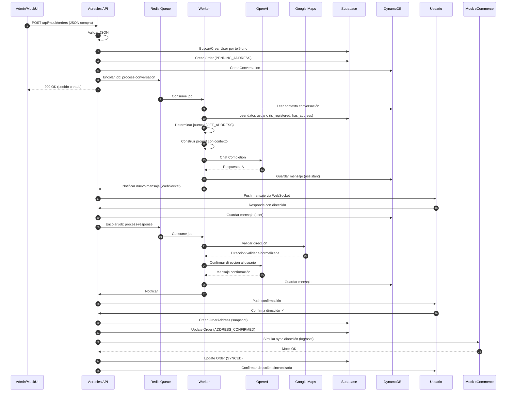

> **Nota**: La Secuencia 2 (Flujo de Reminders) ha sido eliminada, ya que los reminders automáticos no se implementarán en el MVP. Ver sección 1.7 para más detalles.

### 4.9 CI/CD Pipeline (GitHub Actions)

Pipeline simplificado para tu nivel de experiencia, con comentarios explicativos.

```yaml
# .github/workflows/deploy.yml
name: Deploy to Production

# Cuándo ejecutar: al hacer push a main o manualmente
on:
  push:
    branches: [main]
  workflow_dispatch:  # Permite ejecutar manualmente desde GitHub

env:
  REGISTRY: ghcr.io
  IMAGE_PREFIX: ghcr.io/${{ github.repository }}

jobs:
  # Job 1: Ejecutar tests
  test:
    runs-on: ubuntu-latest
    steps:
      - name: Checkout código
        uses: actions/checkout@v4

      - name: Setup Node.js
        uses: actions/setup-node@v4
        with:
          node-version: '20'
          cache: 'pnpm'

      - name: Instalar pnpm
        uses: pnpm/action-setup@v2
        with:
          version: 8

      - name: Instalar dependencias
        run: pnpm install

      - name: Ejecutar linter
        run: pnpm lint

      - name: Ejecutar tests
        run: pnpm test

  # Job 2: Construir y publicar imágenes Docker
  build:
    needs: test  # Solo si tests pasan
    runs-on: ubuntu-latest
    strategy:
      matrix:
        app: [api, worker, web-chat]  # Construir cada app
    
    steps:
      - name: Checkout código
        uses: actions/checkout@v4

      - name: Login a GitHub Container Registry
        uses: docker/login-action@v3
        with:
          registry: ${{ env.REGISTRY }}
          username: ${{ github.actor }}
          password: ${{ secrets.GITHUB_TOKEN }}

      - name: Construir y publicar imagen
        uses: docker/build-push-action@v5
        with:
          context: ./apps/${{ matrix.app }}
          push: true
          tags: |
            ${{ env.IMAGE_PREFIX }}/${{ matrix.app }}:latest
            ${{ env.IMAGE_PREFIX }}/${{ matrix.app }}:${{ github.sha }}

  # Job 3: Desplegar en servidor
  deploy:
    needs: build  # Solo si build pasa
    runs-on: ubuntu-latest
    
    steps:
      - name: Checkout código
        uses: actions/checkout@v4

      - name: Copiar docker-compose al servidor
        uses: appleboy/scp-action@v0.1.4
        with:
          host: ${{ secrets.SERVER_HOST }}
          username: ${{ secrets.SERVER_USER }}
          key: ${{ secrets.SERVER_SSH_KEY }}
          source: "infrastructure/docker/docker-compose.yml"
          target: "/opt/adresles"
          strip_components: 2

      - name: Deploy via SSH
        uses: appleboy/ssh-action@v1.0.0
        with:
          host: ${{ secrets.SERVER_HOST }}
          username: ${{ secrets.SERVER_USER }}
          key: ${{ secrets.SERVER_SSH_KEY }}
          script: |
            cd /opt/adresles
            
            # Login a GitHub Container Registry
            echo ${{ secrets.GITHUB_TOKEN }} | docker login ghcr.io -u ${{ github.actor }} --password-stdin
            
            # Descargar nuevas imágenes
            docker compose pull
            
            # Reiniciar servicios con nuevas imágenes
            docker compose up -d --remove-orphans
            
            # Limpiar imágenes antiguas
            docker image prune -f
            
            # Verificar que todo está corriendo
            docker compose ps
```

#### Secrets necesarios en GitHub

| Secret | Descripción | Ejemplo |
|--------|-------------|---------|
| `SERVER_HOST` | IP o dominio de tu servidor | `123.45.67.89` |
| `SERVER_USER` | Usuario SSH | `deploy` |
| `SERVER_SSH_KEY` | Clave privada SSH | (contenido de ~/.ssh/id_rsa) |

#### Setup inicial en el servidor (una sola vez)

```bash
# 1. Crear usuario para deploy
sudo adduser deploy
sudo usermod -aG docker deploy

# 2. Crear directorio de la aplicación
sudo mkdir -p /opt/adresles
sudo chown deploy:deploy /opt/adresles

# 3. Crear archivo de variables de entorno
cat > /opt/adresles/.env << EOF
ACME_EMAIL=tu@email.com
SUPABASE_URL=https://xxx.supabase.co
SUPABASE_SERVICE_KEY=xxx
AWS_REGION=eu-west-1
AWS_ACCESS_KEY_ID=xxx
AWS_SECRET_ACCESS_KEY=xxx
OPENAI_API_KEY=sk-xxx
GOOGLE_MAPS_API_KEY=xxx
EOF

# 4. Proteger el archivo .env
chmod 600 /opt/adresles/.env

# 5. Configurar SSH key para GitHub Actions
# (añadir clave pública a ~/.ssh/authorized_keys del usuario deploy)
```

### 4.10 Seguridad

#### Capas de Seguridad

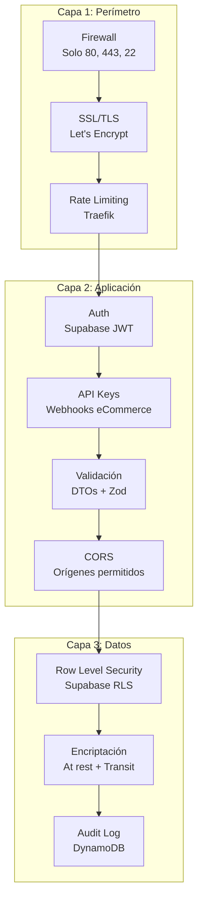

#### Checklist de Seguridad

| Área | Medida | Implementación |
|------|--------|----------------|
| **Red** | Firewall | UFW: solo 80, 443, 22 |
| **Red** | SSL/TLS | Let's Encrypt via Traefik |
| **Red** | Rate limiting | Traefik middleware |
| **Auth** | JWT tokens | Supabase Auth |
| **Auth** | API Keys | Para webhooks de eCommerce |
| **Auth** | Webhook signatures | Validar HMAC de cada plataforma |
| **API** | Input validation | class-validator + Zod |
| **API** | CORS | Whitelist de dominios |
| **API** | Helmet | Headers de seguridad |
| **DB** | Row Level Security | Supabase RLS policies |
| **DB** | Encriptación | Supabase (at rest), TLS (transit) |
| **Secrets** | Variables de entorno | .env en servidor, no en repo |
| **Secrets** | Rotación | API keys rotables |
| **Audit** | Logging | Todos los cambios en AuditLog |
| **Backup** | Base de datos | Supabase automático + DynamoDB PITR |

#### Ejemplo de RLS Policy (Supabase)

```sql
-- Un eCommerce solo puede ver sus tiendas
CREATE POLICY "ecommerce_isolation" ON store
    FOR ALL
    USING (
        ecommerce_id IN (
            SELECT id FROM ecommerce 
            WHERE id = auth.jwt() ->> 'ecommerce_id'
        )
    );

-- Un eCommerce solo puede ver pedidos de sus tiendas
CREATE POLICY "orders_isolation" ON "order"
    FOR ALL
    USING (
        store_id IN (
            SELECT id FROM store 
            WHERE ecommerce_id = auth.jwt() ->> 'ecommerce_id'
        )
    );
```

### 4.11 Monitorización y Observabilidad

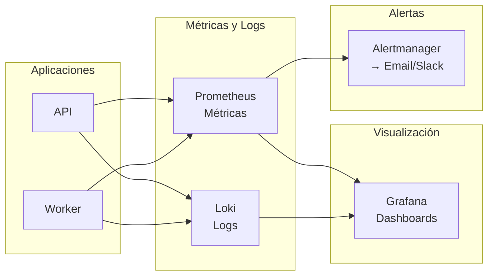

#### Métricas Clave a Monitorizar

| Métrica | Descripción | Alerta si |
|---------|-------------|-----------|
| `http_requests_total` | Total de requests | - |
| `http_request_duration_seconds` | Latencia de requests | p95 > 2s |
| `conversation_messages_total` | Mensajes procesados | - |
| `conversation_completion_time` | Tiempo hasta dirección obtenida | avg > 30min |
| `openai_api_latency` | Latencia de OpenAI | p95 > 10s |
| `openai_api_errors` | Errores de OpenAI | > 5/min |
| `queue_jobs_waiting` | Jobs pendientes | > 100 |
| `queue_jobs_failed` | Jobs fallidos | > 10/hora |

### 4.12 API Endpoints Principales

```yaml
# OpenAPI simplificado
openapi: 3.0.0
info:
  title: Adresles API
  version: 1.0.0

paths:
  # === Webhooks (eCommerce → Adresles) ===
  /webhooks/woocommerce:
    post:
      summary: Recibe pedidos de WooCommerce
      security:
        - webhookSignature: []
      requestBody:
        content:
          application/json:
            schema:
              $ref: '#/components/schemas/WooCommerceOrder'
      responses:
        '200':
          description: Pedido recibido
        '401':
          description: Firma inválida

  # === Conversations ===
  /conversations:
    get:
      summary: Lista conversaciones del usuario
      security:
        - bearerAuth: []
      parameters:
        - name: status
          in: query
          schema:
            type: string
            enum: [ACTIVE, COMPLETED, ESCALATED]
      responses:
        '200':
          description: Lista de conversaciones

  /conversations/{id}/messages:
    get:
      summary: Obtiene mensajes de una conversación
      security:
        - bearerAuth: []
    post:
      summary: Envía mensaje del usuario
      security:
        - bearerAuth: []
      requestBody:
        content:
          application/json:
            schema:
              type: object
              properties:
                content:
                  type: string

  # === Orders (Admin) ===
  /admin/orders:
    get:
      summary: Lista pedidos de la tienda
      security:
        - bearerAuth: []
        - apiKey: []
      parameters:
        - name: store_id
          in: query
          required: true
        - name: status
          in: query

  # === Addresses ===
  /addresses:
    get:
      summary: Lista direcciones del usuario
      security:
        - bearerAuth: []
    post:
      summary: Crea nueva dirección
      security:
        - bearerAuth: []

  /addresses/validate:
    post:
      summary: Valida dirección con Google Maps
      security:
        - bearerAuth: []
      requestBody:
        content:
          application/json:
            schema:
              type: object
              properties:
                address:
                  type: string

components:
  securitySchemes:
    bearerAuth:
      type: http
      scheme: bearer
      bearerFormat: JWT
    apiKey:
      type: apiKey
      in: header
      name: X-API-Key
    webhookSignature:
      type: apiKey
      in: header
      name: X-WC-Webhook-Signature
```

---

## Registro de Decisiones

| Fecha | Decisión | Justificación |
|-------|----------|---------------|
| 30/01/2026 | Uso de GPT-4.0 para conversaciones | Requisito del cliente. Capacidad superior en comprensión de lenguaje natural. |
| 30/01/2026 | App propia en lugar de WhatsApp | Simplifica MVP, evita dependencia de WhatsApp Business API. |
| 30/01/2026 | Teléfono como identificador único | Simplifica onboarding, común en el mercado. Aceptamos limitación de teléfonos compartidos. |
| 30/01/2026 | Google Maps API para validación | Estándar de la industria, cobertura global, normalización consistente. |
| 30/01/2026 | Timeout 15 min + reminders | Balance entre urgencia y no ser intrusivo. |
| 30/01/2026 | Webhook como método principal | Tiempo real, soportado por todas las plataformas target. |
| 30/01/2026 | Fee variable 2.5%-5% | Competitivo para eCommerce, escalable con volumen. |
| 30/01/2026 | WooCommerce primero | Mayor cuota de mercado, comunidad activa, integración bien documentada. |
| 30/01/2026 | Supabase para datos relacionales | Auth integrado, RLS nativo, Realtime, PostgreSQL estándar. |
| 30/01/2026 | DynamoDB para conversaciones | TTL nativo, alto throughput, experiencia AWS del equipo. |
| 30/01/2026 | GiftRecipient sin FK a User | El regalado puede no existir como usuario. Depende solo de Order. |
| 30/01/2026 | Monolito Modular | Velocidad de desarrollo, un solo deploy, fácil extracción futura a microservicios. |
| 30/01/2026 | Node.js + NestJS para backend | TypeScript E2E, ecosistema maduro, buen soporte para WebSockets y colas. |
| 30/01/2026 | Worker separado para conversaciones IA | Aísla carga de OpenAI, permite escalar independientemente, no bloquea API. |
| 30/01/2026 | Redis para cache y colas | BullMQ para jobs, cache de sesiones, PubSub para WebSocket. |
| 30/01/2026 | React + Vite para Chat App | SPA interactiva, no necesita SSR, puede ser PWA. |
| 30/01/2026 | Next.js para Dashboard Admin | SSR para SEO de landing, Server Components para seguridad. |
| 30/01/2026 | Vercel para Dashboard Admin | CDN global, deploy automático, free tier generoso. |
| 30/01/2026 | Servidor dedicado para Backend | Coste fijo predecible, control total, ya disponible (Konsole H). |
| 30/01/2026 | Docker Compose para deployment | Reproducibilidad, facilidad de gestión, apropiado para servidor único. |
| 30/01/2026 | Traefik como reverse proxy | SSL automático con Let's Encrypt, integración nativa con Docker. |
| 30/01/2026 | GitHub Actions para CI/CD | Integración con GitHub, free tier generoso, fácil configuración. |
| 30/01/2026 | pnpm + Turborepo para monorepo | Velocidad de builds, cache compartido, manejo eficiente de workspaces. |

---

## Glosario

| Término | Definición |
|---------|------------|
| **Checkout Adresles** | Proceso de pago simplificado donde el usuario solo proporciona nombre y teléfono |
| **Libreta de Direcciones** | Almacén de direcciones favoritas del usuario en Adresles |
| **Journey** | Flujo de interacción específico según el contexto del usuario |
| **Regalado** | Persona que recibe un pedido como regalo |
| **Reminder** | Mensaje recordatorio enviado cuando el usuario no responde |
| **Webhook** | Notificación HTTP automática del eCommerce a Adresles cuando ocurre un evento |
| **conversation_type** | Tipo de conversación: INFORMATION, GET_ADDRESS, REGISTER, GIFT_NOTIFICATION, SUPPORT |
| **user_type** | Tipo de usuario en la conversación: BUYER (comprador) o RECIPIENT (regalado) |
| **RLS** | Row Level Security - Seguridad a nivel de fila en PostgreSQL/Supabase |
| **TTL** | Time To Live - Tiempo de vida automático para registros en DynamoDB |
| **Monolito Modular** | Arquitectura donde toda la aplicación está en un solo desplegable, pero organizada en módulos con interfaces claras |
| **Worker** | Proceso separado que ejecuta tareas asíncronas (como llamadas a OpenAI) sin bloquear el API principal |
| **BullMQ** | Librería de Node.js para gestión de colas de trabajo basada en Redis |
| **NestJS** | Framework de Node.js para construir aplicaciones backend escalables con TypeScript |
| **Traefik** | Reverse proxy y load balancer moderno con integración nativa de Docker y SSL automático |
| **CI/CD** | Continuous Integration / Continuous Deployment - Automatización de tests y despliegues |
| **Docker Compose** | Herramienta para definir y ejecutar aplicaciones multi-contenedor Docker |
| **JWT** | JSON Web Token - Estándar para autenticación stateless |
| **HMAC** | Hash-based Message Authentication Code - Para validar firmas de webhooks |
| **Reverse Proxy** | Servidor que recibe peticiones y las redirige a los servicios internos apropiados |
| **WebSocket** | Protocolo de comunicación bidireccional en tiempo real sobre TCP |
| **PWA** | Progressive Web App - Aplicación web que puede instalarse como app nativa |
