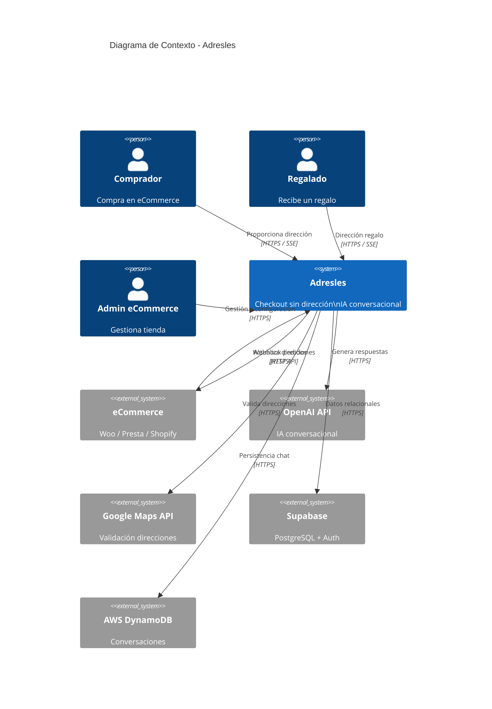
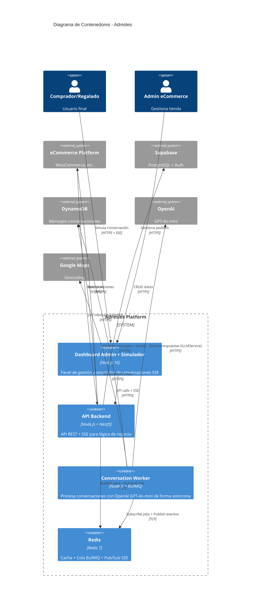
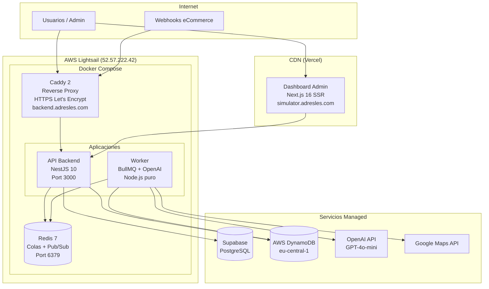
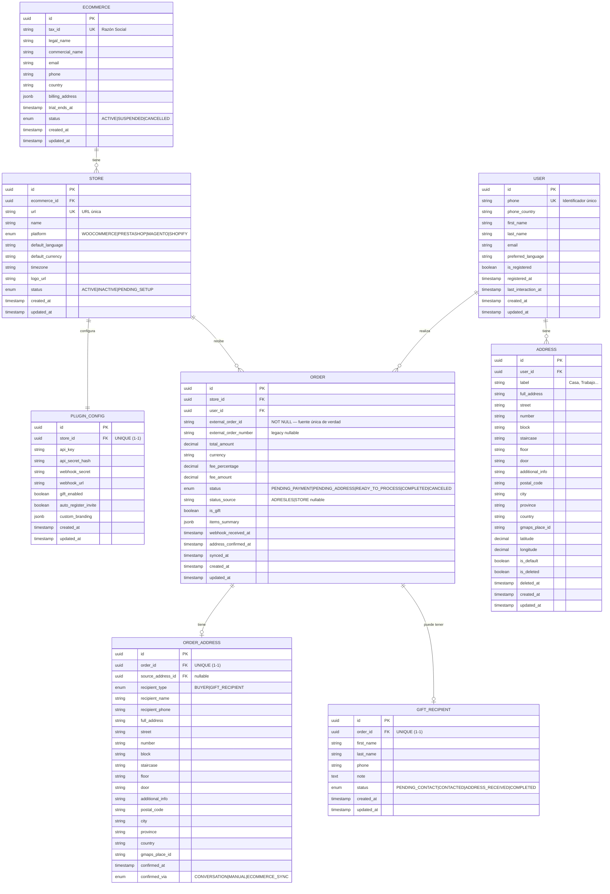
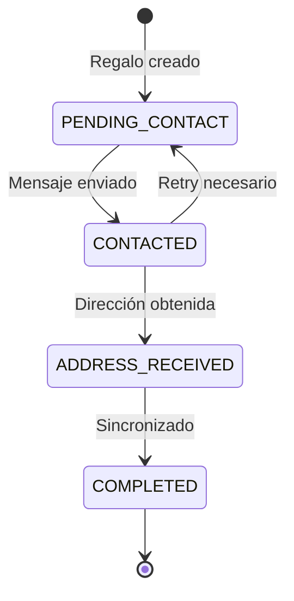

## Índice

0. [Ficha del proyecto](#0-ficha-del-proyecto)
1. [Descripción general del producto](#1-descripción-general-del-producto)
2. [Arquitectura del sistema](#2-arquitectura-del-sistema)
3. [Modelo de datos](#3-modelo-de-datos)
4. [Especificación de la API](#4-especificación-de-la-api)
5. [Historias de usuario](#5-historias-de-usuario)
6. [Tickets de trabajo](#6-tickets-de-trabajo)
7. [Pull requests](#7-pull-requests)

---

## 0. Ficha del proyecto

### **0.1. Tu nombre completo:**

Sergio Valdueza Lozano

### **0.2. Nombre del proyecto:**

ADRESLES

### **0.3. Descripción breve del proyecto:**

Adresles es una plataforma SaaS B2B2C que revoluciona la experiencia de checkout en tiendas online eliminando la fricción más común: la introducción manual de la dirección de entrega. El comprador completa su pedido indicando únicamente nombre y número de teléfono. Un agente conversacional basado en IA (OpenAI GPT-4o-mini) contacta al usuario para obtener la dirección mediante conversación natural, actualizándola automáticamente en el sistema del eCommerce.

**Propuesta de valor central**: "Compra solo con nombre + teléfono, nosotros obtenemos tu dirección conversando contigo"

### **0.4. URL del proyecto:**

https://github.com/SValduezaL/AI4Devs-finalproject

> Repositorio público en GitHub  
> Ramas principales: `finalproject-SVL` (base), `finalproject-SVL-v2` (Monorepo MVP Mock), `finalproject-SVL-v3` (rama de producción activa)

### 0.5. URL o archivo comprimido del repositorio

https://github.com/SValduezaL/AI4Devs-finalproject

> Repositorio público accesible directamente desde GitHub

---

## 1. Descripción general del producto

### **1.1. Objetivo:**

**Propósito**: Eliminar la fricción del checkout en eCommerce reduciendo drásticamente el abandono de carrito causado por formularios largos y tediosos.

**Qué soluciona**:

- **Para el Comprador**: Elimina la tarea de introducir manualmente 12+ campos de dirección en dispositivos móviles o desktop
- **Para el eCommerce**: Reduce el abandono de carrito en el checkout, aumenta la tasa de conversión y mejora significativamente la experiencia de usuario
- **Para tiendas con e-commerce**: Ofrece experiencia omnicanal mejorada y fidelización de clientes

**Valor diferencial**:

1. **Checkout ultra-rápido**: Solo nombre + teléfono (2 campos vs 12 tradicionales)
2. **Conversación natural con IA**: GPT-4o-mini obtiene la dirección mediante diálogo fluido adaptado al usuario
3. **Validación inteligente**: Integración con Google Maps API + detección proactiva de datos faltantes (escalera, bloque, piso, puerta)
4. **Libreta de direcciones centralizada**: El usuario guarda direcciones reutilizables en cualquier eCommerce integrado con Adresles
5. **Funcionalidad de Regalo**: Permite comprar para terceros sin conocer su dirección
6. **Efecto red**: Cuantos más eCommerce usan Adresles, más usuarios tienen dirección pre-guardada
7. **Global desde el inicio**: Multi-idioma y multi-moneda

**Modelo de monetización**: Fee variable por transacción (2.5%-5% inversamente proporcional al importe), con 1 mes de prueba gratuita.

> 📖 **Documentación detallada**: [Adresles_Business.md - Sección 1](./Adresles_Business.md#fase-1-investigación-y-análisis)

### **1.2. Características y funcionalidades principales:**

#### **Para el Comprador (B2C)**

| Función                       | Descripción                                                  | Estado                            |
| ----------------------------- | ------------------------------------------------------------ | --------------------------------- |
| **Checkout Adresles**         | Completar compra solo con nombre y teléfono (sin dirección)  | ✅ Implementado (MVP — `POST /api/mock/orders` modo adresles) |
| **Conversación IA**           | Indicar dirección por chat natural con GPT-4o-mini           | ✅ Implementado (Worker + OpenAI en producción) |
| **Libreta de Direcciones**    | Gestionar direcciones favoritas reutilizables                | ✅ Implementado (sub-journey libreta en Worker + página `/addresses` en Admin) |
| **Modo Regalo**               | Enviar pedido a otra persona sin conocer su dirección        | ✅ Diseñado (pendiente post-MVP)  |
| **Registro Adresles**         | Crear cuenta para persistir preferencias y direcciones       | ✅ Implementado (sub-journey registro voluntario en Worker) |
| **Detección de idioma**       | Conversación automática en el idioma del usuario             | ✅ Diseñado (pendiente post-MVP)  |
| **Validación de direcciones** | Google Maps API normaliza y detecta datos faltantes          | ✅ Implementado (Worker + Google Maps API en producción) |

#### **Para el eCommerce (B2B)**

| Función                   | Descripción                                    | Estado                                      |
| ------------------------- | ---------------------------------------------- | ------------------------------------------- |
| **Plugin de Checkout**    | Integración en el proceso de pago              | 🔄 Pendiente (MVP usa entrada JSON mock)    |
| **Webhook de Compras**    | Recepción automática de pedidos en tiempo real | ✅ Implementado (POST /api/mock/orders)     |
| **Dashboard de Gestión**  | Monitorización de pedidos y conversaciones     | ✅ Implementado (Orders, Users, Simulate con chat SSE) |
| **API de Sincronización** | Actualización de direcciones en el sistema     | 🔄 Mockeado (log estructurado/notificación) |
| **Prueba gratuita**       | 1 mes sin coste para evaluar el servicio       | ✅ Definido en modelo de negocio            |

#### **Para el Sistema (Interno)**

| Función                           | Descripción                                           | Estado                              |
| --------------------------------- | ----------------------------------------------------- | ----------------------------------- |
| **Orquestador de Conversaciones** | Gestión del flujo conversacional con GPT-4o-mini      | ✅ Implementado (Worker BullMQ + `ILLMService` abstracción) |
| **Motor de Journeys**             | Selección automática del flujo según contexto usuario | ✅ Implementado (GET_ADDRESS, INFORMATION; sub-journeys: propuesta dir, registro, libreta) |
| **Sistema de Reminders**          | Recordatorios tras 15 min sin respuesta               | ⏳ Pendiente post-MVP               |
| **Validador de Direcciones**      | Google Maps API + detección datos faltantes           | ✅ Implementado (Worker + Google Maps API en producción) |
| **Escalado a Soporte**            | Envío de incidencias por email cuando IA no resuelve  | ✅ Diseñado                         |
| **Multi-tenant con RLS**          | Aislamiento de datos entre eCommerce                  | ✅ Diseñado (Supabase RLS policies) |

#### **Roadmap de Integraciones**

1. **Fase 0 (MVP actual)**: Integración Mock - Entrada manual JSON
2. **Fase 1**: Plugin WooCommerce real
3. **Fase 2**: PrestaShop
4. **Fase 3**: Magento
5. **Fase 4**: Shopify

> 📖 **Casos de uso detallados**: [Adresles_Business.md - Fase 2](./Adresles_Business.md#fase-2-casos-de-uso)

### **1.3. Diseño y experiencia de usuario:**

#### **User Journeys Principales**

**Journey 1: Compra Tradicional (Usuario NO usa modo Adresles)**

- Usuario completa checkout tradicional con dirección
- Adresles le invita a registrarse para futuras compras más rápidas

**Journey 2: Compra Adresles - Usuario Registrado en Adresles**

- **Con dirección favorita**: Sistema propone dirección guardada, opción de cambiar
- **Sin dirección favorita**: IA solicita nueva dirección

**Journey 3: Compra Adresles - Usuario Registrado solo en eCommerce**

- **Con dirección en eCommerce**: Sistema propone dirección + invitación registro Adresles
- **Sin dirección en eCommerce**: IA solicita dirección + invitación registro Adresles

**Journey 4: Compra Adresles - Usuario Nuevo**

- Usuario no registrado en ningún sistema
- IA solicita dirección + invitación registro Adresles

**Journey 5: Modo Regalo 🎁**

- **Comprador**: Indica nombre + teléfono del destinatario
- **Sistema**: Inicia dos conversaciones paralelas:
    - Con **destinatario** para obtener/confirmar dirección (si registrado, propone su favorita)
    - Con **comprador** para informar del proceso (sin revelar dirección por protección de datos)

#### **Flujo Principal Simplificado**

```
1. Usuario Compra → 2. Checkout Rápido (nombre + teléfono)
                      ↓
3. Adresles Procesa → 4. App Adresles - Conversación IA
                      ↓
5. Dirección Validada (Google Maps) → 6. eCommerce Actualizado
```

#### **Experiencia de Conversación**

La conversación con el agente IA (GPT-4o-mini) incluye:

- **Saludo personalizado** en el idioma del usuario
- **Confirmación de compra** (tienda, productos)
- **Propuesta de dirección** si existe en libreta o eCommerce
- **Solicitud conversacional** de dirección si no existe
- **Validación inteligente** con Google Maps
- **Detección proactiva** de datos faltantes en edificios (piso, puerta, escalera, bloque)
- **Confirmación final** antes de sincronizar con eCommerce
- **Invitación opcional** a registrarse en Adresles

> 📖 **Journeys detallados**: [Adresles_Business.md - Sección 1.6](./Adresles_Business.md#16-user-journeys-detallados)  
> 📖 **Diagramas de secuencia**: [Adresles_Business.md - Sección 4.8](./Adresles_Business.md#48-diagramas-de-secuencia)

> ✅ **Estado actual (marzo 2026)**: MVP completo desplegado en producción. Backend (API + Worker + Redis) en AWS Lightsail con Docker Compose + Caddy HTTPS → `https://backend.adresles.com`. Dashboard Admin en Vercel → `https://simulator.adresles.com`. CI/CD automatizado con GitHub Actions → ECR → SSH. Ver [memory-bank/README.md](./memory-bank/README.md) y [ADR-011](./memory-bank/architecture/011-docker-ecr-lightsail-caddy.md).

### **1.4. Instrucciones de instalación:**

#### **Arquitectura Técnica**

**Stack Tecnológico**:

- **Backend**: Node.js + NestJS + TypeScript
- **Frontend Admin**: Next.js 16 + React 19 + Tailwind v4 + Shadcn/ui
- **Base de Datos**: Supabase (PostgreSQL) + AWS DynamoDB
- **IA Conversacional**: OpenAI GPT-4o-mini (abstracción `ILLMService`)
- **Validación de Direcciones**: Google Maps API (Geocoding)
- **Colas**: Redis + BullMQ
- **Deployment**: Docker Compose + Caddy (reverse proxy con SSL automático vía Let's Encrypt)
- **CI/CD**: GitHub Actions → AWS ECR → SSH
- **Hosting**: AWS Lightsail `backend.adresles.com` (backend) + Vercel `simulator.adresles.com` (dashboard admin)

#### **Estructura del Proyecto (Monorepo Turborepo)**

```
adresles/
├── apps/
│   ├── api/                    # Backend NestJS
│   ├── worker/                 # Worker BullMQ + OpenAI (Node.js puro)
│   └── web-admin/              # Frontend Admin (Next.js 16)
├── packages/
│   ├── prisma-db/              # @adresles/prisma-db — schema, migraciones, seed, cliente Prisma
│   └── shared-types/           # @adresles/shared-types — tipos BullMQ, DTOs compartidos
├── infrastructure/
│   ├── docker/                 # Docker Compose (Redis, DynamoDB Local) — PostgreSQL vía Supabase
│   └── scripts/                # setup-dynamodb.ts, etc.
├── memory-bank/                # Contexto persistente, ADRs, patrones
├── openspec/                   # Specs, changes archivados
└── turbo.json                  # Turborepo config
```

> 📖 **ADR Schema compartido**: [memory-bank/architecture/009-prisma-db-package.md](./memory-bank/architecture/009-prisma-db-package.md)  
> 📖 **ADR Tipos compartidos**: [memory-bank/architecture/007-shared-types-package.md](./memory-bank/architecture/007-shared-types-package.md)

#### **Servicios Externos Requeridos**

| Servicio         | Propósito                                   | Configuración              |
| ---------------- | ------------------------------------------- | -------------------------- |
| **Supabase**     | PostgreSQL + Auth + RLS                     | Cuenta gratuita disponible |
| **AWS DynamoDB** | Mensajes conversacionales (alta volumetría) | Pay-per-request — `adresles-messages-dev` (eu-west-1) y `adresles-messages-prod` (eu-central-1) |
| **OpenAI**       | API GPT-4o-mini para conversaciones (abstracción `ILLMService`) | API Key requerida |
| **Google Maps**  | Geocoding y validación de direcciones       | API Key requerida          |
| **Vercel**       | Hosting Dashboard Admin (`simulator.adresles.com`) | Free tier — producción activa |
| **AWS Lightsail** | Servidor producción (API + Worker + Redis) | `backend.adresles.com` — $12/mes |
| **AWS ECR**      | Registry privado imágenes Docker            | `eu-central-1` — `adresles-api`, `adresles-worker` |

#### **Variables de Entorno**

El proyecto usa **tres archivos `.env`** en la raíz del monorepo según el entorno. API, Worker, Prisma y web-admin los leen como fuente de verdad.

| Archivo | Uso | DynamoDB |
|---------|-----|----------|
| `.env` | Desarrollo local (Docker) | DynamoDB Local (`http://localhost:8000`) |
| `.env.dev` | Dev en AWS | `adresles-messages-dev` (eu-west-1) |
| `.env.prod` | Producción en AWS | `adresles-messages-prod` (eu-central-1) |

**Para activar en local:**
1. Copiar la plantilla: `cp .env.example .env`
2. Editar `.env` en la raíz y rellenar los valores (DB, Redis, AWS, OpenAI, Google Maps, 
`NEXT_PUBLIC_API_URL`).

Variables clave (ver `.env.example` para la lista completa):

```bash
# Database (Prisma, API, Worker)
DATABASE_URL="postgresql://..."
REDIS_URL="redis://localhost:6379"
# AWS / DynamoDB
AWS_REGION="eu-west-1"           # eu-central-1 en prod
AWS_ACCESS_KEY_ID="local"          # IAM user adresles-app-dev / adresles-app-prod
AWS_SECRET_ACCESS_KEY="local"
DYNAMODB_TABLE_NAME="adresles-messages"    # adresles-messages-dev en dev y adresles-messages-prod en prod
# DYNAMODB_ENDPOINT="http://localhost:8000"    # Solo en .env local (DynamoDB Local)
# Worker
OPENAI_API_KEY="sk-xxx"
GOOGLE_MAPS_API_KEY="xxx"
# Web Admin
NEXT_PUBLIC_API_URL="http://localhost:3000"
```

> **Seguridad**: Cada entorno tiene su propio IAM User (`adresles-app-dev`, `adresles-app-prod`) con permisos limitados exclusivamente a su tabla (`PutItem`, `GetItem`, `Query`, `UpdateItem`). Los archivos `.env.dev` y `.env.prod` **no deben comitearse** al repositorio.

#### **Instalación**

```bash
# 1. Clonar repositorio
git clone https://github.com/SValduezaL/AI4Devs-finalproject.git
cd AI4Devs-finalproject

# 2. Instalar dependencias (pnpm requerido)
pnpm install

# 3. Configurar variables de entorno
# Copiar .env.example a .env en la raíz y rellenar (ver sección anterior)

# 4. Iniciar servicios con Docker Compose (Redis, DynamoDB Local). PostgreSQL se usa vía Supabase (.env).
docker compose -f infrastructure/docker/docker-compose.yml up -d

# 5. Configurar DynamoDB Local (tabla según DYNAMODB_TABLE_NAME en .env; por defecto adresles-messages)
pnpm dynamo:setup

# 5b. [Opcional] Validar conexión a DynamoDB en AWS
pnpm dynamo:validate:dev    # Verifica escritura/lectura en adresles-messages-dev (eu-west-1)
pnpm dynamo:validate:prod   # Verifica escritura/lectura en adresles-messages-prod (eu-central-1)

# 6. Generar cliente Prisma (packages/prisma-db)
pnpm db:generate

# 7. Ejecutar migraciones (desde packages/prisma-db)
pnpm db:migrate

# 8. Cargar datos de prueba (ecommerce + store mock)
pnpm db:seed

# 9. Iniciar aplicaciones en modo desarrollo (Turborepo resuelve dependencias)
pnpm dev
# O por separado:
pnpm --filter api dev          # http://localhost:3000
pnpm --filter worker dev       # (background)
pnpm --filter web-admin dev    # http://localhost:3001

# Ejecutar tests
pnpm test                     # Todos los workspaces
pnpm --filter api test        # Solo API
pnpm --filter worker test     # Solo Worker
pnpm --filter api test:cov    # API con cobertura
```

#### **Deployment en Producción**

El backend se despliega en **AWS Lightsail** con Docker Compose. El frontend Admin en **Vercel**.

```
API:    https://backend.adresles.com     → AWS Lightsail (52.57.222.42)
Admin:  https://simulator.adresles.com  → Vercel
```

El CI/CD (`.github/workflows/deploy.yml`) se activa con push a `main`:
1. Build y push imágenes a AWS ECR (`eu-central-1`)
2. SSH al servidor → `docker compose pull` + `docker compose up -d`

#### **Despliegue manual a producción (desde local)**

Este procedimiento replica el pipeline de `.github/workflows/deploy.yml` pero ejecutándolo manualmente desde tu máquina (para ECR/Lightsail) y con un `git push` (para Vercel). No incluye secretos: los valores sensibles deben estar configurados en tu entorno o existir en el servidor.

##### 1) Publicar imágenes backend y worker en AWS ECR

En la raíz del monorepo:

```bash
AWS_REGION="eu-central-1"
AWS_ACCOUNT_ID="<TU_AWS_ACCOUNT_ID>"
ECR_REGISTRY="$AWS_ACCOUNT_ID.dkr.ecr.eu-central-1.amazonaws.com"
IMAGE_TAG="$(git rev-parse HEAD)"

# Asegúrate de tener un profile AWS configurado con permisos de ECR (por ejemplo, el profile del IAM user deploy).
aws ecr get-login-password --region "$AWS_REGION" --profile "<TU_PROFILE_AWS_ECR>" |
  docker login --username AWS --password-stdin "$ECR_REGISTRY"

docker build -f apps/api/Dockerfile \
  -t "$ECR_REGISTRY/adresles-api:$IMAGE_TAG" \
  -t "$ECR_REGISTRY/adresles-api:latest" \
  .

docker push "$ECR_REGISTRY/adresles-api:$IMAGE_TAG"
docker push "$ECR_REGISTRY/adresles-api:latest"

docker build -f apps/worker/Dockerfile \
  -t "$ECR_REGISTRY/adresles-worker:$IMAGE_TAG" \
  -t "$ECR_REGISTRY/adresles-worker:latest" \
  .

docker push "$ECR_REGISTRY/adresles-worker:$IMAGE_TAG"
docker push "$ECR_REGISTRY/adresles-worker:latest"
```

##### 2) Actualizar Lightsail (pull + up) con Docker Compose

Entra al servidor y levanta el stack:

```bash
ssh -i "<ruta_a_tu_adresles-prod.pem>" ubuntu@<LIGHTSAIL_HOST>

cd ~/adresles-prod

# `ECR_REGISTRY` se toma del .env del servidor (~/adresles-prod/.env).
ECR_REGISTRY="$(sed -n 's/^ECR_REGISTRY=//p' .env)"

aws ecr get-login-password --region eu-central-1 |
  docker login --username AWS --password-stdin "$ECR_REGISTRY"

docker compose pull
docker compose up -d --remove-orphans
docker compose ps
docker image prune -f
```

> Nota: asegúrate de que existen en el servidor `~/adresles-prod/docker-compose.yml` (copia del `docker-compose.prod.yml` del repo), `~/adresles-prod/Caddyfile` y `~/adresles-prod/.env.prod` (secrets reales; no comiteados).

##### 3) Publicar el frontend Admin en Vercel

Para que Vercel despliegue el frontend, empuja a la rama configurada como “Production Branch” en el proyecto de Vercel (por defecto, en este repo se documentó `finalproject-SVL-v3`, pero ya está configurado para que sólo despliegue los cambios en `main`):

Si el despliegue que contiene tus cambios queda como “Preview”, en Vercel debes hacer **Promote to Production** para que `simulator.adresles.com` apunte a esa versión.

> Ver [ADR-011](./memory-bank/architecture/011-docker-ecr-lightsail-caddy.md) para la arquitectura completa de producción.

> 📖 **Arquitectura completa**: [Adresles_Business.md - Fase 4](./Adresles_Business.md#fase-4-diseño-de-alto-nivel)  
> 📖 **Stack detallado**: [memory-bank/project-context/tech-stack.md](./memory-bank/project-context/tech-stack.md)  
> 📖 **Memory-Bank (índice)**: [memory-bank/README.md](./memory-bank/README.md)  
> 📖 **Docker Compose dev**: [infrastructure/docker/docker-compose.yml](./infrastructure/docker/docker-compose.yml)  
> 📖 **Docker Compose prod**: [infrastructure/docker/docker-compose.prod.yml](./infrastructure/docker/docker-compose.prod.yml)

---

## 2. Arquitectura del Sistema

### **2.1. Diagrama de arquitectura:**

#### **Patrón Arquitectónico: Monolito Modular**

Se ha elegido una arquitectura de **Monolito Modular** con separación clara de responsabilidades, siguiendo principios de Domain-Driven Design (DDD).

**Justificación**:

- ✅ **Velocidad de desarrollo**: Un solo repositorio, despliegue simplificado
- ✅ **Coste optimizado**: Aprovecha servidor dedicado existente + servicios managed
- ✅ **Escalabilidad futura**: Módulos con interfaces claras, fácil extracción a microservicios
- ✅ **Apropiado para MVP**: Menor complejidad operacional, ideal para validar producto

**Trade-offs**:

- ⚠️ **Escalado horizontal**: Requiere escalar toda la aplicación (no componentes individuales)
- ⚠️ **Acoplamiento potencial**: Requiere disciplina para mantener módulos independientes
- ✅ **Mitigación**: Bounded contexts claros, interfaces bien definidas, repository pattern

#### **Diagrama C4 - Nivel 1: Contexto del Sistema**



#### **Diagrama C4 - Nivel 2: Contenedores**



**Principios Arquitectónicos Aplicados**:

| Principio                  | Aplicación en Adresles                                                               |
| -------------------------- | ------------------------------------------------------------------------------------ |
| **Separación de concerns** | Módulos independientes por dominio (Conversations, Orders, Addresses, Users, Stores) |
| **Dependency Inversion**   | Repositorios abstraídos, servicios inyectables con NestJS DI                         |
| **Event-Driven**           | Colas BullMQ para procesamiento asíncrono de conversaciones                          |
| **API-First**              | Contratos OpenAPI definidos antes de implementación                                  |
| **Infrastructure as Code** | Docker Compose para reproducibilidad                                                 |

> 📖 **Diagramas C4 completos**: [Adresles_Business.md - Secciones 4.2-4.4](./Adresles_Business.md#42-diagrama-c4---nivel-1-contexto-del-sistema)  
> 📖 **ADR Arquitectura**: [memory-bank/architecture/001-monolith-modular.md](./memory-bank/architecture/001-monolith-modular.md)  
> 📖 **ADRs 005-009 (BullMQ, SSE, shared-types, prisma-db)**: [memory-bank/README.md#-decisiones-arquitecturales-adrs](./memory-bank/README.md#-decisiones-arquitecturales-adrs)  
> 📖 **ADR-011 (Docker + ECR + Lightsail + Caddy)**: [memory-bank/architecture/011-docker-ecr-lightsail-caddy.md](./memory-bank/architecture/011-docker-ecr-lightsail-caddy.md)

### **2.2. Descripción de componentes principales:**

#### **Backend - API (NestJS)**

**Tecnología**: Node.js + NestJS 10 + TypeScript  
**Puerto**: 3000  
**URL producción**: `https://backend.adresles.com`  
**Responsabilidades**:

- Endpoints REST para gestión de pedidos, direcciones, usuarios
- Server-Sent Events (SSE) para comunicación en tiempo real (Redis Pub/Sub)
- Orquestación de conversaciones (Journey Engine) — encola jobs BullMQ
- Gestión de webhooks desde eCommerce (mockeados en MVP)

**Módulos principales**:

- `mock/`: `POST /api/mock/orders` — orquestación por modo (adresles / tradicional); `POST /api/mock/conversations/:id/reply` — respuesta del usuario (persiste mensaje en DynamoDB + encola job); `GET /api/mock/conversations/:id/events` — SSE en tiempo real (Redis Pub/Sub)
- `orders/`: Gestión del ciclo de vida de pedidos, cálculo de fee y `ExternalOrderIdService` (generación determinista de IDs por plataforma)
- `users/`: Búsqueda o creación de usuario por teléfono E.164
- `conversations/`: Creación de conversación y encola job BullMQ
- `stores/`: Búsqueda o creación de tienda por URL
- `ecommerce-sync/`: Simulación de sincronización con eCommerce (mock)
- `admin/`: Endpoints de visualización para el dashboard admin (`GET /admin/orders`, `GET /admin/users`, `GET /admin/stores`, `GET /admin/addresses`, `GET /admin/conversations/:id/messages`)
- `queue/`: Configuración de BullMQ (cola `process-conversation` y `process-response`)
- `prisma/`: Módulo de acceso a base de datos (Prisma desde `@adresles/prisma-db`)

> 📖 **ADR SSE + Redis Pub/Sub**: [memory-bank/architecture/006-sse-redis-pubsub.md](./memory-bank/architecture/006-sse-redis-pubsub.md)

#### **Worker - Conversation Processor (BullMQ)**

**Tecnología**: Node.js puro (sin NestJS) + BullMQ + TypeScript  
**Responsabilidades**:

- Procesamiento asíncrono de jobs de conversación
- Llamadas a OpenAI GPT-4o-mini para generar respuestas (vía abstracción `ILLMService`)
- Máquina de estados de 9 fases para el journey conversacional
- Validación y normalización de direcciones con Google Maps API
- Formateo Markdown de respuestas del asistente

**Procesadores y servicios principales**:

- `processors/conversation.processor.ts`: Consume colas `process-conversation` y `process-response`; journeys `GET_ADDRESS` (llama a OpenAI, guarda en DynamoDB, publica en Redis), `INFORMATION` (confirmación de compra tradicional con formato Markdown); sub-journeys: propuesta de dirección guardada (2.1/2.3), registro voluntario (3.x), libreta de direcciones (offerSaveAddress, WAITING_SAVE_ADDRESS_LABEL). Patrón single-writer: solo el Worker persiste mensajes del usuario (API encola sin reescribir)
- `services/address.service.ts`: Integración con Google Maps API — valida dirección, detecta edificios (solicita datos adicionales como piso/puerta), confirma y sincroniza; interpreta intenciones del usuario (registro, guardar dirección)
- `llm/llm.interface.ts`: Contrato `ILLMService` con 3 métodos: `generateMessage`, `extractAddress`, `interpretIntent`
- `llm/openai-llm.service.ts`: Implementación con OpenAI `gpt-4o-mini` (temperature 0.7, max_tokens 500)
- `llm/mock-llm.service.ts`: Implementación sin red para tests y desarrollo sin API key
- `dynamodb/dynamodb.service.ts`: Escritura y lectura de mensajes en DynamoDB (tabla configurable vía `DYNAMODB_TABLE_NAME`)
- `redis-publisher.ts`: Publica eventos en Redis (`conversation:{id}:update`) para SSE

> 📖 **ADR BullMQ + Worker**: [memory-bank/architecture/005-bullmq-worker-conversations.md](./memory-bank/architecture/005-bullmq-worker-conversations.md)  
> 📖 **Patrones Worker**: [memory-bank/patterns/worker-testing-patterns.md](./memory-bank/patterns/worker-testing-patterns.md)

#### **Frontend - Chat App (React + Vite) — No implementada en MVP**

> La Chat App (`apps/web-chat/`) fue planificada pero **no implementada** en el MVP. La funcionalidad de simulación de conversaciones se integró directamente en el Dashboard Admin (`/simulate`), eliminando la necesidad de una aplicación separada para el MVP.

#### **Frontend - Dashboard Admin (Next.js)**

**Tecnología**: Next.js 16.1.6 + React 19 + Tailwind v4 + Shadcn/ui  
**Puerto**: 3001 (dev)  
**URL producción**: `https://simulator.adresles.com` (Vercel)  
**Responsabilidades**:

- Panel de visualización para administradores de eCommerce
- Tabla de pedidos con ordenación, filtros (estado, modo, fecha, búsqueda) y enlace a chat
- Tabla de usuarios con ordenación, filtros (registro, búsqueda) y tooltips accesibles
- **Tabla de direcciones** (`/addresses`) con ordenación, búsqueda, filtro de favoritas y chips de filtros activos
- Visor de chat con burbujas por rol, **renderizado Markdown** (`react-markdown` + `remark-breaks`), metadatos de conversación y banner TTL
- **Simulador** (`/simulate`): Configuración de pedido mock con **smart defaults** (preselección de tienda/usuario, filtro por tienda), chat en vivo con SSE, indicador de escritura, badges de estado

**Stack**:

- **Rendering**: Server Components + Client Components (mínimo client side)
- **Estilos**: Tailwind v4 CSS-first (`@theme` en `globals.css`); tokens de marca `brand-black`, `brand-lime`, `brand-teal`
- **UI Components**: Shadcn/ui (Radix UI)
- **Chat Markdown**: `react-markdown` 9.x + `remark-gfm` + `remark-breaks` (componente `MarkdownMessage`)
- **Accesibilidad**: WCAG 2.1 AA (`aria-label`, `scope="col"`, `role="log"`, tooltips, `focus-visible`)
- **Deployment**: Vercel (free tier) — `simulator.adresles.com`

#### **Base de Datos - Arquitectura Híbrida**

**Supabase (PostgreSQL)**  
**Propósito**: Datos relacionales con integridad referencial  
**Tablas principales**:

- `ecommerce`: Razón social de eCommerce
- `store`: Tiendas (identificadas por URL única)
- `user`: Usuarios (identificador único: teléfono)
- `address`: Libreta de direcciones
- `order`: Pedidos
- `order_address`: Snapshot inmutable de dirección en pedido
- `gift_recipient`: Datos de destinatario en modo regalo

**Ventajas**:

- Auth integrado (JWT)
- Row Level Security (RLS) para multi-tenant
- Realtime subscriptions
- PostgreSQL estándar (SQL completo)

**AWS DynamoDB**  
**Propósito**: Mensajes conversacionales (alta volumetría, TTL automático)  
**Tabla implementada**: `adresles-messages` (local) / `adresles-messages-dev` (AWS eu-west-1) / `adresles-messages-prod` (AWS eu-central-1)

| Atributo | Tipo | Rol |
|----------|------|-----|
| `conversationId` | String | **Partition Key (PK)** — UUID de la conversación |
| `messageId` | String | **Sort Key (SK)** — timestamp dinámico o valor reservado `__state__` |
| `role` | String | `'system'` / `'user'` / `'assistant'` |
| `content` | String | Texto del mensaje |
| `timestamp` | String | ISO 8601 |
| `expiresAt` | Number | **TTL automático** (Unix timestamp, 90 días) |
| `state` | String | JSON del estado del Worker (solo cuando `messageId = '__state__'`) |

**Entornos y acceso**:

| Entorno | Tabla | Región | IAM User |
|---------|-------|--------|----------|
| Local (Docker) | `adresles-messages` | — | credenciales ficticias |
| Dev | `adresles-messages-dev` | `eu-west-1` | `adresles-app-dev` |
| Prod | `adresles-messages-prod` | `eu-central-1` | `adresles-app-prod` |

**Ventajas**:

- TTL nativo (90 días para mensajes, configurable en código)
- Alto throughput para escrituras
- Pay-per-request (coste optimizado)
- Mínimo privilegio: cada IAM User solo accede a su tabla

> 📖 **ADR Base de Datos**: [memory-bank/architecture/002-supabase-dynamodb.md](./memory-bank/architecture/002-supabase-dynamodb.md)

#### **Servicios Externos**

**OpenAI GPT-4o-mini (vía abstracción `ILLMService`)**  
**Propósito**: Motor de conversación inteligente  
**Uso**: Generación de respuestas naturales (`generateMessage`), extracción de direcciones (`extractAddress`), detección de intenciones (`interpretIntent`)  
**Abstracción**: `ILLMService` permite intercambiar la implementación (OpenAI, Mock) sin modificar el procesador de conversaciones

**Google Maps API (Geocoding)**  
**Propósito**: Validación y normalización de direcciones  
**Uso**: Validación de direcciones, normalización de formato, obtención de coordenadas

**Redis**  
**Propósito**: Cache + Cola de mensajes + Bus de eventos  
**Uso**: BullMQ jobs (process-conversation, process-response), Redis Pub/Sub para SSE (Worker → API → Frontend)

> 📖 **Stack completo**: [memory-bank/project-context/tech-stack.md](./memory-bank/project-context/tech-stack.md)

### **2.3. Descripción de alto nivel del proyecto y estructura de ficheros**

#### **Estructura del Proyecto (Monorepo con pnpm + Turborepo)**

```
adresles/
├── apps/                              # Aplicaciones
│   ├── api/                           # Backend NestJS
│   │   ├── src/
│   │   │   ├── admin/                 # AdminModule — dashboard endpoints (orders, users, stores, conversations)
│   │   │   ├── conversations/        # ConversationsService — crea y encola
│   │   │   ├── ecommerce-sync/       # EcommerceSyncService — sync mock
│   │   │   ├── mock/                 # MockOrdersController, MockConversationsController, MockSseService
│   │   │   │                         # POST /api/mock/orders, POST .../reply, GET .../events (SSE)
│   │   │   ├── orders/               # OrdersService — ciclo de vida + fee
│   │   │   ├── prisma/               # PrismaService (importa @adresles/prisma-db)
│   │   │   ├── queue/                # BullMQ — colas process-conversation / process-response
│   │   │   ├── stores/               # StoresService — findOrCreate por URL
│   │   │   ├── users/                # UsersService — findOrCreate por teléfono E.164
│   │   │   ├── app.module.ts
│   │   │   └── main.ts
│   │   ├── prisma.config.ts          # Apunta a packages/prisma-db
│   │   └── package.json
│   │
│   ├── worker/                        # Worker BullMQ + OpenAI (Node.js puro)
│   │   ├── src/
│   │   │   ├── processors/
│   │   │   │   └── conversation.processor.ts  # Journeys, sub-journeys, máquina de 9 fases
│   │   │   ├── services/
│   │   │   │   └── address.service.ts          # Google Maps API + interpretación de intenciones
│   │   │   ├── llm/                             # Abstracción LLM (ADR-004 actualizado)
│   │   │   │   ├── llm.interface.ts            # Contrato ILLMService
│   │   │   │   ├── openai-llm.service.ts       # Implementación GPT-4o-mini
│   │   │   │   └── mock-llm.service.ts         # Implementación sin red (tests)
│   │   │   ├── dynamodb/
│   │   │   │   └── dynamodb.service.ts         # Tabla configurable por DYNAMODB_TABLE_NAME (TTL 90d)
│   │   │   ├── redis-publisher.ts               # Publica en Redis para SSE
│   │   │   └── main.ts                          # Instancia OpenAI o Mock según OPENAI_API_KEY
│   │   ├── Dockerfile                 # Multi-stage build (builder + runner Alpine)
│   │   └── package.json              # prisma.schema → @adresles/prisma-db
│   │
│   └── web-admin/                     # Frontend Admin (Next.js 16)
│       ├── src/
│       │   ├── app/
│       │   │   ├── globals.css
│       │   │   ├── layout.tsx
│       │   │   ├── page.tsx           # Redirect a /orders
│       │   │   ├── orders/            # Tabla pedidos + ordenación + filtros
│       │   │   ├── users/             # Tabla usuarios + ordenación + filtros
│       │   │   ├── addresses/         # Tabla direcciones + ordenación + filtros + favoritas
│       │   │   ├── simulate/          # Simulador de chat (config + chat SSE + smart defaults)
│       │   │   └── conversations/[conversationId]/  # Visor de chat con burbujas Markdown
│       │   ├── components/
│       │   │   ├── ui/                # Shadcn/ui
│       │   │   ├── layout/            # Sidebar, Providers
│       │   │   ├── orders/            # OrdersTable, filtros, badges
│       │   │   ├── users/             # UsersTable, filtros, RelativeDateCell
│       │   │   ├── addresses/         # AddressesTable, filtros, badges favorita
│       │   │   ├── simulate/          # OrderConfigModal, SimulationChat, UserCombobox
│       │   │   └── chat/              # ChatView, ChatBubble, MarkdownMessage, ChatExpiryBanner
│       │   ├── lib/
│       │   └── types/
│       └── package.json
│
├── packages/
│   ├── prisma-db/                     # @adresles/prisma-db
│   │   ├── schema.prisma              # Fuente única de verdad
│   │   ├── migrations/
│   │   ├── generated/                 # Cliente Prisma
│   │   ├── seed.ts
│   │   └── package.json
│   └── shared-types/                   # @adresles/shared-types
│       ├── src/index.ts               # ProcessConversationJobData, ProcessResponseJobData, MockOrderContext
│       └── package.json
│
├── infrastructure/
│   ├── docker/
│   │   ├── docker-compose.yml             # Dev local: Redis, DynamoDB Local (PostgreSQL vía Supabase)
│   │   ├── docker-compose.prod.yml        # Producción: api, worker, redis, caddy
│   │   └── Caddyfile                      # Reverse proxy — backend.adresles.com HTTPS
│   ├── iam/
│   │   ├── policy-adresles-app-dev.json   # Política IAM mínima para adresles-app-dev
│   │   └── policy-adresles-app-prod.json  # Política IAM mínima para adresles-app-prod
│   └── scripts/
│       ├── setup-dynamodb.ts              # Crea la tabla en DynamoDB Local (nombre desde DYNAMODB_TABLE_NAME en .env)
│       └── validate-dynamodb-aws.ts       # Valida conexión y escritura en AWS
│
├── memory-bank/                       # Contexto persistente
│   ├── project-context/               # overview, tech-stack, domain-glossary
│   ├── architecture/                  # ADRs 001-011 (incluye 010-DynamoDB AWS, 011-Docker+ECR+Lightsail+Caddy)
│   ├── patterns/                      # validation, real-time-sse, frontend-form, prisma-shared, worker-testing,
│   │                                  # admin-table-page, conversation-message-single-writer, chat-markdown
│   ├── sessions/                      # 27 sesiones documentadas (2026-02-18 a 2026-03-16)
│   └── references/
│       └── business-doc-map.md
│
├── openspec/
│   ├── specs/                         # Estándares, data-model
│   └── changes/archive/              # Changes completados (CU-01, CU-02, T01-T03, CU03-A1-A6, CU03-B1-B4, infra,
│                                      # llm-service-abstraction, fix-information-journey, admin-addresses-page,
│                                      # external-order-id-coherence, chat-markdown-rendering, smart-defaults, ...)
│
├── apps/api/Dockerfile                # Multi-stage build (builder Alpine + runner Alpine + openssl)
├── apps/worker/Dockerfile             # Multi-stage build (builder Alpine + runner Alpine + openssl)
├── .env                               # Desarrollo local (DynamoDB Local + Docker)
├── .env.dev                           # Dev en AWS (adresles-messages-dev, eu-west-1) — no comitear
├── .env.prod                          # Prod en AWS (adresles-messages-prod, eu-central-1) — no comitear
├── .env.example                       # Plantilla de variables para desarrollo local (sí comitear)
├── .env.prod.example                  # Plantilla de variables para producción (sí comitear)
├── .dockerignore                      # Optimiza contexto de build Docker
├── .github/
│   └── workflows/
│       └── deploy.yml                 # CI/CD: ECR push + SSH deploy a Lightsail
├── package.json                       # Scripts: dev, build, db:generate, db:migrate, db:seed, dynamo:setup, dynamo:validate:dev/prod
├── pnpm-workspace.yaml
├── turbo.json
├── Adresles_Business.md
└── readme.md                          # Este archivo
```

> 📖 **Memory-Bank (índice)**: [memory-bank/README.md](./memory-bank/README.md)  
> 📖 **Patrón Prisma compartido**: [memory-bank/patterns/prisma-shared-package-patterns.md](./memory-bank/patterns/prisma-shared-package-patterns.md)  
> 📖 **Patrón SSE**: [memory-bank/patterns/real-time-sse-patterns.md](./memory-bank/patterns/real-time-sse-patterns.md)

#### **Patrón de Organización: Domain-Driven Design (DDD)**

El backend sigue principios de DDD con **Bounded Contexts** claros:

| Dominio           | Responsabilidad                                        | Módulo                   |
| ----------------- | ------------------------------------------------------ | ------------------------ |
| **Conversations** | 🎯 Núcleo del sistema - Orquestación conversaciones IA | `modules/conversations/` |
| **Orders**        | Gestión del ciclo de vida de pedidos                   | `modules/orders/`        |
| **Addresses**     | Validación, normalización y gestión de direcciones     | `modules/addresses/`     |
| **Users**         | Identidad, autenticación y perfiles                    | `modules/users/`         |
| **Stores**        | Configuración de tiendas y eCommerce                   | `modules/stores/`        |

**Ventajas de esta estructura**:

- ✅ Separación clara de responsabilidades
- ✅ Fácil localización de código por funcionalidad
- ✅ Extracción futura a microservicios sin refactoring mayor
- ✅ Onboarding rápido de nuevos desarrolladores

> 📖 **Estructura completa**: [Adresles_Business.md - Sección 4.5](./Adresles_Business.md#45-estructura-del-proyecto)  
> 📖 **Backend Standards**: [/.cursor/rules/backend-standards.mdc](./.cursor/rules/backend-standards.mdc)  
> 📖 **Changes archivados**: [openspec/changes/archive/](./openspec/changes/archive/) — CU-01, CU-02, T01-T03, CU03-A1-A6, CU03-B1-B4, infra, llm-service-abstraction, admin-addresses-page, external-order-id-coherence, chat-markdown-rendering y más

### **2.4. Infraestructura y despliegue**

#### **Diagrama de Infraestructura**



#### **Componentes de Infraestructura**

**Caddy 2 (Reverse Proxy)**

- **Función**: Enrutamiento de tráfico, HTTPS automático con Let's Encrypt
- **Puertos**: 80 (HTTP → redirect 443), 443 (HTTPS TLS 1.3)
- **Configuración**: `Caddyfile` → `backend.adresles.com` → `reverse_proxy api:3000`
- **Ventajas**: Zero-config HTTPS, renovación automática de certificados, mínima configuración

**AWS Lightsail (Servidor de Producción)**

- **Plan**: `small_3_0` — 2 GB RAM, 2 vCPU, $12/mes
- **Sistema Operativo**: Ubuntu 22.04 LTS
- **IP estática**: `52.57.222.42`
- **Servicios alojados**: API Backend, Worker, Redis, Caddy (todos vía Docker Compose)
- **Ventaja**: Coste fijo predecible, IP estática incluida, integración nativa con ECR

**AWS ECR (Container Registry)**

- **Repositorios**: `adresles-api`, `adresles-worker` (privados)
- **Región**: `eu-central-1`
- **Flujo**: GitHub Actions build → push ECR → SSH deploy Lightsail

**Vercel (Frontend Admin)**

- **Plan**: Free tier
- **URL**: `simulator.adresles.com`
- **Características**: CDN global, deploy automático desde Git, SSL incluido
- **Ventaja**: SSR optimizado para Next.js, zero-config

#### **Proceso de Despliegue (CI/CD con GitHub Actions)**

**Pipeline Automatizado** (`.github/workflows/deploy.yml`):

1. **Trigger**: Push a rama `main`
2. **Step 1 - ECR Login**: Autenticación con AWS ECR (`eu-central-1`) usando IAM user `Cursor-Deployer`
3. **Step 2 - Build & Push**: Construye imágenes Docker multi-stage y las publica en AWS ECR (`adresles-api`, `adresles-worker`)
4. **Step 3 - SSH Deploy**: Conecta al servidor Lightsail (`52.57.222.42`) vía SSH, ejecuta `docker compose pull` + `docker compose up -d` + limpieza de imágenes

**Comandos en servidor**:

```bash
# En servidor Lightsail (vía GitHub Actions SSH)
cd ~/adresles-prod
aws ecr get-login-password --region eu-central-1 | docker login --username AWS --password-stdin $ECR_REGISTRY
docker compose pull
docker compose up -d --remove-orphans
docker image prune -f
```

**Secrets requeridos en GitHub**:

- `AWS_ACCOUNT_ID`, `AWS_ACCESS_KEY_ID`, `AWS_SECRET_ACCESS_KEY`: Credenciales IAM para ECR
- `LIGHTSAIL_HOST`: IP del servidor (`52.57.222.42`)
- `LIGHTSAIL_SSH_KEY`: Clave privada SSH para usuario `ubuntu`

> 📖 **ADR-011 (Despliegue producción)**: [memory-bank/architecture/011-docker-ecr-lightsail-caddy.md](./memory-bank/architecture/011-docker-ecr-lightsail-caddy.md)  
> 📖 **Pipeline YAML**: [.github/workflows/deploy.yml](./.github/workflows/deploy.yml)  
> 📖 **Docker Compose prod**: [infrastructure/docker/docker-compose.prod.yml](./infrastructure/docker/docker-compose.prod.yml)

### **2.5. Seguridad**

#### **Capas de Seguridad**

**Capa 1: Perímetro**

- **Firewall**: UFW configurado, solo puertos 80, 443, 22 abiertos
- **SSL/TLS**: Certificados Let's Encrypt renovados automáticamente vía Caddy 2 (TLS 1.3)
- **HTTPS forzado**: Caddy redirige automáticamente HTTP → HTTPS

**Capa 2: Aplicación**

- **Autenticación**: JWT tokens gestionados por Supabase Auth (planificado para post-MVP)
- **API Keys**: Para webhooks de eCommerce (validación HMAC, planificado)
- **Validación de entrada**: DTOs con `class-validator` + `class-transformer` en NestJS (`ValidationPipe` global con `whitelist`, `forbidNonWhitelisted`, `transform`)
- **CORS**: Habilitado en `main.ts` con orígenes permitidos
- **IAM DynamoDB**: Principio de mínimo privilegio — cada entorno tiene su propio IAM User (`adresles-app-dev`, `adresles-app-prod`) con permisos limitados a `PutItem`, `GetItem`, `Query`, `UpdateItem` sobre su tabla específica

**Capa 3: Datos**

- **Row Level Security (RLS)**: Políticas de Supabase para aislamiento multi-tenant (diseñado)
- **Encriptación**:
    - At rest: Supabase automático + DynamoDB automático
    - In transit: TLS obligatorio (Caddy + Supabase + DynamoDB)
- **Secrets management**: `.env.prod` en servidor (no comiteado), GitHub Secrets para CI/CD

#### **Prácticas de Seguridad Implementadas**

| Área        | Medida               | Implementación                      | Estado        |
| ----------- | -------------------- | ----------------------------------- | ------------- |
| **Red**     | Firewall             | UFW: solo 80, 443, 22               | ✅ Producción |
| **Red**     | SSL/TLS              | Let's Encrypt via Caddy 2 (TLS 1.3) | ✅ Producción |
| **Auth**    | JWT tokens           | Supabase Auth                       | 🔄 Post-MVP  |
| **Auth**    | API Keys             | Para webhooks de eCommerce          | 🔄 Post-MVP  |
| **Auth**    | Webhook signatures   | Validar HMAC de cada plataforma     | 🔄 Post-MVP  |
| **API**     | Input validation     | `class-validator` + `ValidationPipe` global | ✅ Producción |
| **API**     | CORS                 | Habilitado en `main.ts`             | ✅ Producción |
| **DB**      | Row Level Security   | Supabase RLS policies               | 🔄 Post-MVP  |
| **DB**      | IAM mínimo privilegio | IAM Users por entorno (`PutItem`, `GetItem`, `Query`, `UpdateItem`) | ✅ Producción |
| **DB**      | Encriptación         | Supabase + DynamoDB (at rest), TLS (transit) | ✅ Producción |
| **Secrets** | Variables de entorno | `.env.prod` en servidor, GitHub Secrets CI/CD | ✅ Producción |
| **Secrets** | Aislamiento          | Archivos `.env.dev` y `.env.prod` no comiteados | ✅ Producción |
| **Backup**  | Base de datos        | Supabase automático + DynamoDB PITR | ✅ Producción |

#### **Ejemplo de RLS Policy (Supabase)**

```sql
-- Un eCommerce solo puede ver sus tiendas
CREATE POLICY "ecommerce_isolation" ON store
    FOR ALL
    USING (
        ecommerce_id IN (
            SELECT id FROM ecommerce
            WHERE id = auth.jwt() ->> 'ecommerce_id'
        )
    );

-- Un eCommerce solo puede ver pedidos de sus tiendas
CREATE POLICY "orders_isolation" ON "order"
    FOR ALL
    USING (
        store_id IN (
            SELECT id FROM store
            WHERE ecommerce_id = auth.jwt() ->> 'ecommerce_id'
        )
    );
```

> 📖 **Seguridad completa**: [Adresles_Business.md - Sección 4.10](./Adresles_Business.md#410-seguridad)

### **2.6. Tests**

**Framework**: Jest + Supertest (`@nestjs/testing`)

#### **Tests implementados — Backend API (apps/api)**

**13 archivos de tests — 100% pasan**

| Archivo | Tests | Cobertura |
|---------|-------|-----------|
| `src/orders/orders.service.spec.ts` | `createFromMock`, `updateStatus`, `createAddressFromConversation` | Servicio de pedidos |
| `src/orders/external-order-id.service.spec.ts` | Generación determinista de `externalOrderId` por plataforma | ExternalOrderIdService |
| `src/users/users.service.spec.ts` | `findOrCreateByPhone` | Servicio de usuarios |
| `src/shared/fee.utils.spec.ts` | Cálculo de fee variable (2.5%-5%) | Utilidades compartidas |
| `src/mock/mock-orders.service.spec.ts` | Orquestación modos adresles y tradicional | Orquestación mock |
| `src/mock/mock-orders.controller.spec.ts` | HTTP `supertest`; validación 400 | Controller HTTP |
| `src/mock/mock-conversations.controller.spec.ts` | Reply HTTP + validación | Controller conversaciones |
| `src/mock/mock-sse.service.spec.ts` | Suscripción Redis, filtro por conversationId | SSE + Pub/Sub |
| `src/admin/admin.service.spec.ts` | Paginación, filtrado, datos relacionales, direcciones | Admin service |
| `src/admin/admin.controller.spec.ts` | Integración HTTP endpoints admin | Admin controller |

#### **Tests implementados — Worker (apps/worker)**

**3 archivos de tests — 100% pasan**

| Archivo | Tests |
|---------|-------|
| `src/processors/conversation.processor.spec.ts` | Journeys GET_ADDRESS, INFORMATION; sub-journeys (propuesta dirección, registro, libreta); inyección `ILLMService` vía `setLLMService()` |
| `src/services/address.service.spec.ts` | Validación Google Maps, detección edificios, interpretación de intenciones |
| `src/redis-publisher.spec.ts` | `publishConversationUpdate`, `publishConversationComplete` |

> 📖 **Patrón testing Worker**: [memory-bank/patterns/worker-testing-patterns.md](./memory-bank/patterns/worker-testing-patterns.md)

#### **Comandos de tests**

```bash
# Todos los workspaces (Turborepo)
pnpm test

# Por app
pnpm --filter api test
pnpm --filter api test:cov
pnpm --filter worker test
```

#### **Tests pendientes (post-MVP)**

- **Frontend**: Vitest + React Testing Library (componentes, hooks)
- **E2E**: Playwright (flujo completo de checkout, conversación, modo regalo)
- **Carga**: Artillery o k6 (múltiples conversaciones simultáneas)

**Cobertura objetivo**: 80% en lógica de negocio crítica (Conversations, Orders, Addresses)

> 📖 **Backend Standards incluye testing**: [/.cursor/rules/backend-standards.mdc](./.cursor/rules/backend-standards.mdc)

---

## 3. Modelo de Datos

### **3.1. Diagrama del modelo de datos:**

#### **Arquitectura de Base de Datos: Híbrida (Supabase + DynamoDB)**

**Decisión arquitectural**: Se utiliza una arquitectura híbrida para optimizar rendimiento y costes:

- **Supabase (PostgreSQL)**: Datos relacionales con integridad referencial
- **DynamoDB**: Mensajes conversacionales (alta volumetría, TTL automático)

#### **Modelo Entidad-Relación (Supabase - PostgreSQL)**



#### **Modelo de Conversaciones (DynamoDB) — Esquema Implementado**

> **Nota**: El esquema real difiere del diseño original en `Adresles_Business.md`. En la implementación se usa una **tabla única** (`adresles-messages`) con claves simples y sin GSIs, priorizando simplicidad para el MVP. Ver [ADR-002 (actualizado)](./memory-bank/architecture/002-supabase-dynamodb.md) y [ADR-010](./memory-bank/architecture/010-dynamodb-aws-multienv.md).

**Tabla única: `adresles-messages`** (nombre configurable vía `DYNAMODB_TABLE_NAME`)

| Atributo         | Tipo   | Key           | Descripción                                                                      |
| ---------------- | ------ | ------------- | -------------------------------------------------------------------------------- |
| `conversationId` | String | Partition Key | UUID de la conversación (Prisma)                                                 |
| `messageId`      | String | Sort Key      | Timestamp dinámico (ISO 8601) para mensajes, o valor reservado `__state__` para estado del Worker |
| `role`           | String |               | `'system'` \| `'user'` \| `'assistant'`                                          |
| `content`        | String |               | Texto del mensaje (puede incluir Markdown)                                       |
| `timestamp`      | String |               | ISO 8601                                                                         |
| `expiresAt`      | Number |               | **TTL automático** — Unix timestamp, 90 días desde creación (DynamoDB borra automáticamente) |
| `state`          | String |               | JSON serializado del estado del Worker (solo cuando `messageId = '__state__'`)    |

**Uso dual de la tabla**:
- **Mensajes**: Items con `messageId` = timestamp ISO 8601. Atributos: `role`, `content`, `timestamp`, `expiresAt`
- **Estado del Worker**: Item con `messageId` = `'__state__'`. Atributo `state` contiene JSON con fase actual, dirección pendiente, historial de sub-journeys

**Sin GSIs**: El MVP no requiere búsquedas por `order_id` o `user_phone` en DynamoDB; esas consultas se realizan en PostgreSQL (Prisma)

**Entornos**:

| Entorno | Tabla | Región | IAM User |
|---------|-------|--------|----------|
| Local (Docker) | `adresles-messages` | — | Credenciales ficticias |
| Dev (AWS) | `adresles-messages-dev` | `eu-west-1` | `adresles-app-dev` |
| Prod (AWS) | `adresles-messages-prod` | `eu-central-1` | `adresles-app-prod` |

#### **Política de Retención de Datos**

| Dato                        | Retención                                  | Justificación                          |
| --------------------------- | ------------------------------------------ | -------------------------------------- |
| **Messages** (contenido)    | 90 días → Auto-delete vía TTL              | Cumplimiento GDPR, reducción de costes |
| **Conversation** (metadata) | 2 años → Luego solo estadísticas agregadas | Análisis y mejora del servicio         |
| **AuditLog**                | 1 año → Configurable por compliance        | Auditoría y trazabilidad               |
| **Order**                   | 7 años → Requisito fiscal                  | Obligaciones legales                   |
| **OrderAddress**            | 7 años → Vinculado a Order                 | Inmutable, requisito fiscal            |
| **User**                    | Indefinido mientras activo                 | Hasta que usuario solicite eliminación |
| **Address** (soft deleted)  | 1 año tras soft-delete → Hard delete       | Balance entre recuperación y GDPR      |
| **ECommerce/Store**         | Indefinido mientras activo                 | Datos de negocio críticos              |

> 📖 **Modelo de datos completo**: [Adresles_Business.md - Fase 3](./Adresles_Business.md#fase-3-modelado-de-datos)  
> 📖 **ADR Base de Datos**: [memory-bank/architecture/002-supabase-dynamodb.md](./memory-bank/architecture/002-supabase-dynamodb.md)  
> 📖 **Glosario (OrderStatus, StatusSource, syncedAt)**: [memory-bank/project-context/domain-glossary.md](./memory-bank/project-context/domain-glossary.md)

### **3.2. Descripción de entidades principales:**

#### **ECOMMERCE** (Supabase)

Representa la razón social (empresa) que contrata Adresles. Un eCommerce puede tener múltiples tiendas (stores).

| Atributo          | Tipo         | Restricciones           | Descripción                                           |
| ----------------- | ------------ | ----------------------- | ----------------------------------------------------- |
| `id`              | UUID         | PK                      | Identificador único                                   |
| `tax_id`          | VARCHAR(50)  | UNIQUE, NOT NULL        | Razón Social / CIF / VAT (identificador fiscal único) |
| `legal_name`      | VARCHAR(255) | NOT NULL                | Nombre legal de la empresa                            |
| `commercial_name` | VARCHAR(255) |                         | Nombre comercial                                      |
| `email`           | VARCHAR(255) | NOT NULL                | Email de contacto principal                           |
| `phone`           | VARCHAR(20)  |                         | Teléfono de contacto                                  |
| `country`         | VARCHAR(2)   | NOT NULL                | Código ISO país sede                                  |
| `billing_address` | JSONB        |                         | Dirección de facturación completa                     |
| `trial_ends_at`   | TIMESTAMPTZ  |                         | Fin del periodo de prueba (1 mes)                     |
| `status`          | TEXT         | NOT NULL, CHECK         | `ACTIVE` \| `SUSPENDED` \| `CANCELLED`                |
| `created_at`      | TIMESTAMPTZ  | NOT NULL, DEFAULT now() | Fecha de creación                                     |
| `updated_at`      | TIMESTAMPTZ  | NOT NULL, DEFAULT now() | Última modificación                                   |

**Relaciones**:

- `1:N` con **STORE** (un eCommerce tiene múltiples tiendas)

---

#### **STORE** (Supabase)

Representa una tienda online específica de un eCommerce, identificada por URL única.

| Atributo           | Tipo         | Restricciones            | Descripción                                             |
| ------------------ | ------------ | ------------------------ | ------------------------------------------------------- |
| `id`               | UUID         | PK                       | Identificador único                                     |
| `ecommerce_id`     | UUID         | FK → ecommerce, NOT NULL | eCommerce propietario                                   |
| `url`              | VARCHAR(500) | UNIQUE, NOT NULL         | URL única de la tienda (ej: https://shop.example.com)   |
| `name`             | VARCHAR(255) | NOT NULL                 | Nombre de la tienda                                     |
| `platform`         | TEXT         | NOT NULL, CHECK          | `WOOCOMMERCE` \| `PRESTASHOP` \| `MAGENTO` \| `SHOPIFY` |
| `default_language` | VARCHAR(5)   | NOT NULL                 | Idioma por defecto (ISO 639-1: es, en, fr...)           |
| `default_currency` | VARCHAR(3)   | NOT NULL                 | Moneda por defecto (ISO 4217: EUR, USD, GBP...)         |
| `timezone`         | VARCHAR(50)  | NOT NULL                 | Zona horaria (ej: Europe/Madrid)                        |
| `logo_url`         | VARCHAR(500) |                          | Logo de la tienda                                       |
| `status`           | TEXT         | NOT NULL, CHECK          | `ACTIVE` \| `INACTIVE` \| `PENDING_SETUP`               |
| `created_at`       | TIMESTAMPTZ  | NOT NULL, DEFAULT now()  | Fecha de creación                                       |
| `updated_at`       | TIMESTAMPTZ  | NOT NULL, DEFAULT now()  | Última modificación                                     |

**Relaciones**:

- `N:1` con **ECOMMERCE** (muchas tiendas pertenecen a un eCommerce)
- `1:1` con **PLUGIN_CONFIG** (cada tienda tiene una configuración de plugin)
- `1:N` con **ORDER** (una tienda recibe múltiples pedidos)

---

#### **USER** (Supabase)

Representa un comprador o destinatario. El **número de teléfono** es el identificador único.

| Atributo              | Tipo         | Restricciones           | Descripción                                    |
| --------------------- | ------------ | ----------------------- | ---------------------------------------------- |
| `id`                  | UUID         | PK                      | Identificador único interno                    |
| `phone`               | VARCHAR(20)  | UNIQUE, NOT NULL        | **Teléfono (identificador único del usuario)** |
| `phone_country`       | VARCHAR(2)   | NOT NULL                | Código país del teléfono (ISO 3166-1 alpha-2)  |
| `first_name`          | VARCHAR(100) |                         | Nombre                                         |
| `last_name`           | VARCHAR(100) |                         | Apellidos                                      |
| `email`               | VARCHAR(255) |                         | Email opcional                                 |
| `preferred_language`  | VARCHAR(5)   |                         | Idioma preferido detectado automáticamente     |
| `is_registered`       | BOOLEAN      | DEFAULT false           | Usuario registrado voluntariamente en Adresles |
| `registered_at`       | TIMESTAMPTZ  |                         | Fecha de registro voluntario                   |
| `last_interaction_at` | TIMESTAMPTZ  |                         | Última interacción con el sistema              |
| `created_at`          | TIMESTAMPTZ  | NOT NULL, DEFAULT now() | Primera vez que aparece en el sistema          |
| `updated_at`          | TIMESTAMPTZ  | NOT NULL, DEFAULT now() | Última modificación                            |

**Relaciones**:

- `1:N` con **ADDRESS** (un usuario tiene múltiples direcciones en su libreta)
- `1:N` con **ORDER** (un usuario realiza múltiples compras)

**Notas importantes**:

- El teléfono es el identificador único. Si dos personas comparten teléfono, el sistema las trata como un solo usuario.
- `is_registered = false`: Usuario existe pero no se ha registrado voluntariamente (solo compró)
- `is_registered = true`: Usuario aceptó registrarse para aprovechar beneficios (libreta de direcciones, checkouts más rápidos)

---

#### **ADDRESS** (Supabase)

Representa direcciones en la libreta del usuario. Las direcciones son reutilizables entre diferentes eCommerce.

| Atributo          | Tipo          | Restricciones           | Descripción                                         |
| ----------------- | ------------- | ----------------------- | --------------------------------------------------- |
| `id`              | UUID          | PK                      | Identificador único                                 |
| `user_id`         | UUID          | FK → user, NOT NULL     | Usuario propietario                                 |
| `label`           | VARCHAR(100)  |                         | Etiqueta amigable (Casa, Trabajo, Oficina...)       |
| `full_address`    | VARCHAR(500)  | NOT NULL                | Dirección completa formateada (legible)             |
| `street`          | VARCHAR(255)  | NOT NULL                | Calle                                               |
| `number`          | VARCHAR(20)   |                         | Número                                              |
| `block`           | VARCHAR(20)   |                         | Bloque                                              |
| `staircase`       | VARCHAR(20)   |                         | Escalera                                            |
| `floor`           | VARCHAR(20)   |                         | Piso                                                |
| `door`            | VARCHAR(20)   |                         | Puerta                                              |
| `additional_info` | VARCHAR(255)  |                         | Info adicional (ej: "Timbre roto, llamar al móvil") |
| `postal_code`     | VARCHAR(20)   | NOT NULL                | Código postal                                       |
| `city`            | VARCHAR(100)  | NOT NULL                | Ciudad                                              |
| `province`        | VARCHAR(100)  |                         | Provincia/Estado                                    |
| `country`         | VARCHAR(2)    | NOT NULL                | Código ISO país (ISO 3166-1 alpha-2)                |
| `gmaps_place_id`  | VARCHAR(255)  |                         | ID de Google Maps (validación)                      |
| `latitude`        | DECIMAL(10,8) |                         | Latitud (coordenadas)                               |
| `longitude`       | DECIMAL(11,8) |                         | Longitud (coordenadas)                              |
| `is_default`      | BOOLEAN       | DEFAULT false           | Dirección favorita del usuario                      |
| `is_deleted`      | BOOLEAN       | DEFAULT false           | Soft delete (no se elimina físicamente)             |
| `deleted_at`      | TIMESTAMPTZ   |                         | Fecha de soft delete                                |
| `created_at`      | TIMESTAMPTZ   | NOT NULL, DEFAULT now() | Fecha de creación                                   |
| `updated_at`      | TIMESTAMPTZ   | NOT NULL, DEFAULT now() | Última modificación                                 |

**Relaciones**:

- `N:1` con **USER** (muchas direcciones pertenecen a un usuario)
- `1:N` con **ORDER_ADDRESS** (una dirección puede ser fuente de múltiples snapshots)

**Notas importantes**:

- **Soft delete**: `is_deleted = true` marca la dirección como eliminada pero persiste 1 año
- **Dirección favorita**: Solo una dirección por usuario tiene `is_default = true`
- **Google Maps**: `gmaps_place_id`, `latitude`, `longitude` se obtienen de validación con Google Maps API

---

#### **ORDER** (Supabase)

Representa un pedido realizado en una tienda online.

| Atributo                | Tipo          | Restricciones           | Descripción                                                                     |
| ----------------------- | ------------- | ----------------------- | ------------------------------------------------------------------------------- |
| `id`                    | UUID          | PK                      | Identificador único interno de Adresles                                         |
| `store_id`              | UUID          | FK → store, NOT NULL    | Tienda origen del pedido                                                        |
| `user_id`               | UUID          | FK → user, NOT NULL     | Comprador (siempre el que paga)                                                 |
| `external_order_id`     | VARCHAR(100)  | NOT NULL                | ID del pedido en el eCommerce. **Fuente única de verdad** para UI, búsqueda y sort. Generado por `ExternalOrderIdService` si no viene en el payload |
| `external_order_number` | VARCHAR(50)   | ⚠️ Legacy (nullable)    | Campo sin uso activo desde `external-order-id-coherence` (2026-03-13). No utilizar en código nuevo |
| `total_amount`          | DECIMAL(12,2) | NOT NULL                | Importe total del pedido                                                        |
| `currency`              | VARCHAR(3)    | NOT NULL                | Moneda (ISO 4217: EUR, USD, GBP...)                                             |
| `fee_percentage`        | DECIMAL(5,2)  | NOT NULL                | % de fee aplicado (2.5% - 5%)                                                   |
| `fee_amount`            | DECIMAL(12,2) | NOT NULL                | Importe de fee cobrado a eCommerce                                              |
| `status`                | TEXT          | NOT NULL, CHECK         | `PENDING_PAYMENT` \| `PENDING_ADDRESS` \| `READY_TO_PROCESS` \| `COMPLETED` \| `CANCELED` |
| `status_source`         | TEXT          | CHECK, NULL             | `ADRESLES` \| `STORE` — quién originó el último cambio de estado                |
| `is_gift`               | BOOLEAN       | DEFAULT false           | Pedido es un regalo (modo regalo activo)                                        |
| `items_summary`         | JSONB         |                         | Resumen de productos comprados                                                  |
| `webhook_received_at`   | TIMESTAMPTZ   | NOT NULL                | Cuándo se recibió el webhook del eCommerce                                      |
| `address_confirmed_at`  | TIMESTAMPTZ   |                         | Cuándo el usuario confirmó la dirección                                         |
| `synced_at`             | TIMESTAMPTZ   |                         | Último cambio de estado (seteado con status_source)                             |
| `created_at`            | TIMESTAMPTZ   | NOT NULL, DEFAULT now() | Fecha de creación                                                               |
| `updated_at`            | TIMESTAMPTZ   | NOT NULL, DEFAULT now() | Última modificación                                                             |

**Relaciones**:

- `N:1` con **STORE** (muchos pedidos pertenecen a una tienda)
- `N:1` con **USER** (muchos pedidos realizados por un usuario)
- `1:1` con **ORDER_ADDRESS** (un pedido tiene una dirección confirmada)
- `1:1` con **GIFT_RECIPIENT** (si `is_gift = true`)

**Estados del pedido** (MVP Mock):

- `PENDING_PAYMENT`: Webhook recibido, pago pendiente de confirmar
- `PENDING_ADDRESS`: Modo adresles, esperando dirección del usuario
- `READY_TO_PROCESS`: **Estado final del MVP** — dirección confirmada; para adresles: Worker completa `finalizeAddress()`; para tradicional: asignado al crear
- `COMPLETED`: Reservado para integración real con eCommerce (no usado en MVP mock)
- `CANCELED`: Pedido cancelado

**StatusSource** (`status_source`): `ADRESLES` (sistema cambió estado) \| `STORE` (tienda cambió). Se setea junto con `synced_at`.

> 📖 **Glosario OrderStatus**: [memory-bank/project-context/domain-glossary.md](./memory-bank/project-context/domain-glossary.md)

**Fórmula de fee**:

```
Si importe ≤ 10€:       fee = 5%
Si importe ≥ 100€:      fee = 2.5%
Si 10€ < importe < 100€: fee = 5 - (2.5 × (importe - 10) / 90)
```

**Índices**:

- `idx_order_store_status` ON (store_id, status)
- `idx_order_user` ON (user_id)
- `idx_order_external` ON (store_id, external_order_id) UNIQUE

---

#### **ORDER_ADDRESS** (Supabase) - Snapshot Inmutable

Representa la dirección confirmada de un pedido específico. **Este registro es INMUTABLE** una vez creado.

| Atributo            | Tipo         | Restricciones                    | Descripción                                             |
| ------------------- | ------------ | -------------------------------- | ------------------------------------------------------- |
| `id`                | UUID         | PK                               | Identificador único                                     |
| `order_id`          | UUID         | FK → order, **UNIQUE**, NOT NULL | Pedido asociado (relación 1:1)                          |
| `source_address_id` | UUID         | FK → address, NULL               | Dirección origen si aplica (puede ser null si es nueva) |
| `recipient_type`    | TEXT         | NOT NULL, CHECK                  | `BUYER` \| `GIFT_RECIPIENT`                             |
| `recipient_name`    | VARCHAR(200) | NOT NULL                         | Nombre completo del destinatario                        |
| `recipient_phone`   | VARCHAR(20)  | NOT NULL                         | Teléfono del destinatario                               |
| `full_address`      | VARCHAR(500) | NOT NULL                         | Dirección completa formateada                           |
| `street`            | VARCHAR(255) | NOT NULL                         | Calle                                                   |
| `number`            | VARCHAR(20)  |                                  | Número                                                  |
| `block`             | VARCHAR(20)  |                                  | Bloque                                                  |
| `staircase`         | VARCHAR(20)  |                                  | Escalera                                                |
| `floor`             | VARCHAR(20)  |                                  | Piso                                                    |
| `door`              | VARCHAR(20)  |                                  | Puerta                                                  |
| `additional_info`   | VARCHAR(255) |                                  | Info adicional                                          |
| `postal_code`       | VARCHAR(20)  | NOT NULL                         | Código postal                                           |
| `city`              | VARCHAR(100) | NOT NULL                         | Ciudad                                                  |
| `province`          | VARCHAR(100) |                                  | Provincia                                               |
| `country`           | VARCHAR(2)   | NOT NULL                         | País (ISO 3166-1 alpha-2)                               |
| `gmaps_place_id`    | VARCHAR(255) |                                  | ID de Google Maps                                       |
| `confirmed_at`      | TIMESTAMPTZ  | NOT NULL                         | Momento exacto de confirmación                          |
| `confirmed_via`     | TEXT         | NOT NULL, CHECK                  | `CONVERSATION` \| `MANUAL` \| `ECOMMERCE_SYNC`          |

**Relaciones**:

- `1:1` con **ORDER** (cada pedido tiene exactamente un snapshot de dirección)
- `N:1` con **ADDRESS** (opcional, si la dirección proviene de libreta)

**⚠️ IMPORTANTE - Inmutabilidad**:

- Una vez creado, este registro **NO SE MODIFICA NUNCA**
- Si el usuario cambia su dirección en la libreta (`address`), este snapshot permanece intacto
- Garantiza trazabilidad: siempre sabremos exactamente dónde se envió cada pedido
- Requisito legal: direcciones de pedidos deben conservarse 7 años sin modificación

---

#### **GIFT_RECIPIENT** (Supabase)

Representa al destinatario de un regalo. Solo existe si `order.is_gift = true`.

| Atributo     | Tipo         | Restricciones                    | Descripción                                                           |
| ------------ | ------------ | -------------------------------- | --------------------------------------------------------------------- |
| `id`         | UUID         | PK                               | Identificador único                                                   |
| `order_id`   | UUID         | FK → order, **UNIQUE**, NOT NULL | Pedido regalo asociado (relación 1:1)                                 |
| `first_name` | VARCHAR(100) | NOT NULL                         | Nombre del destinatario del regalo                                    |
| `last_name`  | VARCHAR(100) | NOT NULL                         | Apellidos del destinatario                                            |
| `phone`      | VARCHAR(20)  | NOT NULL                         | Teléfono del destinatario                                             |
| `note`       | TEXT         |                                  | Nota opcional del comprador para el destinatario                      |
| `status`     | TEXT         | NOT NULL, CHECK                  | `PENDING_CONTACT` \| `CONTACTED` \| `ADDRESS_RECEIVED` \| `COMPLETED` |
| `created_at` | TIMESTAMPTZ  | NOT NULL, DEFAULT now()          | Fecha de creación                                                     |
| `updated_at` | TIMESTAMPTZ  | NOT NULL, DEFAULT now()          | Última modificación                                                   |

**Relaciones**:

- `1:1` con **ORDER** (cada regalo tiene exactamente un destinatario)
- **NO tiene FK a USER**: El destinatario puede no existir como usuario registrado

**Estados del destinatario de regalo**:



**Nota importante**:

- El destinatario puede o no existir en la tabla `user`
- Si el destinatario tiene cuenta Adresles (mismo teléfono en `user`), se le propondrá su dirección favorita
- Si no tiene cuenta, se le solicitará dirección y luego se le invitará a registrarse

> 📖 **Diccionario completo**: [Adresles_Business.md - Sección 3.3](./Adresles_Business.md#33-diccionario-de-datos)  
> 📖 **Diagramas de estados**: [Adresles_Business.md - Sección 3.5](./Adresles_Business.md#35-diagramas-de-estados)

---

## 4. Especificación de la API

El backend expone una API REST + SSE (Server-Sent Events) para comunicación en tiempo real. A continuación se describen 3 endpoints principales en formato OpenAPI.

### **Endpoint 1: Recibir Pedido Mock desde eCommerce**

```yaml
/api/mock/orders:
    post:
        summary: Recibe pedidos mock (simula webhook de eCommerce)
        description: |
            Endpoint de entrada manual que simula la recepción de un pedido desde
            un eCommerce. Orquesta el flujo según el modo (adresles / tradicional).
            En modo adresles crea la Order en PENDING_ADDRESS e inicia una
            conversación GET_ADDRESS con GPT-4o-mini. En modo tradicional crea la Order
            en READY_TO_PROCESS con OrderAddress incluida y la marca COMPLETED.
        requestBody:
            required: true
            content:
                application/json:
                    schema:
                        type: object
                        required:
                            - order_id
                            - order_number
                            - store_url
                            - customer
                            - total
                            - currency
                            - mode
                        properties:
                            order_id:
                                type: string
                                description: ID del pedido en WooCommerce
                                example: "wc_12345"
                            order_number:
                                type: string
                                description: Número visible del pedido
                                example: "#12345"
                            store_url:
                                type: string
                                format: uri
                                description: URL de la tienda
                                example: "https://shop.example.com"
                            customer:
                                type: object
                                required:
                                    - first_name
                                    - last_name
                                    - phone
                                properties:
                                    first_name:
                                        type: string
                                        example: "Juan"
                                    last_name:
                                        type: string
                                        example: "Pérez"
                                    phone:
                                        type: string
                                        example: "+34612345678"
                                    email:
                                        type: string
                                        format: email
                                        example: "juan@example.com"
                            total:
                                type: number
                                format: decimal
                                description: Importe total del pedido
                                example: 55.90
                            currency:
                                type: string
                                description: Código ISO 4217
                                example: "EUR"
                            mode:
                                type: string
                                enum: [adresles, tradicional]
                                description: Modo de checkout utilizado
                                example: "adresles"
                            delivery_address:
                                type: object
                                description: Dirección de entrega (solo si mode=tradicional)
                                properties:
                                    street:
                                        type: string
                                    number:
                                        type: string
                                    city:
                                        type: string
                                    postal_code:
                                        type: string
                                    country:
                                        type: string
                            is_gift:
                                type: boolean
                                description: Si el pedido es un regalo
                                example: false
                            gift_recipient:
                                type: object
                                description: Datos del destinatario (solo si is_gift=true)
                                properties:
                                    first_name:
                                        type: string
                                    last_name:
                                        type: string
                                    phone:
                                        type: string
                                    note:
                                        type: string
                            items:
                                type: array
                                description: Productos del pedido
                                items:
                                    type: object
                                    properties:
                                        name:
                                            type: string
                                        quantity:
                                            type: integer
                                        price:
                                            type: number
        responses:
            "201":
                description: Pedido creado y procesado correctamente
                content:
                    application/json:
                        schema:
                            type: object
                            properties:
                                orderId:
                                    type: string
                                    description: ID interno de Adresles
                                    example: "550e8400-e29b-41d4-a716-446655440000"
                                conversationId:
                                    type: string
                                    description: ID de la conversación iniciada
                                    example: "6ba7b810-9dad-11d1-80b4-00c04fd430c8"
                                status:
                                    type: string
                                    example: "PENDING_ADDRESS"
            "400":
                description: Datos del pedido inválidos (class-validator)
                content:
                    application/json:
                        schema:
                            type: object
                            properties:
                                message:
                                    type: array
                                    example: ["phone must be a valid phone number"]
                                statusCode:
                                    type: number
                                    example: 400
```

**Ejemplo de petición (Modo Adresles sin dirección)**:

```json
{
    "order_id": "wc_12345",
    "order_number": "#12345",
    "store_url": "https://shop.example.com",
    "customer": {
        "first_name": "Juan",
        "last_name": "Pérez",
        "phone": "+34612345678",
        "email": "juan@example.com"
    },
    "total": 55.9,
    "currency": "EUR",
    "mode": "adresles",
    "is_gift": false,
    "items": [
        {
            "name": "Camiseta Azul",
            "quantity": 2,
            "price": 19.95
        },
        {
            "name": "Pantalón Vaquero",
            "quantity": 1,
            "price": 35.95
        }
    ]
}
```

---

### **Endpoint 2: Enviar Mensaje en Conversación**

```yaml
/conversations/{conversation_id}/messages:
    post:
        summary: Envía mensaje del usuario en una conversación
        description: |
            El usuario responde en la conversación activa. 
            El sistema procesa el mensaje con GPT-4o-mini y genera respuesta.
        security:
            - bearerAuth: []
        parameters:
            - name: conversation_id
              in: path
              required: true
              schema:
                  type: string
                  format: uuid
              description: ID de la conversación
        requestBody:
            required: true
            content:
                application/json:
                    schema:
                        type: object
                        required:
                            - content
                        properties:
                            content:
                                type: string
                                description: Contenido del mensaje del usuario
                                example: "Calle Mayor 123, 3º B, Madrid"
        responses:
            "200":
                description: Mensaje enviado correctamente
                content:
                    application/json:
                        schema:
                            type: object
                            properties:
                                success:
                                    type: boolean
                                    example: true
                                message_id:
                                    type: string
                                    format: ulid
                                    example: "01HZJQXYZ1234567890ABCDEFG"
                                status:
                                    type: string
                                    enum: [processing, completed]
                                    example: "processing"
            "401":
                description: Usuario no autenticado
            "404":
                description: Conversación no encontrada
            "400":
                description: Mensaje vacío o inválido
```

**Ejemplo de petición**:

```json
{
    "content": "Calle Mayor 123, 3º B, 28013 Madrid"
}
```

**Ejemplo de respuesta**:

```json
{
    "success": true,
    "message_id": "01HZJQXYZ1234567890ABCDEFG",
    "status": "processing"
}
```

---

### **Endpoint 3: Validar Dirección con Google Maps**

```yaml
/addresses/validate:
    post:
        summary: Valida y normaliza una dirección usando Google Maps API
        description: |
            Valida formato de dirección, normaliza campos y detecta datos faltantes 
            (escalera, piso, puerta) en edificios.
        security:
            - bearerAuth: []
        requestBody:
            required: true
            content:
                application/json:
                    schema:
                        type: object
                        required:
                            - address
                        properties:
                            address:
                                type: string
                                description: Dirección en texto libre
                                example: "Calle Mayor 123, Madrid"
                            country_hint:
                                type: string
                                description: Código ISO país (hint para mejorar precisión)
                                example: "ES"
        responses:
            "200":
                description: Dirección validada correctamente
                content:
                    application/json:
                        schema:
                            type: object
                            properties:
                                valid:
                                    type: boolean
                                    description: Si la dirección es válida según Google Maps
                                    example: true
                                normalized:
                                    type: object
                                    description: Dirección normalizada por Google Maps
                                    properties:
                                        full_address:
                                            type: string
                                            example: "Calle Mayor, 123, 28013 Madrid, España"
                                        street:
                                            type: string
                                            example: "Calle Mayor"
                                        number:
                                            type: string
                                            example: "123"
                                        postal_code:
                                            type: string
                                            example: "28013"
                                        city:
                                            type: string
                                            example: "Madrid"
                                        province:
                                            type: string
                                            example: "Madrid"
                                        country:
                                            type: string
                                            example: "ES"
                                        gmaps_place_id:
                                            type: string
                                            example: "ChIJgTwKgJQpQg0RaSKMYcHeNsQ"
                                        latitude:
                                            type: number
                                            format: decimal
                                            example: 40.4167
                                        longitude:
                                            type: number
                                            format: decimal
                                            example: -3.7037
                                missing_fields:
                                    type: array
                                    description: Campos que probablemente faltan (edificios)
                                    items:
                                        type: string
                                        enum: [floor, door, staircase, block]
                                    example: ["floor", "door"]
                                is_building:
                                    type: boolean
                                    description: Si parece ser un edificio con múltiples viviendas
                                    example: true
            "400":
                description: Dirección inválida o no encontrada
                content:
                    application/json:
                        schema:
                            type: object
                            properties:
                                valid:
                                    type: boolean
                                    example: false
                                error:
                                    type: string
                                    example: "Address not found in Google Maps"
                                suggestions:
                                    type: array
                                    description: Sugerencias de direcciones similares
                                    items:
                                        type: string
                                    example:
                                        [
                                            "Calle Mayor, 123, Madrid",
                                            "Calle Mayor, 123, Móstoles",
                                        ]
            "401":
                description: Usuario no autenticado
```

**Ejemplo de petición**:

```json
{
    "address": "Calle Mayor 123, Madrid",
    "country_hint": "ES"
}
```

**Ejemplo de respuesta (dirección válida, edificio con datos faltantes)**:

```json
{
    "valid": true,
    "normalized": {
        "full_address": "Calle Mayor, 123, 28013 Madrid, España",
        "street": "Calle Mayor",
        "number": "123",
        "postal_code": "28013",
        "city": "Madrid",
        "province": "Madrid",
        "country": "ES",
        "gmaps_place_id": "ChIJgTwKgJQpQg0RaSKMYcHeNsQ",
        "latitude": 40.4167,
        "longitude": -3.7037
    },
    "missing_fields": ["floor", "door"],
    "is_building": true
}
```

---

---

### **Endpoint 4: Mock Conversations — Respuesta y SSE (Simulador)**

```yaml
/api/mock/conversations/{conversationId}/reply:
    post:
        summary: Envía respuesta simulada del usuario (simulador /simulate)
        description: |
            Permite al simulador enviar respuestas del usuario. Encola job process-response
            en BullMQ. El Worker procesa y publica en Redis. El frontend recibe via SSE.
        parameters:
            - name: conversationId
              in: path
              required: true
              schema: { type: string, format: uuid }
        requestBody:
            required: true
            content:
                application/json:
                    schema:
                        type: object
                        required: [content]
                        properties:
                            content:
                                type: string
                                example: "Calle Mayor 123, Madrid"
        responses:
            "200": { description: Mensaje recibido, procesando en background }
            "404": { description: Conversación no encontrada }

/api/mock/conversations/{conversationId}/events:
    get:
        summary: SSE — Eventos en tiempo real de la conversación
        description: |
            Server-Sent Events. El Worker publica en Redis; la API reenvía al cliente.
            Incluye mensajes del asistente y eventos terminales (conversation:complete).
        parameters:
            - name: conversationId
              in: path
              required: true
              schema: { type: string, format: uuid }
        responses:
            "200":
                description: Stream SSE (text/event-stream)
```

> 📖 **Patrón SSE**: [memory-bank/patterns/real-time-sse-patterns.md](./memory-bank/patterns/real-time-sse-patterns.md)

---

### **Endpoint 5: Dashboard Admin — Pedidos, Usuarios y Chat**

```yaml
/admin/orders:
    get:
        summary: Lista pedidos con paginación y datos relacionales
        parameters:
            - name: page
              in: query
              schema: { type: integer, default: 1 }
            - name: limit
              in: query
              schema: { type: integer, default: 20 }
        responses:
            "200":
                description: Lista paginada de pedidos
                content:
                    application/json:
                        schema:
                            type: object
                            properties:
                                data:
                                    type: array
                                    items: { $ref: '#/components/schemas/Order' }
                                total:
                                    type: integer
                                page:
                                    type: integer
                                limit:
                                    type: integer

/admin/users:
    get:
        summary: Lista usuarios (excluye soft-deleted)
        parameters:
            - name: page
              in: query
              schema: { type: integer, default: 1 }
            - name: limit
              in: query
              schema: { type: integer, default: 20 }
        responses:
            "200":
                description: Lista paginada de usuarios

/admin/addresses:
    get:
        summary: Lista direcciones con paginación, filtros y ordenación
        parameters:
            - name: page
              in: query
              schema: { type: integer, default: 1 }
            - name: limit
              in: query
              schema: { type: integer, default: 20 }
            - name: search
              in: query
              schema: { type: string }
              description: Búsqueda por full_address, label, city
            - name: isDefault
              in: query
              schema: { type: string, enum: ['true', 'false'] }
              description: Filtro por dirección favorita
            - name: sortBy
              in: query
              schema: { type: string, default: createdAt }
            - name: sortDir
              in: query
              schema: { type: string, enum: [asc, desc], default: desc }
        responses:
            "200":
                description: Lista paginada de direcciones con datos de usuario

/admin/conversations/{conversationId}/messages:
    get:
        summary: Devuelve mensajes de una conversación con contexto
        description: |
            Incluye ConversationContext (tipo, estado, timestamps, número de pedido)
            en la respuesta para evitar múltiples peticiones desde el frontend.
        parameters:
            - name: conversationId
              in: path
              required: true
              schema: { type: string, format: uuid }
        responses:
            "200":
                description: Mensajes de la conversación con contexto
            "404":
                description: Conversación no encontrada
```

---

### **Componentes de Seguridad**

```yaml
components:
    securitySchemes:
        bearerAuth:
            type: http
            scheme: bearer
            bearerFormat: JWT
            description: JWT token de Supabase Auth
        webhookSignature:
            type: apiKey
            in: header
            name: X-WC-Webhook-Signature
            description: Firma HMAC del webhook de WooCommerce
```

> 📖 **API completa**: [Adresles_Business.md - Sección 4.12](./Adresles_Business.md#412-api-endpoints-principales)  
> 📖 **Spec mock-orders-api**: [openspec/specs/mock-orders-api/spec.md](./openspec/specs/mock-orders-api/spec.md)  
> 📖 **Spec mock-conversations**: [openspec/specs/mock-conversations/spec.md](./openspec/specs/mock-conversations/spec.md)

---

## 5. Historias de Usuario

> ✅ **Estado**: El MVP está implementado y desplegado en producción. Las historias de usuario 1 y 3 están implementadas; la historia 2 (modo regalo) queda como roadmap post-MVP.

A continuación se presentan 3 historias de usuario principales basadas en los casos de uso diseñados:

### **Historia de Usuario 1: Compra Rápida con Modo Adresles**

**Como** comprador habitual online  
**Quiero** completar mi compra solo con nombre y teléfono (sin introducir dirección manualmente)  
**Para** ahorrar tiempo y evitar la fricción de formularios largos en móvil

**Criterios de Aceptación**:

- ✅ El checkout muestra solo 2 campos obligatorios: Nombre completo y Teléfono
- ✅ El sistema valida el formato del teléfono (internacional)
- ✅ Tras confirmar compra, recibo una notificación en la App Adresles en menos de 30 segundos
- ✅ El agente IA me saluda en mi idioma preferido
- ✅ Si tengo dirección favorita guardada, el sistema me la propone automáticamente
- ✅ Si no tengo dirección guardada, el agente IA me solicita la dirección mediante conversación natural
- ✅ El sistema valida mi dirección con Google Maps y detecta si faltan datos (piso, puerta)
- ✅ Tras confirmar dirección, el pedido se sincroniza con la tienda online en menos de 1 minuto
- ✅ Recibo confirmación de que mi pedido está procesándose

**Escenarios**:

1. **Usuario registrado con dirección favorita**:
    - Sistema propone dirección guardada
    - Usuario confirma con un "Sí" o cambia a otra dirección
    - Tiempo total: ~30 segundos

2. **Usuario registrado sin dirección favorita**:
    - IA solicita dirección conversacionalmente
    - Usuario proporciona dirección ("Calle Mayor 123, 3º B, Madrid")
    - IA valida con Google Maps
    - IA solicita confirmación
    - Usuario confirma
    - Tiempo total: ~2 minutos

3. **Usuario nuevo (no registrado)**:
    - IA solicita dirección conversacionalmente
    - Usuario proporciona dirección
    - IA valida y solicita confirmación
    - Usuario confirma
    - IA invita a registrarse en Adresles
    - Usuario acepta o rechaza registro
    - Tiempo total: ~3 minutos

**Prioridad**: ALTA (Core del producto)  
**Puntos de Historia**: 13 (Epic - se descompondrá en subtareas)  
**Dependencies**: Integración OpenAI GPT-4o-mini, Google Maps API, Supabase Auth

> 📖 **Caso de Uso detallado**: [Adresles_Business.md - CU-02](./Adresles_Business.md#23-caso-de-uso-2-obtención-de-dirección-por-conversación)

---

### **Historia de Usuario 2: Enviar Regalo sin Conocer Dirección**

**Como** comprador que quiere enviar un regalo  
**Quiero** comprar sin conocer la dirección del destinatario  
**Para** sorprender al destinatario sin tener que preguntarle su dirección previamente

**Criterios de Aceptación**:

- ✅ El checkout tiene opción "Es un regalo" visible y clara
- ✅ Al activar "Es un regalo", aparecen campos adicionales: Nombre destinatario, Teléfono destinatario, Nota opcional
- ✅ Completo la compra solo con mis datos + datos básicos del destinatario
- ✅ El sistema inicia DOS conversaciones paralelas:
    - **Conversación conmigo (comprador)**: Recibo confirmación de compra y se me informa que se está contactando al destinatario
    - **Conversación con destinatario**: IA contacta al destinatario para obtener/confirmar su dirección
- ✅ Como comprador, recibo actualizaciones del progreso ("Hemos contactado a María", "María ha confirmado su dirección")
- ✅ La dirección del destinatario NO se me revela (protección de datos)
- ✅ Si el destinatario tiene dirección favorita en Adresles, el sistema se la propone automáticamente
- ✅ Si el destinatario no responde, recibo notificación del estado
- ✅ Cuando la dirección es confirmada, recibo confirmación final de que el regalo se enviará

**Escenarios**:

1. **Destinatario registrado con dirección favorita**:
    - IA contacta al destinatario
    - IA: "Hola María, Juan te ha enviado un regalo 🎁. ¿Confirmas que lo enviemos a tu dirección: Calle Luna 45, 2º A, Barcelona?"
    - Destinatario confirma
    - Comprador recibe: "María ha confirmado su dirección. Tu regalo se enviará pronto."
    - Tiempo total: ~1 minuto

2. **Destinatario no registrado**:
    - IA contacta al destinatario
    - IA: "Hola María, Juan te ha enviado un regalo 🎁. ¿A qué dirección te lo enviamos?"
    - Destinatario proporciona dirección
    - IA valida con Google Maps y confirma
    - IA invita al destinatario a registrarse
    - Comprador recibe actualización
    - Tiempo total: ~3-5 minutos

3. **Destinatario no responde**:
    - IA contacta al destinatario
    - Tras 15 minutos sin respuesta, comprador recibe: "Todavía no hemos recibido respuesta de María. Le hemos enviado recordatorio."
    - Sistema escala manualmente a soporte si no hay respuesta prolongada (MVP)
    - Tiempo: Variable

**Prioridad**: ALTA (Diferenciador competitivo)  
**Puntos de Historia**: 13 (Epic - incluye gestión de dos conversaciones paralelas)  
**Dependencies**: Sistema de conversaciones, gestión de estado de `gift_recipient`

> 📖 **Caso de Uso detallado**: [Adresles_Business.md - CU-01 FA-1](./Adresles_Business.md#22-caso-de-uso-1-procesar-compra-desde-ecommerce-mock)

---

### **Historia de Usuario 3: Registro Voluntario en Adresles**

**Como** usuario que ha completado una compra (modo Adresles o tradicional)  
**Quiero** registrarme voluntariamente en Adresles  
**Para** aprovechar beneficios como libreta de direcciones y checkouts más rápidos en futuras compras

**Criterios de Aceptación**:

- ✅ Tras confirmar dirección de pedido, el agente IA me invita a registrarme
- ✅ IA explica claramente los beneficios del registro:
    - Futuras compras más rápidas en cualquier tienda integrada
    - Libreta de direcciones centralizada
    - Reutilizar direcciones guardadas sin repetirlas
    - Gestión unificada de direcciones
- ✅ IA me pregunta: "¿Desea registrarse en Adresles para disfrutar de estos beneficios?"
- ✅ Puedo aceptar o rechazar el registro
- ✅ Si acepto:
    - Mi cuenta se crea/actualiza con `is_registered = true`
    - IA me pregunta si quiero guardar la dirección de esta compra en mi libreta
    - Si acepto guardar dirección, se marca como favorita (si es mi primera dirección)
    - Recibo confirmación: "¡Registro completado! Ya puede usar Adresles en cualquier tienda integrada"
- ✅ Si rechazo:
    - IA respeta mi decisión: "Entendido. Puede registrarse cuando lo desee desde cualquier compra futura"
    - No se modifica `is_registered` (permanece false)
    - Puedo seguir usando Adresles sin registrarme
- ✅ Si pido más información sobre privacidad:
    - IA explica política de privacidad
    - IA explica datos almacenados (nombre, teléfono, email opcional, direcciones)
    - IA lista tiendas integradas con Adresles
    - IA informa que puedo actualizar o eliminar mi cuenta en cualquier momento
    - Tras información, IA vuelve a preguntar si deseo registrarme

**Escenarios**:

1. **Usuario acepta registro y guarda dirección**:
    - IA invita a registro tras confirmar pedido
    - Usuario: "Sí, quiero registrarme"
    - IA: "¿Desea guardar esta dirección para futuras compras?"
    - Usuario: "Sí"
    - Sistema crea cuenta y guarda dirección como favorita
    - IA: "¡Registro completado! Su dirección ha sido guardada"
    - Tiempo: ~30 segundos

2. **Usuario acepta registro pero no guarda dirección**:
    - Similar al anterior, pero usuario rechaza guardar dirección
    - Sistema crea cuenta sin direcciones guardadas
    - Tiempo: ~30 segundos

3. **Usuario rechaza registro**:
    - IA invita a registro
    - Usuario: "No, gracias"
    - IA: "Entendido. Puede registrarse cuando lo desee"
    - Sistema no modifica estado de registro
    - Tiempo: ~15 segundos

4. **Usuario pide más información**:
    - IA invita a registro
    - Usuario: "¿Qué datos almacenáis?"
    - IA proporciona información detallada
    - Usuario decide (acepta/rechaza)
    - Tiempo: ~2 minutos

**Prioridad**: MEDIA (Feature importante pero no bloqueante para MVP)  
**Puntos de Historia**: 8  
**Dependencies**: Sistema de conversaciones, gestión de estado `user.is_registered`

> 📖 **Caso de Uso detallado**: [Adresles_Business.md - CU-03](./Adresles_Business.md#24-caso-de-uso-3-solicitud-de-registro-voluntario-en-adresles)

---

### **Mapa de Historias de Usuario → Journeys**

| Historia de Usuario          | Journey Asociado            | Caso de Uso |
| ---------------------------- | --------------------------- | ----------- |
| HU-1: Compra Rápida Adresles | Journey 2, 3, 4             | CU-02       |
| HU-2: Regalo sin Dirección   | Journey 5                   | CU-01 FA-1  |
| HU-3: Registro Voluntario    | Aplica a todos los journeys | CU-03       |

> 📖 **User Journeys completos**: [Adresles_Business.md - Sección 1.6](./Adresles_Business.md#16-user-journeys-detallados)

---

## 6. Tickets de Trabajo

> Documenta 3 de los tickets de trabajo principales del desarrollo, uno de backend, uno de frontend, y uno de bases de datos. Da todo el detalle requerido para desarrollar la tarea de inicio a fin teniendo en cuenta las buenas prácticas al respecto.

**Ticket 1 — Base de datos (`infra-prisma-shared-schema`)**

**ID**: `infra-prisma-shared-schema`  
**App**: `packages/` (nuevo workspace package) + `apps/api` + `apps/worker` 
**Prerrequisitos**: `CU03-B1` completado (Opción C activa y el `worker` apuntaba al schema del `api`)  
**Tipo**: Refactorización de infraestructura (sin cambios funcionales en producción)

**Por qué es importante (visión de producto)**
Garantiza que todo el monorepo use el mismo schema de Prisma como fuente única de verdad. Esto elimina drift de tipos entre `api` y `worker` y permite que Turborepo gestione correctamente el grafo de dependencias cuando el schema cambia.

**Historia de usuario (resumen)**
Como desarrollador, necesito que el schema de Prisma viva en `packages/prisma-db` para que cualquier app lo declare explícitamente y el monorepo mantenga coherencia.

**Qué cambia**
- Crear el package workspace `packages/prisma-db` que expone `schema.prisma` como única fuente de verdad (sin paso de compilación).
- Mover `apps/api/prisma/schema.prisma` → `packages/prisma-db/schema.prisma`.
- En `apps/api/package.json` añadir `@adresles/prisma-db` en `devDependencies` y configurar `prisma.schema` apuntando al nuevo path.
- En `apps/worker/package.json` añadir `@adresles/prisma-db` en `devDependencies` y actualizar `prisma.schema` para que apunte al mismo path.
- Mantener migraciones en `apps/api/prisma/migrations/` (API sigue siendo propietaria de migraciones).
- Mantener `db:generate` en el `package.json` de la raíz para regenerar clientes en ambas apps.

**Estructura objetivo**
`packages/`
- `prisma-db/` (nuevo): `package.json` + `schema.prisma`

`apps/`
- `api/`: migra aquí; apunta a `packages/prisma-db/schema.prisma`
- `worker/`: no migra; genera cliente con el mismo schema compartido

**Definición de Hecho (DoD)**
- [ ] Crear `packages/prisma-db/package.json` con `name: "@adresles/prisma-db"`, `private: true` y `files: ["schema.prisma"]`.
- [ ] Mover `apps/api/prisma/schema.prisma` a `packages/prisma-db/schema.prisma`.
- [ ] Actualizar `apps/api/package.json`: añadir `"@adresles/prisma-db": "workspace:*"` en `devDependencies` y configurar `"prisma": { "schema": "../../packages/prisma-db/schema.prisma" }`.
- [ ] Actualizar `apps/worker/package.json`: añadir `"@adresles/prisma-db": "workspace:*"` en `devDependencies` y configurar `"prisma": { "schema": "../../packages/prisma-db/schema.prisma" }`.
- [ ] Ejecutar `pnpm install` en la raíz del monorepo.
- [ ] Ejecutar `pnpm --filter api exec prisma generate` y verificar generación correcta.
- [ ] Ejecutar `pnpm --filter worker exec prisma generate` y verificar generación correcta.
- [ ] Verificar que `pnpm --filter api exec prisma migrate dev` funciona con el schema en su nueva ubicación.
- [ ] Ejecutar `npx tsc --noEmit` en `apps/api` y `apps/worker` sin errores.
- [ ] Ejecutar `pnpm test` en API y Worker para asegurar que no hay regresiones.

**Plan de verificación**
- Generación de clientes Prisma en `api` y `worker` sin drift.
- Migraciones aplicándose desde `apps/api`.
- Compilación TypeScript (`tsc --noEmit`) sin fallos.
- Tests pasando en `api` y `worker`.

**Plan de reversión**
- Volver `schema.prisma` a `apps/api/prisma/schema.prisma`.
- Restaurar `prisma.schema` en `apps/api` y `apps/worker` a la configuración previa.
- Eliminar `packages/prisma-db` si no se requiere tras la reversión.

---

**Ticket 2 — Backend (`CU03-B1-worker-db-sync`)**

**ID**: `CU03-B1-worker-db-sync`  
**App**: `apps/worker` (BullMQ Worker) + `apps/api` (schema + `OrdersService`)
**Prerrequisitos**: `CU03-A6` completado (chat SSE de extremo a extremo funcional)
**ADRs afectados**: `ADR-005` (Worker BullMQ), `ADR-006` (SSE + Redis Pub/Sub)

**Por qué es importante (visión de producto)**
Cierra el gap entre lo que se muestra en el chat y lo que queda registrado en base de datos: al confirmar dirección, el pedido debe quedar en el estado final del MVP (`READY_TO_PROCESS`) con trazabilidad del origen del cambio.

**Historia de usuario (resumen)**
Como sistema, quiero actualizar el pedido a `READY_TO_PROCESS` con `syncedAt` y `statusSource` tras confirmar la dirección del usuario para obtener trazabilidad y coherencia del estado final.

**Qué cambia**
- `apps/api/prisma/schema.prisma`: añadir enum `StatusSource { ADRESLES STORE }` y campo `statusSource` en `Order`.
- `apps/worker/prisma/schema.prisma`: sincronizar el schema con el del `api` (el worker solo regenera cliente; no migra).
- `apps/api/src/orders/orders.service.ts`: actualizar `updateStatus()` para aceptar `statusSource`; en `createFromMock()`, para pedidos `TRADITIONAL`, setear `syncedAt` y `statusSource: 'STORE'`; eliminar el update posterior a `COMPLETED` en el flujo `TRADITIONAL`.
- `apps/worker/src/processors/conversation.processor.ts`: en `finalizeAddress()`, setear `syncedAt` y `statusSource: 'ADRESLES'`.
- `apps/worker/src/services/address.service.ts`: `buildSyncSuccessMessage()` recibe `storeName` y genera un mensaje con la tienda indicada; `simulateEcommerceSync()` acepta `storeName` y mejora logs.

**Definición de Hecho (DoD)**
Bloque 1: schema y migración (`apps/api`)
- [ ] Añadir enum `StatusSource { ADRESLES STORE }`.
- [ ] Añadir `statusSource StatusSource? @map("status_source")` en `Order`.
- [ ] Ejecutar migración `add-order-status-source`.
- [ ] Ejecutar `prisma generate` en `apps/api`.

Bloque 2: schema del worker (`apps/worker`)
- [ ] Reemplazar el schema del worker por el del API.
- [ ] Ejecutar `prisma generate` en `apps/worker`.
- [ ] Ejecutar `npx tsc --noEmit` en `apps/worker`.

Bloque 3: API (`apps/api`)
- [ ] Actualizar `OrdersService.updateStatus()` para incluir `statusSource`.
- [ ] Actualizar `createFromMock()` para setear `syncedAt` y `statusSource: 'STORE'` en `TRADITIONAL`.
- [ ] Eliminar update a `COMPLETED` en `MockOrdersService.processTraditionalOrder()`.
- [ ] Actualizar tests afectados.
- [ ] Ejecutar `npx tsc --noEmit` en `apps/api`.

Bloque 4: Worker (`apps/worker`)
- [ ] Actualizar `finalizeAddress()` con `syncedAt` y `statusSource: 'ADRESLES'`.
- [ ] Actualizar `buildSyncSuccessMessage()` para incluir `storeName`.
- [ ] Actualizar llamadas a `buildSyncSuccessMessage()` y `simulateEcommerceSync()`.

Bloque 5: verificación de extremo a extremo
- [ ] Ejecutar simulación completa desde `/simulate`.
- [ ] Confirmar que el chat muestra la confirmación con el nombre de la tienda.
- [ ] Confirmar que el chat se cierra correctamente tras `conversation:complete`.
- [ ] Confirmar que el pedido aparece con estado `READY_TO_PROCESS`.
- [ ] Verificar en DB que `orders` tenga `status=READY_TO_PROCESS`, `synced_at` y `status_source='ADRESLES'`.

**Tests unitarios mínimos**
- [ ] `buildSyncSuccessMessage()`: comprobar que `storeName` aparece correctamente.
- [ ] `OrdersService.updateStatus()`: comprobar que `statusSource` se propaga a `prisma.order.update`.

**Plan de reversión**
La columna `status_source` es nullable (`StatusSource?`). Si se requiere revertir, eliminarla mediante una migración que quite la columna sin afectar el flujo principal.

---

**Ticket 3 — Frontend (`CU03-A6-simulation-chat`)**

**ID**: `CU03-A6-simulation-chat`  
**App**: `apps/web-admin` (Next.js 16; componentes cliente) 
**Prerrequisitos**: `CU03-A2` completado (endpoint SSE disponible), `CU03-A5` completado (`SimulationPage` recibe `conversationId`)

**Por qué es importante (visión de producto)**
Hace funcional la simulación completa dentro de `/simulate`: muestra mensajes del agente en tiempo real y permite responder como usuario simulado, cerrando el loop sin intervención manual del backend.

**Historia de usuario (resumen)**
Como administrador del Dashboard Admin, quiero ver los mensajes en tiempo real y responder para simular el proceso de obtención de dirección de entrega.

**Qué cambia**
- Nuevo componente `SimulationChat` que abre `EventSource` para SSE, abre el SSE antes de cargar historial (para evitar condiciones de carrera), carga historial inicial con `GET /api/mock/conversations/:id/history`, añade mensajes SSE de forma incremental, omite mensajes con `role: 'system'` en el chat visible, muestra indicador de escritura mientras el agente responde, automatiza el desplazamiento al último mensaje, deshabilita la entrada mientras `isTyping` o `isSending` están activos y reemplaza la entrada por un estado final al recibir `conversation:complete`.
- Nuevo componente `TypingIndicator` para el “agente escribiendo”.
- Extensión del cliente API en `apps/web-admin/src/lib/api.ts`:
- `getConversationHistory()` tipado como `Promise<ConversationMessage[]>` (arreglo directo).
- `sendReply()` con `POST /api/mock/conversations/:id/reply`.
- Reestructuración de `simulation-page.tsx`: unifica “zona de chat” y “zona de entrada” bajo `SimulationChat` y ajusta wrappers a `flex flex-col overflow-hidden` para que el desplazamiento sea interno al componente.

**Orden estricto para evitar condiciones de carrera**
1. Abrir el `EventSource` primero.
2. Después solicitar el historial.
3. Incorporar los eventos SSE posteriores sin sobrescribir el estado inicial.

**Definición de Hecho (DoD)**
Nuevos archivos
- [ ] Crear `typing-indicator.tsx`.
- [ ] Crear `simulation-chat.tsx` con suscripción SSE, carga de historial tras abrir SSE, desplazamiento automático e indicador de escritura y estado final (`COMPLETED`, `ESCALATED`, `TIMEOUT`).

Modificaciones
- [ ] En `apps/web-admin/src/lib/api.ts`: añadir `getConversationHistory()` y `sendReply()`.
- [ ] En `simulation-page.tsx`: eliminar la separación previa de “zona B” y “zona C” y renderizar `SimulationChat` con `conversationId`.

Verificación funcional
- [ ] Mensajes del agente aparecen en tiempo real.
- [ ] El indicador de escritura aparece al enviar y desaparece al recibir respuesta.
- [ ] El desplazamiento automático lleva al último mensaje.
- [ ] La entrada se deshabilita mientras haya espera/envío.
- [ ] Al recibir `conversation:complete`, se muestra el estado final y desaparece la entrada.
- [ ] Compilación TypeScript sin errores (`tsc --noEmit`).

**Plan de reversión**
- Restaurar el layout anterior de `simulation-page.tsx`.
- Eliminar los componentes `typing-indicator.tsx` y `simulation-chat.tsx` creados para esta iteración.

---

## 7. Pull Requests

> Documenta 3 de las Pull Requests realizadas durante la ejecución del proyecto

### **Pull Request 1: Implementación Completa de la Infraestructura del Proyecto Adresles**

#### 📋 Información General

- **Rama origen**: `finalproject-SVL`
- **Rama destino**: `main`
- **Autor**: Sergio Valdueza Lozano
- **Fecha**: 10 de febrero de 2026
- **Tipo de cambio**: Feature - Infraestructura inicial del proyecto
- **Estado**: ✅ Merged
- **Commits incluidos**: 11 commits
- **Link**: [Ver PR completa](./PR%2020260210.md)

#### 🎯 Resumen Ejecutivo

Esta Pull Request establece **la base completa del proyecto Adresles**. Incluye toda la documentación arquitectural, infraestructura de desarrollo con OPENSPEC, sistema de memoria persistente (Memory-Bank), y definición exhaustiva del producto.

**Impacto**: Representa la fase de **planificación y diseño completada** del proyecto, sentando las bases técnicas, arquitecturales y de proceso para las futuras implementaciones del MVP.

#### 📊 Estadísticas de Cambios

```
93 archivos modificados
19,857 líneas añadidas (+)
43 líneas eliminadas (-)
```

**Distribución por Categorías**:

| Categoría | Archivos | Líneas | Descripción |
|-----------|----------|--------|-------------|
| **OPENSPEC (Skills & Commands)** | 42 | ~7,500 | Framework de desarrollo con workflows |
| **Memory-Bank** | 13 | ~3,000 | Sistema de documentación persistente |
| **Documentación de Negocio** | 2 | ~2,400 | Diseño completo del sistema y prompts |
| **Especificaciones Técnicas** | 10 | ~4,200 | Standards, API specs, modelos de datos |
| **README & Configuración** | 3 | ~2,400 | Documentación principal del proyecto |
| **Infraestructura** | 23 | ~350 | .gitignore, configs, templates |

#### 🚀 Principales Cambios Implementados

##### 1️⃣ Implementación de OPENSPEC (Framework de Desarrollo)

OPENSPEC es un framework de desarrollo dirigido por especificaciones que estructura el trabajo en artifacts (proposal → specs → design → tasks → implementation).

**Archivos principales**:
- `.cursor/skills/openspec-*/SKILL.md` (7 skills)
- `.cursor/commands/opsx-*.md` (7 comandos)
- `openspec/config.yaml` (configuración central)
- `openspec/schemas/my-workflow/` (templates y schemas)

**Beneficios**:
- ✅ **Consistencia**: Workflow estandarizado para todos los desarrollos
- ✅ **Trazabilidad**: Cada cambio documentado desde propuesta hasta implementación
- ✅ **Productividad**: Comandos reutilizables (`/opsx:new`, `/opsx:continue`, `/opsx:apply`)
- ✅ **Calidad**: Verificación sistemática con `/opsx:verify` antes de archivar cambios

##### 2️⃣ Memory-Bank (Sistema de Contexto Persistente)

Sistema de documentación modular diseñado para que sesiones de IA conserven contexto del proyecto sin tener que releer documentos de 2,000+ líneas.

**Estructura**:
```
memory-bank/
├── README.md (índice maestro)
├── project-context/ (overview, tech-stack, domain-glossary)
├── architecture/ (4 ADRs - Decisiones Arquitecturales)
├── patterns/ (patrones emergentes)
└── references/ (navegación temática)
```

**Impacto**: Reduce tiempo de onboarding de nuevas sesiones de IA de ~10 minutos a ~2 minutos.

##### 3️⃣ Documentación de Negocio (Adresles_Business.md)

Documento maestro de **2,170 líneas** que contiene el diseño completo del sistema en 4 fases:
1. **Fase 1**: Investigación y Análisis (Lean Canvas, User Journeys, Pricing)
2. **Fase 2**: Casos de Uso (3 casos con diagramas UML)
3. **Fase 3**: Modelado de Datos (Modelo E-R, diccionario de datos, políticas de retención)
4. **Fase 4**: Diseño de Alto Nivel (Arquitectura C4, diagramas de secuencia, API endpoints, CI/CD)

**Contenido destacado**:
- 🎨 Diagramas C4 (niveles 1-3)
- 🗂️ Modelo E-R completo: 9 entidades principales
- 📡 42 API Endpoints documentados por módulo
- 🔄 8 Diagramas de Secuencia
- 🏗️ Estructura del Proyecto: Arquitectura modular DDD (5 bounded contexts)

##### 4️⃣ Especificaciones Técnicas (openspec/specs/)

| Archivo | Líneas | Propósito |
|---------|--------|-----------|
| `backend-standards.mdc` | 1,327 | Principios DDD, SOLID, arquitectura hexagonal, testing |
| `frontend-standards.mdc` | 638 | Componentes React, Next.js, TypeScript, UX patterns |
| `data-model.md` | 284 | Modelo de datos detallado (Supabase + DynamoDB) |
| `api-spec-example.yml` | 1,093 | Especificación OpenAPI 3.0 de ejemplo |
| `development_guide.md` | 220 | Guía de desarrollo para nuevos contribuidores |

##### 5️⃣ Actualización Masiva del README.md

De un README básico de ~76 líneas a un **documento completo de 2,019 líneas** que incluye:
- ✅ Ficha del Proyecto
- ✅ Descripción General (objetivo, características, diseño UX)
- ✅ Arquitectura del Sistema
- ✅ Modelo de Datos
- ✅ Especificación de la API
- ✅ 3 Historias de Usuario detalladas

##### 6️⃣ Configuración del Repositorio

- `.gitignore` (294 líneas) - Seguridad y prevención de commits accidentales
- `prompts.md` (351 líneas) - Trazabilidad de uso de IA
- Configuraciones de `.cursor/` y `.claude/` para trabajo con IA

#### 🎯 Decisiones Arquitecturales Clave (ADRs)

Esta PR documenta **4 decisiones arquitecturales fundamentales**:

**ADR-001: Monolito Modular vs Microservicios**
- ✅ **Decisión**: Monolito modular con 5 bounded contexts (DDD)
- 🎯 **Razón**: Simplicidad en MVP, menor overhead operacional
- 📦 **Módulos**: Conversations, Orders, Addresses, Users, Stores

**ADR-002: Arquitectura DB Híbrida (Supabase + DynamoDB)**
- ✅ **Decisión**: Supabase para datos relacionales + DynamoDB para mensajes
- 🎯 **Razón**: PostgreSQL ideal para entidades + DynamoDB para alta volumetría
- 🔐 **Ventaja**: RLS (Row Level Security) nativo en Supabase para multi-tenancy

**ADR-003: NestJS como Framework Backend**
- ✅ **Decisión**: NestJS + TypeScript
- 🎯 **Razón**: Arquitectura modular nativa, soporte DDD, inyección de dependencias
- 🏗️ **Patrón**: Hexagonal architecture (Ports & Adapters)

**ADR-004: OpenAI GPT-4 para Conversaciones**
- ✅ **Decisión**: OpenAI GPT-4 como motor conversacional
- 🎯 **Razón**: Mejor comprensión de contexto, multiidioma nativo, "tools calling"
- 🔄 **Alternativas consideradas**: Claude, Gemini, modelos open-source

#### 🏗️ Estructura del Proyecto Definida

```
AI4Devs-finalproject/
├── .cursor/                    # Configuración Cursor IDE
│   ├── commands/              # Comandos reutilizables
│   └── skills/                # Skills de OPENSPEC
├── memory-bank/                # Sistema de contexto persistente
│   ├── project-context/       # Síntesis del proyecto
│   ├── architecture/          # ADRs
│   └── references/            # Índices de navegación
├── openspec/                   # Framework de desarrollo
│   ├── schemas/               # Schemas de workflows
│   └── specs/                 # Especificaciones técnicas
├── Adresles_Business.md        # Documento maestro (2170 líneas)
├── prompts.md                  # Histórico de prompts IA
├── readme.md                   # Documentación principal
└── .gitignore                  # Configuración Git
```

#### 🔍 Commits Incluidos (11 total)

1. `70dabd4` - Format README tables and whitespace cleanup
2. `1477a6d` - Actualización del README.md para Adresles
3. `c64e07f` - Redefinición del MVP de Adresles con enfoque mock
4. `03e8cf9` - Implementación del Memory-Bank para Adresles
5. `94473cb` - Expand Adresles system design documentation
6. `6be6b82` - Add initial documentation for Adresles system design
7. `b899c94` - Enhance my-workflow schema.yaml with improved instructions
8. `d22b9fa` - Integración de AI-SPECS de Lidr con OPENSPEC
9. `5428af2` - Implementación y Configuración de OPEN SPEC
10. `7eec2bb` - Remove WooCommerce plugin ignore rule from .gitignore
11. `6d3544a` - Add comprehensive .gitignore file

#### 💡 Impacto en el Proyecto

**Corto Plazo (Inmediato)**:
- ✅ Base documentada para empezar implementación
- ✅ Workflow de desarrollo estructurado con OPENSPEC
- ✅ Claridad total sobre arquitectura y decisiones técnicas

**Medio Plazo (2-4 semanas)**:
- ✅ Implementación del MVP siguiendo especificaciones
- ✅ Consistencia en código gracias a standards definidos
- ✅ Reducción de tiempo de desarrollo por contexto claro

**Largo Plazo (Post-MVP)**:
- ✅ Fácil onboarding de nuevos desarrolladores
- ✅ Base sólida para migración a microservicios si es necesario
- ✅ Documentación técnica que evoluciona con el código

#### 🎓 Aprendizajes y Buenas Prácticas Aplicadas

1. **Documentación como código**: Todos los documentos versionados con Git
2. **ADRs para decisiones**: Registro del "por qué" de cada decisión arquitectural
3. **Separación de concerns**: Documentación de negocio vs documentación técnica
4. **Onboarding optimizado**: Memory-Bank permite arrancar rápido en nuevas sesiones
5. **Workflow estructurado**: OPENSPEC garantiza consistencia en futuros desarrollos

#### 🎯 Conclusión

Esta Pull Request representa **la fundación completa del proyecto Adresles**. No contiene código de aplicación, pero establece:

1. ✅ **Qué se va a construir** (Adresles_Business.md)
2. ✅ **Cómo se va a construir** (OPENSPEC + Standards)
3. ✅ **Por qué se toman ciertas decisiones** (ADRs en Memory-Bank)
4. ✅ **Cómo mantener contexto** (Memory-Bank)

**Este es el trabajo previo necesario para un desarrollo exitoso**. Invertir tiempo en diseño, arquitectura y documentación evita refactorizaciones costosas después.

> 📄 **Documentación completa**: [PR 20260210.md](./PR%2020260210.md)

---

### **Pull Request 2: Monorepo Funcional (MVP Mock) — Etapa 2**

#### 📋 Información General

- **Rama origen**: `finalproject-SVL-v2`
- **Rama destino**: `finalproject-SVL`
- **Autor**: Sergio Valdueza Lozano
- **Fecha**: 2 de marzo de 2026
- **Tipo de cambio**: Feature + Architecture
- **Estado**: ✅ Listo para revisión y merge
- **Link**: [Ver PR completa](./PR%2020260302.md)

#### 🎯 Resumen Ejecutivo

Transformación de la planificación documental (Etapa 1) en un **Monorepo funcional** capaz de ejecutar el flujo completo del MVP en modo Mock. Incluye:

- **Monorepo Turborepo**: `apps/` (api, web-admin, worker) y `packages/` (prisma-db, shared-types)
- **Flujo end-to-end Mock**: API → BullMQ → Worker → Redis Pub/Sub → SSE → Frontend
- **Simulador** (`/simulate`): Configuración de pedido, chat en vivo con SSE
- **Worker completo**: Journeys GET_ADDRESS, INFORMATION; sub-journeys (propuesta dirección, registro voluntario, libreta de direcciones)

#### 📊 ADRs Incorporados (005-009)

| ADR | Título |
|-----|--------|
| [005](./memory-bank/architecture/005-bullmq-worker-conversations.md) | BullMQ + Worker Dedicado para Conversaciones IA |
| [006](./memory-bank/architecture/006-sse-redis-pubsub.md) | SSE + Redis Pub/Sub para Real-Time |
| [007](./memory-bank/architecture/007-shared-types-package.md) | `packages/shared-types` — Tipos compartidos |
| [008](./memory-bank/architecture/008-prisma-schema-worker-opcion-c.md) | Worker apunta al schema del API (obsoleto, sustituido por 009) |
| [009](./memory-bank/architecture/009-prisma-db-package.md) | `packages/prisma-db` — Fuente única del schema Prisma |

#### 🚀 Principales Cambios

- **packages/prisma-db**: Schema, migraciones, seed y cliente Prisma centralizado
- **packages/shared-types**: `ProcessConversationJobData`, `ProcessResponseJobData`, `MockOrderContext`
- **API**: Módulo mock con `POST /reply`, `GET /events` (SSE); MockSseService (Redis Pub/Sub)
- **Worker**: redis-publisher, conversation.processor con sub-journeys (address proposals, registration, address book)
- **web-admin**: Página `/simulate`, OrderConfigModal, SimulationChat, filtros y ordenación en Orders/Users

#### 📚 Referencias

- **Documentación completa**: [PR 20260302.md](./PR%2020260302.md)
- **Memory-Bank**: [memory-bank/README.md](./memory-bank/README.md)
- **Sesiones relacionadas**: [memory-bank/sessions/](./memory-bank/sessions/) (2026-02-21 a 2026-03-02)

---

### **Pull Request 3: MVP en Producción — Etapa 3 Final**

#### 📋 Información General

- **Rama origen**: `finalproject-SVL-v3`
- **Rama destino**: `main` de LIDR-academy/AI4Devs-finalproject
- **Autor**: Sergio Valdueza Lozano
- **Fecha**: 19 de marzo de 2026
- **Tipo de cambio**: Feature + Architecture + Deployment
- **Estado**: ✅ Listo para revisión y merge
- **Link**: [Ver PR completa](./PR%2020260319.md)

#### 🎯 Resumen Ejecutivo

Transformación del Monorepo Mock (Etapa 2) en un **MVP completamente funcional desplegado en producción**. Incluye:

- **IA real en producción**: Worker conectado a OpenAI `gpt-4o-mini` con abstracción `ILLMService` (`OpenAILLMService` + `MockLLMService`)
- **Infraestructura completa**: Docker multi-stage → AWS ECR → Lightsail + Caddy HTTPS → `backend.adresles.com`; Dashboard Admin en Vercel → `simulator.adresles.com`
- **DynamoDB en AWS**: Migración de DynamoDB Local a tablas en AWS con entornos separados (dev `eu-west-1`, prod `eu-central-1`) e IAM de mínimo privilegio
- **Dashboard Admin mejorado**: Página `/addresses`, renderizado Markdown en chat (`react-markdown` + `remark-breaks`), smart defaults en simulador, `externalOrderId` como referencia única
- **CI/CD**: GitHub Actions → ECR push → SSH deploy a Lightsail

#### 📊 Estadísticas de Cambios

```
174 archivos modificados/añadidos
~23,981 líneas añadidas (+)
~1,227 líneas eliminadas (-)
20 commits
```

#### 🎯 ADRs Incorporados (010-011) + Actualizaciones

| ADR | Título | Acción |
|-----|--------|--------|
| [010](./memory-bank/architecture/010-dynamodb-aws-multienv.md) | DynamoDB en AWS con Entornos Separados e IAM Mínimo Privilegio | **Nuevo** |
| [011](./memory-bank/architecture/011-docker-ecr-lightsail-caddy.md) | Despliegue Producción — Docker + ECR + Lightsail + Caddy | **Nuevo** |
| [001](./memory-bank/architecture/001-monolith-modular.md) | Monolito Modular | Actualizado — Worker es Node.js puro; nuevos módulos documentados |
| [002](./memory-bank/architecture/002-supabase-dynamodb.md) | DB Híbrida | Actualizado — esquema DynamoDB real (sin GSIs, `__state__`, `expiresAt`) |
| [003](./memory-bank/architecture/003-nestjs-backend.md) | NestJS Backend | Actualizado — SSE + Redis Pub/Sub reemplaza Socket.io |
| [004](./memory-bank/architecture/004-openai-gpt4.md) | OpenAI GPT-4 | Actualizado — modelo `gpt-4o-mini`; abstracción `ILLMService` implementada |

#### 🚀 Principales Cambios

1. **Motor IA real**: Abstracción `ILLMService` → `OpenAILLMService` (GPT-4o-mini) + `MockLLMService`; builders de mensaje con Markdown
2. **Infraestructura producción**: Dockerfiles multi-stage, Docker Compose prod, Caddyfile, GitHub Actions CI/CD
3. **DynamoDB AWS**: Tablas por entorno, IAM de mínimo privilegio, scripts de validación
4. **Dashboard Admin**: Página `/addresses`, renderizado Markdown en chat, smart defaults, `ExternalOrderIdService`
5. **Estándares y documentación**: Memory-Bank actualizado con 11 ADRs, 8 patrones, 27 sesiones

#### 📚 Referencias

- **Documentación completa**: [PR 20260319.md](./PR%2020260319.md)
- **Memory-Bank**: [memory-bank/README.md](./memory-bank/README.md)
- **Sesiones v3**: [memory-bank/sessions/](./memory-bank/sessions/) (2026-03-08 a 2026-03-16)
